# Product Requirement Document: Catena Core Platform

**Version:** 3.0  
**Last Updated:** 2026-02-07  
**Scope:** Core Payment Switch, Ledger & Reconciliation  
**Status:** Draft for Architecture Review  
**Related Documents:** [Technical Requirements Document (TRD.md)](TRD.md)

---

## Table of Contents

1. [Business Context & Problem Statement](#1-business-context--problem-statement)
2. [User Personas](#2-user-personas)
3. [Functional Requirements](#3-functional-requirements)
   - [3.1 Domain Model & Glossary](#31-domain-model--glossary)
   - [3.2 Payment Lifecycle](#32-payment-lifecycle-state-machine)
   - [3.3 Core Capabilities](#33-core-capabilities)
   - [3.4 End-to-End Flows](#34-end-to-end-flows)
   - [3.5 API Contracts](#35-api-contracts)
   - [3.6 Event & Webhook System](#36-event--webhook-system)
   - [3.7 Reconciliation & Settlement](#37-reconciliation--settlement)
   - [3.8 Multi-Region & Global Operations](#38-multi-region--global-operations)
   - [3.9 High-Volume Merchant Scenarios](#39-high-volume-merchant-scenarios)
   - [3.10 Analytics & Derived Data](#310-analytics--derived-data)
   - [3.11 Schema Evolution & API Versioning](#311-schema-evolution--api-versioning)
4. [Non-Functional Requirements & SLOs](#4-non-functional-requirements--slos)
5. [System Constraints & Context](#5-system-constraints--context)
6. [Data Requirements & Compliance](#6-data-requirements--compliance)
7. [Traffic & Capacity Forecasts](#7-traffic--capacity-forecasts)
8. [Security & Compliance Requirements](#8-security--compliance-requirements)
9. [Testing Plan & Acceptance Criteria](#9-testing-plan--acceptance-criteria)

---

## 1. Business Context & Problem Statement

### 1.1 The Problem

Online commerce is global, but banking infrastructure is fragmented and local. When a merchant in Germany sells to a customer in India, the transaction traverses multiple systems:

```
┌─────────────┐    ┌─────────────┐    ┌─────────────┐    ┌─────────────┐
│  Merchant   │───▶│   Gateway   │───▶│  Acquirer   │───▶│ Card Network│
│  (Germany)  │    │   (???)     │    │   (India)   │    │ (Visa/MC)   │
└─────────────┘    └─────────────┘    └─────────────┘    └─────────────┘
```

**Current Pain Points:**

| Problem | Impact | Frequency |
|---------|--------|-----------|
| Network timeouts during authorization | Customer charged but merchant unaware → duplicate charges or lost sales | 2-5% of cross-border transactions |
| Single gateway dependency | Complete outage during provider incidents | 3-4 major incidents/year/provider |
| No intelligent routing | Higher interchange fees, lower auth rates | Every transaction |
| Black-box failures | "Payment failed" with no actionable reason → customer abandonment | 15-30% of declines are recoverable |
| Flash sale collapse | Systems crumble under 10x traffic spikes | Every major sale event |
| Ledger inconsistencies | Money "disappears" between systems → manual reconciliation | 0.01-0.1% of transactions |

### 1.2 The Solution

**Catena** is a payment orchestration platform that acts as an intelligent routing layer between merchants and the fragmented banking ecosystem.


### 1.3 Core Value Propositions

| Value | Description | Measurable Outcome |
|-------|-------------|-------------------|
| **Reliability** | Multi-provider failover with automatic rerouting | 99.99% effective availability (vs 99.9% single-provider) |
| **Optimization** | Cost-based and success-rate-based routing | +5% authorization rate uplift, -15% interchange costs |
| **Consistency** | Double-entry ledger with guaranteed reconciliation | 100% ledger-to-bank match rate |
| **Transparency** | Structured decline reasons and real-time status | 40% reduction in support tickets |
| **Scale** | Elastic infrastructure for burst traffic | 50,000 TPS peak capacity |

### 1.4 System Actors

| Actor | Type | Responsibility |
|-------|------|----------------|
| **Merchant System** | External (Upstream) | Initiates payment requests, receives webhooks, queries status |
| **Catena Platform** | Internal | Orchestrates, routes, records, and reconciles all transactions |
| **Payment Service Provider (PSP)** | External (Downstream) | Connects to card networks, processes authorizations |
| **Card Network** | External (Downstream) | Visa/MasterCard/Amex schemes that route to issuing banks |
| **Issuing Bank** | External (Downstream) | Customer's bank that approves/declines the transaction |

### 1.5 Business KPIs

| KPI | Target | Measurement Method |
|-----|--------|-------------------|
| Authorization Rate | ≥95% for domestic, ≥85% for cross-border | (Successful auths / Total auth attempts) × 100 |
| Routing Optimization Savings | ≥15% cost reduction vs single-provider | Comparison of actual interchange vs baseline |
| Merchant Integration Time | ≤5 business days to first transaction | Time from API key issuance to first live payment |
| Reconciliation Accuracy | 100% match rate | (Matched transactions / Total transactions) × 100 |
| Dispute Rate | ≤0.1% of transactions | (Disputes / Total captured transactions) × 100 |

---

## 2. User Personas

### 2.1 Primary Personas

#### Persona 1: Enterprise Integration Engineer (Merchant Developer)

| Attribute | Description |
|-----------|-------------|
| **Role** | Backend engineer at a high-volume merchant |
| **Technical Level** | Senior engineer, comfortable with REST APIs, webhooks, distributed systems |
| **Goals** | Integrate payments with minimal friction, handle edge cases gracefully, debug issues quickly |
| **Frustrations** | Undocumented error codes, inconsistent webhook delivery, no sandbox for edge cases |

**Key Jobs-to-be-Done:**
1. Integrate Catena API into checkout flow within 1 sprint
2. Handle payment failures gracefully with actionable error messages
3. Implement idempotent retry logic for network failures
4. Set up webhook receivers with proper acknowledgment
5. Query transaction status when webhooks are missed

#### Persona 2: Financial Controller (Merchant Finance Team)

| Attribute | Description |
|-----------|-------------|
| **Role** | Head of Payments / CFO at merchant organization |
| **Technical Level** | Non-technical, relies on dashboards and CSV exports |
| **Goals** | Accurate daily reconciliation, minimize chargebacks, optimize payment costs |
| **Frustrations** | Discrepancies between systems, delayed settlement reports, opaque fees |

**Key Jobs-to-be-Done:**
1. Download daily settlement reports by 9 AM local time
2. Identify and resolve discrepancies within 24 hours
3. Track interchange costs by card type and region
4. Monitor chargeback rates by merchant category
5. Generate audit-ready transaction logs

#### Persona 3: Platform Operations Engineer (Catena Internal)

| Attribute | Description |
|-----------|-------------|
| **Role** | SRE/DevOps engineer responsible for Catena platform health |
| **Technical Level** | Expert in distributed systems, observability, incident response |
| **Goals** | Maintain 99.99% uptime, detect anomalies before they impact merchants, rapid incident resolution |
| **Frustrations** | Alert fatigue, incomplete traces, unclear runbooks |

**Key Jobs-to-be-Done:**
1. Detect PSP degradation within 30 seconds
2. Execute automatic failover without manual intervention
3. Trace any transaction across all services within 2 minutes
4. Generate incident post-mortems with root cause analysis

#### Persona 4: Compliance Officer (Catena Internal)

| Attribute | Description |
|-----------|-------------|
| **Role** | Data protection and PCI-DSS compliance auditor |
| **Technical Level** | Moderate technical understanding, expert in regulatory frameworks |
| **Goals** | Maintain PCI-DSS Level 1 certification, ensure GDPR compliance, pass audits |
| **Frustrations** | Unclear data flows, missing access logs, cross-border data transfers |

**Key Jobs-to-be-Done:**
1. Demonstrate PAN isolation during annual PCI audit
2. Respond to GDPR data subject access requests within 72 hours
3. Verify data residency compliance for EU transactions
4. Generate access logs for any sensitive operation

### 2.2 Secondary Personas

#### Persona 5: End Customer (Shopper)

| Attribute | Description |
|-----------|-------------|
| **Role** | Consumer making a purchase on a merchant website |
| **Technical Level** | Non-technical |
| **Goals** | Complete purchase quickly, understand why payment failed (if it fails) |
| **Frustrations** | Generic "Payment failed" messages, being charged twice, slow redirects |

*Note: End customers never interact with Catena directly. They interact with the merchant's checkout UI. However, Catena's behavior directly impacts their experience through response times, decline reasons, and 3DS flows.*

---

## 3. Functional Requirements

### 3.1 Domain Model & Glossary

#### 3.1.1 Core Entities

The system manages the following primary entities and their relationships:

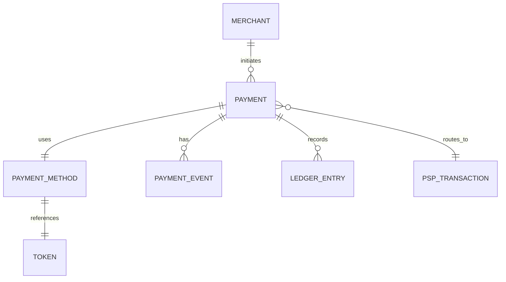

| Entity | Description | Key Attributes |
|--------|-------------|----------------|
| **Merchant** | Organization using Catena to process payments | ID, name, API credentials, webhook URL, routing preferences, data residency region |
| **Payment** | A single financial transaction representing a customer's intent to pay | ID, merchant reference, idempotency key, status, amount (smallest currency unit), currency, customer info, metadata, timestamps |
| **Payment Method** | The instrument used to pay (card, bank transfer) | ID, token reference, type, card brand, last four, expiry, billing country |
| **Token** | Non-sensitive substitute for PAN used within Catena | ID, token value, vault region, expiry |
| **Payment Event** | Immutable record of a state transition | ID, payment reference, event type, before/after state, event data, timestamp |
| **Ledger Entry** | Double-entry accounting record | ID, payment reference, journal ID, accounts (debit/credit), amount, currency, type, actor, reason |
| **PSP Transaction** | Record of interaction with a specific PSP | ID, payment reference, PSP name, PSP reference, status, latency, raw response |

#### 3.1.2 Glossary of Terms

| Term | Definition | Example |
|------|------------|---------|
| **Payment** | A single financial transaction representing a customer's intent to pay | `pay_8hf93hf9h3f` |
| **Authorization (Auth)** | Bank's approval to reserve funds on customer's card; funds not yet transferred | Auth for $100 holds funds for 7 days |
| **Capture** | Request to transfer previously authorized funds from customer to merchant | Capturing $100 after shipping goods |
| **Void** | Cancellation of an authorization before capture; releases held funds | Voiding auth when order is cancelled |
| **Refund** | Return of captured funds to customer | Refunding $50 for returned item |
| **Chargeback** | Customer disputes transaction through their bank; forced reversal | Customer claims fraud, bank reverses payment |
| **PSP (Payment Service Provider)** | Third-party that processes payments and connects to card networks | Stripe, Adyen, Chase Paymentech |
| **Acquirer** | Bank that processes card transactions on behalf of merchant | Chase, Wells Fargo |
| **Issuer** | Customer's bank that issued their card | Bank of America, Citi |
| **Interchange Fee** | Fee paid by acquirer to issuer for each transaction | 1.5% + $0.10 per transaction |
| **PAN (Primary Account Number)** | The 16-digit card number | 4111111111111111 |
| **Token** | Non-sensitive substitute for PAN used within Catena | `tok_visa_4242_exp1225` |
| **Idempotency Key** | Client-provided unique identifier to prevent duplicate processing | `order_123_attempt_1` |
| **3D Secure (3DS)** | Two-factor authentication protocol for card payments | SMS code sent by bank |
| **Settlement** | Actual transfer of funds between banks (T+1 to T+3) | Funds deposited in merchant account |

#### 3.1.3 Currency Handling

All monetary amounts in Catena are represented as integers in the **smallest currency unit**:

| Currency | Smallest Unit | $10.00 Representation |
|----------|--------------|----------------------|
| USD | Cent | `1000` |
| EUR | Cent | `1000` |
| GBP | Penny | `1000` |
| JPY | Yen | `10` (no subunit) |
| BHD | Fils | `10000` (3 decimal places) |

**Rule:** API consumers must convert display amounts to smallest-unit integers before API calls. Catena never accepts or returns floating-point monetary values.

---

### 3.2 Payment Lifecycle (State Machine)

#### 3.2.1 State Definitions

| State | Description | Terminal? | Allowed Transitions |
|-------|-------------|-----------|---------------------|
| `CREATED` | Payment record created, not yet submitted to PSP | No | `PROCESSING`, `CANCELLED` |
| `PROCESSING` | Submitted to PSP, awaiting response | No | `REQUIRES_ACTION`, `AUTHORIZED`, `FAILED` |
| `REQUIRES_ACTION` | Awaiting customer action (e.g., 3DS authentication) | No | `PROCESSING`, `FAILED`, `EXPIRED` |
| `AUTHORIZED` | Funds reserved on customer's card | No | `CAPTURING`, `VOIDED`, `AUTH_EXPIRED` |
| `CAPTURING` | Capture request submitted to PSP | No | `CAPTURED`, `CAPTURE_FAILED` |
| `CAPTURED` | Funds transferred to merchant (pending settlement) | Yes* | `REFUNDING`, `DISPUTED` |
| `VOIDED` | Authorization cancelled, funds released | Yes | None |
| `FAILED` | Payment definitively failed (non-retryable) | Yes | None |
| `EXPIRED` | Customer action timeout or auth expiration | Yes | None |
| `REFUNDING` | Refund request submitted to PSP | No | `REFUNDED`, `PARTIAL_REFUNDED`, `REFUND_FAILED` |
| `REFUNDED` | Full refund completed | Yes | None |
| `PARTIAL_REFUNDED` | Partial refund completed, remaining balance captured | Yes* | `REFUNDING` |
| `DISPUTED` | Chargeback initiated by customer's bank | No | `DISPUTE_WON`, `DISPUTE_LOST` |

*Terminal for primary flow, but can transition for post-capture events.

#### 3.2.2 State Machine Diagram

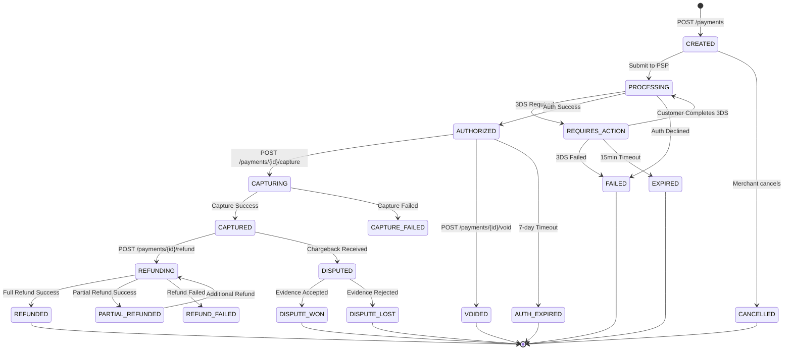

#### 3.2.3 State Transition Rules

**Invariant 1: No State Skipping**
A payment MUST pass through intermediate states. Direct transitions like `CREATED → CAPTURED` are forbidden.

**Invariant 2: Terminal State Immutability**
Once a payment reaches a terminal state (except `CAPTURED`), no further state changes are permitted. The only exception is `CAPTURED`, which can transition to `REFUNDING` or `DISPUTED`.

**Invariant 3: Concurrent Transition Protection**
Only one state transition may be in progress at any time. Concurrent requests (e.g., simultaneous `capture` and `void`) must be serialized. The system must guarantee that exactly one operation succeeds and others receive a conflict response.

**Transition Failure Handling:**

| Scenario | Current State | Action | Behavior |
|----------|--------------|--------|----------|
| Capture timeout | `AUTHORIZED` | Capture request sent, no response | Transition to `CAPTURING`, background recovery resolves |
| Void during capture | `CAPTURING` | Void requested | Return `409 Conflict` - cannot void during capture |
| Refund on voided | `VOIDED` | Refund requested | Return `422 Unprocessable` - no funds to refund |
| Double capture | `CAPTURED` | Capture requested | Return idempotent success with original response |

---

### 3.3 Core Capabilities

#### 3.3.1 Idempotency Engine

**Purpose:** Ensure exactly-once processing semantics for payment operations despite network failures, client retries, or distributed system partitions.

**Requirements:**

| Requirement ID | Requirement | Acceptance Criteria |
|----------------|-------------|---------------------|
| IDEM-001 | System MUST accept an idempotency key on all mutating endpoints | All POST/PUT/DELETE endpoints accept the key |
| IDEM-002 | Keys are scoped to merchant (same key, different merchants = different operations) | Composite uniqueness: merchant + key |
| IDEM-003 | Key TTL: 24 hours from first use | After 24h, same key creates new operation |
| IDEM-004 | Matching key + matching params = return cached response | Response body, status code, and headers identical |
| IDEM-005 | Matching key + different params = return conflict error | Error includes diagnostic info for debugging |
| IDEM-006 | Matching key + operation in-progress = block briefly, then return current state | Client receives either completed result or an accepted/pending response |
| IDEM-007 | Idempotency must work across regional failovers | If Region A fails mid-request, retry to Region B must recognize the key |
| IDEM-008 | Failed operations with matching key allow retry | Client can retry after a transient failure without conflict |

**Behavioral Flow:**

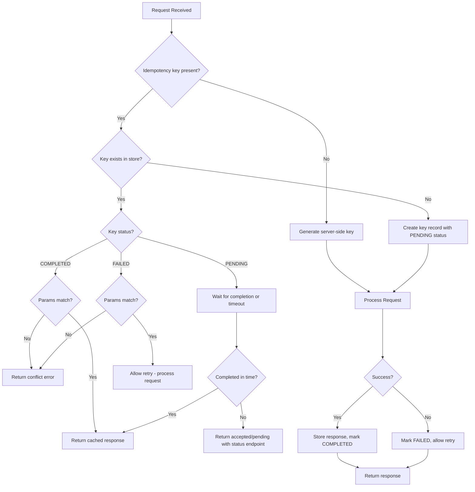

#### 3.3.2 Token Vault (PCI-DSS Compliance)

**Purpose:** Isolate sensitive cardholder data (PAN, CVV) in a separate security domain, providing tokens for internal use. No other component in the system should ever see or store raw card numbers.

**Requirements:**

| Requirement ID | Requirement | Acceptance Criteria |
|----------------|-------------|---------------------|
| VAULT-001 | PAN enters system only at the edge and is immediately sent to the vault | No PAN in any log, metric, or trace outside the vault |
| VAULT-002 | Tokens are merchant-scoped (cannot be used across merchants) | Token includes merchant association |
| VAULT-003 | CVV never stored, only forwarded in the same request | CVV exists in memory only for the duration of the request |
| VAULT-004 | Vault is in a dedicated, isolated security zone | Only authorized services can reach the vault |
| VAULT-005 | All PAN storage encrypted with hardware-backed key management | Encryption at rest with regular key rotation |
| VAULT-006 | Token lookup latency P99 < 10ms | Measured at vault service boundary |
| VAULT-007 | Token expiration matches card expiration | Token unusable after card expires |
| VAULT-008 | Vault must remain available even if one region is completely offline | Regional isolation with cross-region token resolution |

**Token Lifecycle:**

| Event | Token State | Action |
|-------|-------------|--------|
| Card tokenized | ACTIVE | Token usable for payments |
| Card updated (new expiry) | ACTIVE | New token created, old token deprecated |
| Card deleted by customer | DELETED | Token returns "not found" |
| Card expired | EXPIRED | Token returns "card expired" |
| Fraud detected | BLOCKED | Token returns "card blocked" |

#### 3.3.3 Smart Router

**Purpose:** Select optimal PSP for each transaction based on cost, success rate, latency, and availability.

**Routing Decision Factors:**

| Factor | Weight | Data Source | Update Frequency |
|--------|--------|-------------|------------------|
| PSP Health Score | 30% | Real-time health monitoring metrics | Continuous (short sliding window) |
| Historical Success Rate | 25% | Analytics (card brand x issuer x PSP) | Hourly |
| Interchange Cost | 25% | Configuration + card BIN lookup | Daily |
| Latency P95 | 10% | Real-time metrics | Continuous |
| Merchant Preference | 10% | Merchant routing rules | On change |

**Circuit Breaker Behavior:**

The router must implement circuit breaker logic per PSP:

| State | Description | Behavior |
|-------|-------------|----------|
| CLOSED | PSP healthy | All traffic routed normally |
| OPEN | PSP unhealthy (error rate exceeds threshold for sustained period) | 0% traffic routed, automatic cooldown period |
| HALF-OPEN | Testing recovery after cooldown | Small probe traffic, promote to CLOSED on consecutive successes, revert to OPEN on failure |

**Routing Requirements:**

| Requirement ID | Requirement | Acceptance Criteria |
|----------------|-------------|---------------------|
| ROUTE-001 | Router selects PSP within 20ms | P99 routing decision time < 20ms |
| ROUTE-002 | Unhealthy PSP receives 0 traffic within 5s of detection | Circuit opens in ≤5s of threshold breach |
| ROUTE-003 | Merchant can override routing with PSP preference | Preference honored if PSP healthy |
| ROUTE-004 | At least 2 PSPs configured per card brand for fallback | Failover always possible |
| ROUTE-005 | Routing decision logged for analytics | Every payment includes routing reason in metadata |
| ROUTE-006 | Cost optimization saves ≥15% vs random routing | A/B test over 30 days shows savings |

**Retry & Failover Logic:**

| PSP Response | Retryable? | Retry Behavior |
|--------------|------------|----------------|
| Network timeout | Yes | Retry same PSP once, then failover |
| Connection refused | Yes | Immediate failover to backup PSP |
| 5xx Server Error | Yes | Retry same PSP once after brief delay, then failover |
| 4xx Client Error (Bad Request) | No | Return error to merchant |
| Requires Action (3DS) | No | Return 3DS redirect to merchant |
| Decline: Insufficient Funds | No | Return structured decline |
| Decline: Stolen Card | No | Return structured decline, flag for fraud |
| Decline: Do Not Honor | Maybe | Retry on different PSP (different acquirer) |

#### 3.3.4 Double-Entry Ledger

**Purpose:** Maintain an immutable, auditable record of all financial movements with guaranteed consistency.

**Accounting Model:**

Every financial event creates exactly two ledger entries (debit and credit) that must balance:

| Account Type | Normal Balance | Examples |
|--------------|---------------|----------|
| Asset | Debit | `merchant_receivable`, `psp_settlement_pending` |
| Liability | Credit | `customer_payable`, `merchant_balance` |
| Revenue | Credit | `catena_fee_revenue` |
| Expense | Debit | `interchange_expense`, `chargeback_loss` |

**Standard Journal Entries:**

| Event | Debit Account | Credit Account | Amount |
|-------|---------------|----------------|--------|
| Authorization | `customer_auth_hold` | `merchant_pending_auth` | Full amount |
| Capture | `psp_settlement_pending` | `customer_auth_hold` | Full amount |
| Capture | `merchant_pending_auth` | `merchant_balance` | Full amount |
| Capture | `merchant_balance` | `catena_fee_revenue` | Catena fee |
| Void | `merchant_pending_auth` | `customer_auth_hold` | Full amount (reversal) |
| Refund | `merchant_balance` | `psp_settlement_pending` | Refund amount |
| Chargeback | `chargeback_loss` | `merchant_balance` | Dispute amount |

**Ledger Requirements:**

| Requirement ID | Requirement | Acceptance Criteria |
|----------------|-------------|---------------------|
| LEDGER-001 | All entries are append-only (immutable) | No UPDATE or DELETE on ledger records. Corrections are new compensating entries |
| LEDGER-002 | Every entry has a balancing counter-entry | SUM(debits) = SUM(credits) for each journal (enforced at write time) |
| LEDGER-003 | Entries created atomically with state change | State transition and ledger write succeed or fail together |
| LEDGER-004 | Ledger queryable by time range, account, and merchant | Efficient query support for reconciliation and dashboards |
| LEDGER-005 | Running balance calculable in <100ms | Pre-computed or materialized balances available |
| LEDGER-006 | Audit trail includes actor and reason | Every entry records who/what caused it and why |
| LEDGER-007 | Ledger must never show inconsistent state, even during regional failures | Strong consistency required for all writes |
| LEDGER-008 | Historical ledger queries must return point-in-time accurate data | No dirty reads or phantom reads for financial queries |
| LEDGER-009 | Ledger must support end-of-day snapshots for reconciliation | Daily balance snapshots available for all accounts |

---

### 3.4 End-to-End Flows

#### 3.4.1 Flow 1: Simple Card Payment (Happy Path)

**Scenario:** Customer purchases $50 item on merchant website with a Visa card. No 3DS required. Single PSP attempt succeeds.

**Actors:** Merchant System, Catena, PSP, Visa Network, Issuing Bank

**Preconditions:**
- Merchant has valid API credentials
- Customer has valid Visa card with sufficient funds
- PSP is healthy

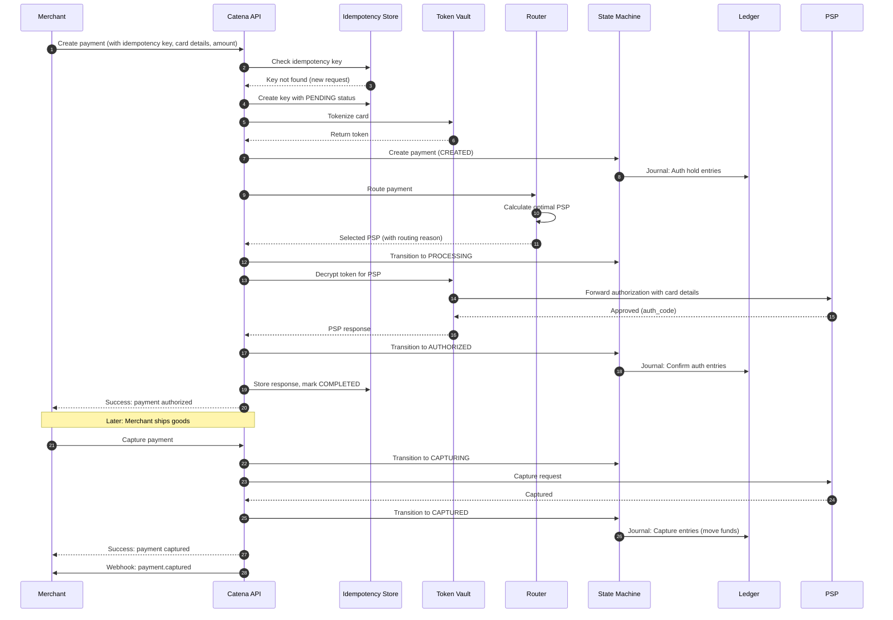

**Post-conditions:**
- Payment in CAPTURED state
- Ledger entries balance for auth and capture
- Merchant received webhook notification
- Idempotency key stored with completed response

#### 3.4.2 Flow 2: Payment with 3D Secure

**Scenario:** Customer's bank requires 3DS authentication. Customer completes authentication successfully.

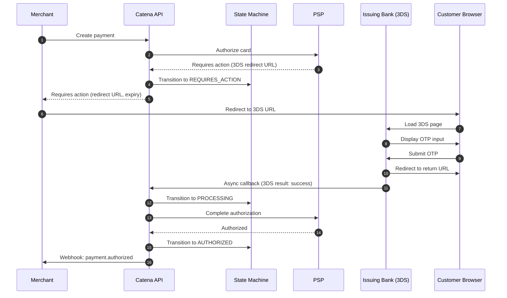

**3DS Timeout Handling:**

| Condition | Timeout | System Behavior |
|-----------|---------|-----------------|
| Customer hasn't started 3DS | 15 minutes | Transition to `EXPIRED`, notify merchant |
| Customer started but abandoned | 15 minutes from start | Transition to `EXPIRED`, notify merchant |
| Bank callback never received | 30 minutes | Poll bank status, then expire or complete |

#### 3.4.3 Flow 3: Network Timeout with Recovery ("Zombie Transaction")

**Scenario:** Catena sends authorization to PSP, but network fails before response. Customer may or may not be charged. This is the most critical failure scenario for payment systems.

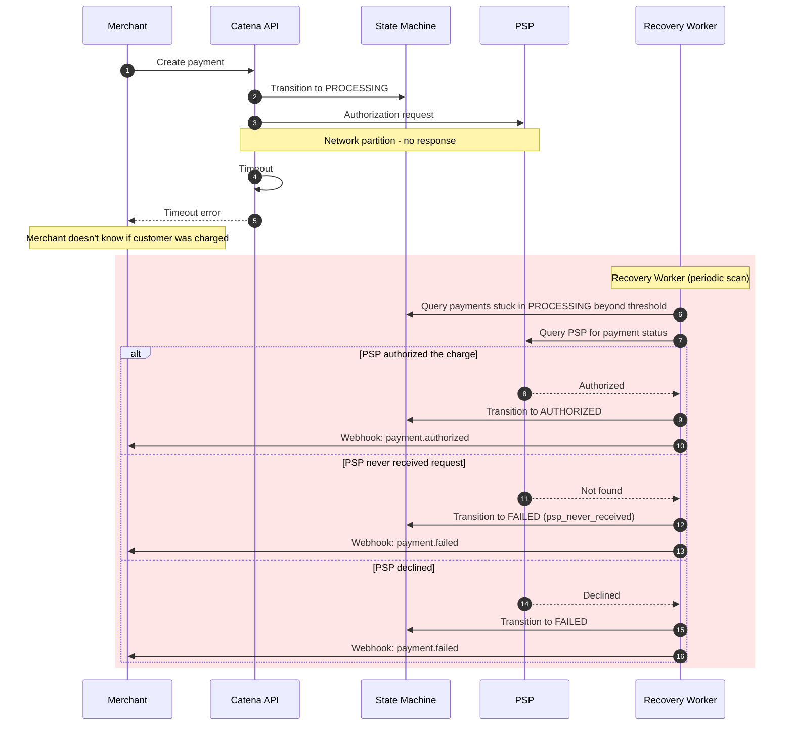

**Recovery Requirements:**

| Requirement ID | Requirement | Acceptance Criteria |
|----------------|-------------|---------------------|
| RECOVERY-001 | Scan for stuck payments periodically | Worker heartbeat visible in metrics |
| RECOVERY-002 | Payment stuck beyond threshold triggers PSP inquiry | PSP status queried promptly after timeout |
| RECOVERY-003 | PSP inquiry uses idempotent identifier | Query by Catena payment ID, not retry auth |
| RECOVERY-004 | Final state determined within 5 minutes | No payment in PROCESSING > 5 minutes |
| RECOVERY-005 | Webhook sent after recovery | Merchant notified of final state |
| RECOVERY-006 | Recovery worker itself must be idempotent | Multiple workers running concurrently must not cause duplicate actions |

#### 3.4.4 Flow 4: Concurrent Capture and Void (Race Condition)

**Scenario:** Merchant system bug sends capture and void simultaneously for the same payment.

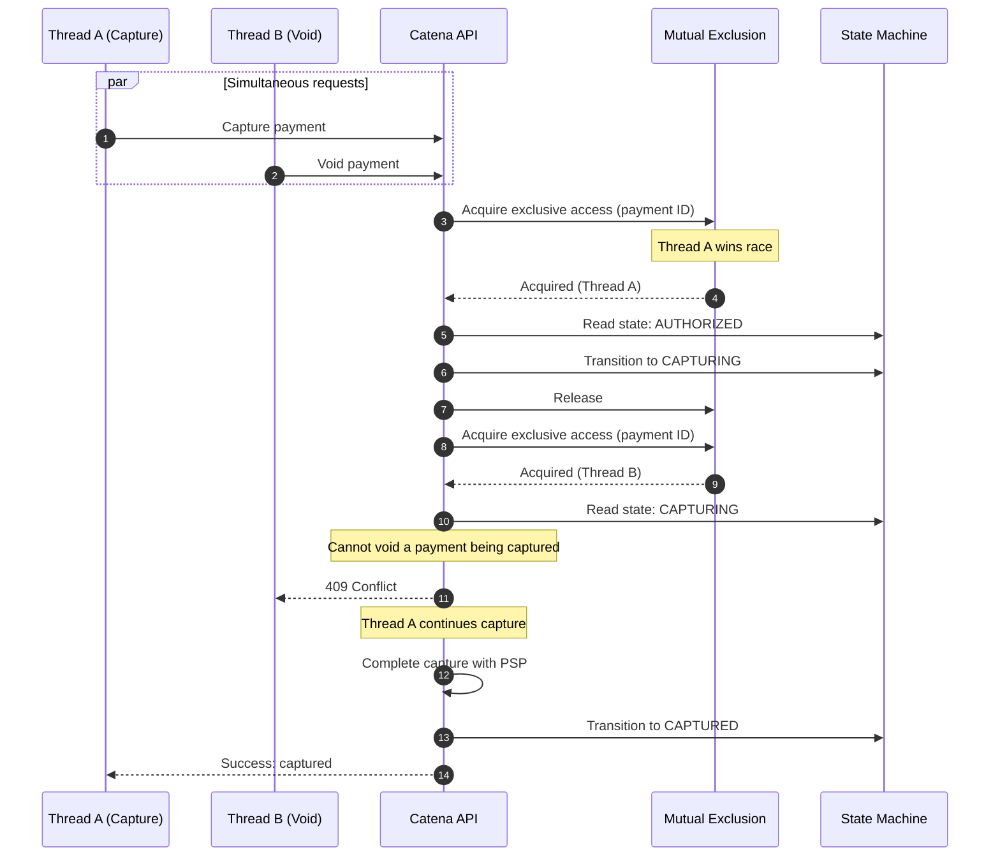

**Key Requirement:** The system must guarantee mutual exclusion for state transitions on the same payment. Only one operation can proceed; others must receive a clear conflict response indicating the current state and why their operation was rejected.

#### 3.4.5 Flow 5: PSP Failover

**Scenario:** Primary PSP is down. Router fails over to backup PSP.

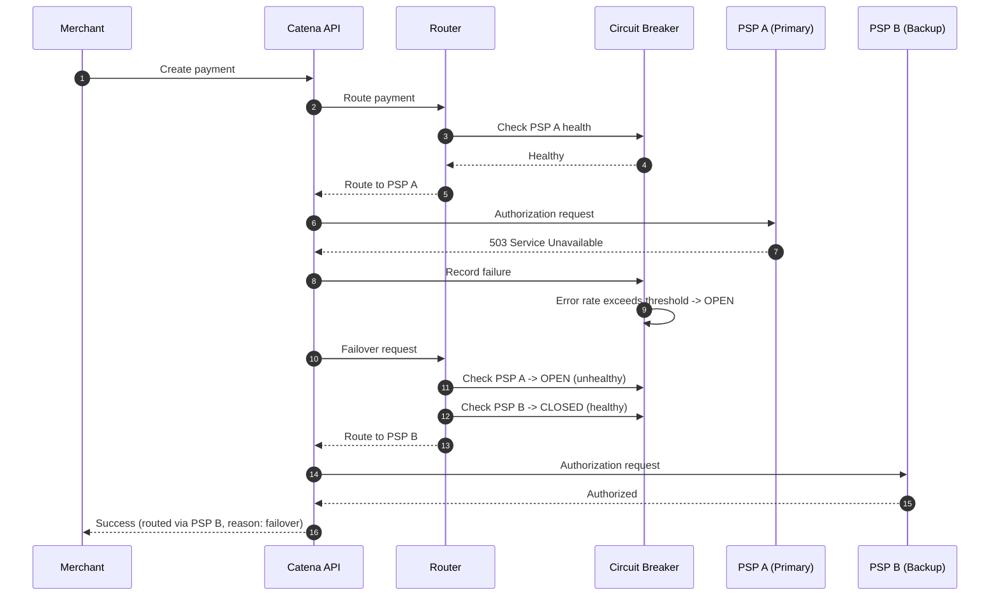

**Failover Decision Matrix:**

| Primary PSP Response | Action | Reason |
|---------------------|--------|--------|
| 2xx Success | Complete | Normal flow |
| 4xx Client Error | Return error | Client error, not PSP issue |
| 4xx Decline | Return decline | Card declined, not PSP issue |
| 5xx Server Error | Retry same PSP once, then failover | Transient error |
| Connection failure | Immediate failover | PSP unreachable |
| Timeout | Failover + start recovery job | Unknown state |

#### 3.4.6 Flow 6: Refund (Full and Partial)

**Scenario:** Merchant initiates full or partial refund.

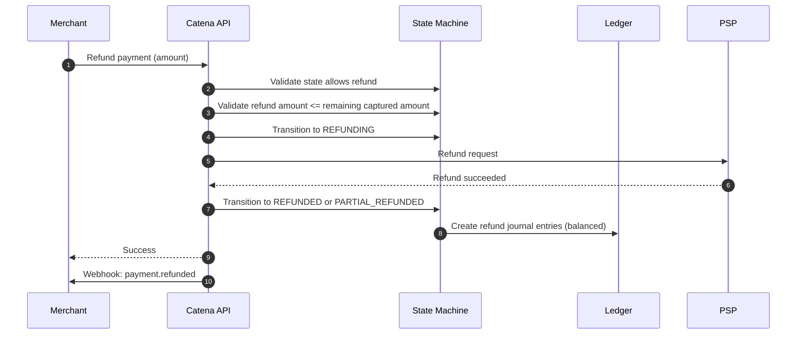

**Refund Rules:**

| Rule | Constraint |
|------|------------|
| Total refunds <= captured amount | Cannot refund more than captured |
| Refund currency = capture currency | No cross-currency refunds |
| Refund window | 180 days from capture |
| Partial refunds | Allowed, tracked cumulatively |
| Refund on voided payment | Not allowed (no funds captured) |

#### 3.4.7 Flow 7: Chargeback (Dispute)

**Scenario:** Customer disputes charge with their bank. Bank initiates chargeback.

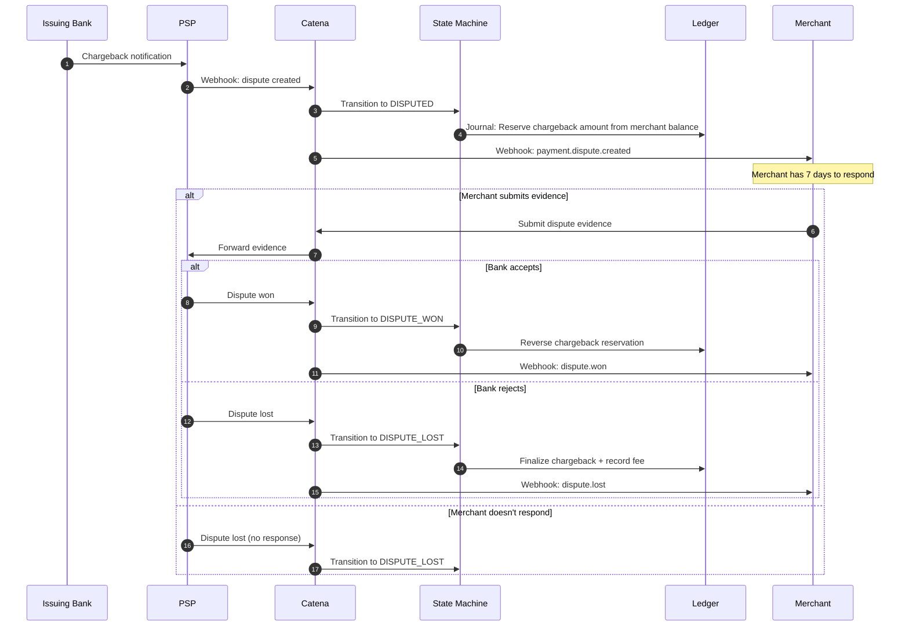

#### 3.4.8 Flow 8: Idempotent Retry

**Scenario:** Merchant retries request due to timeout. Original request already succeeded.

The system must return the exact cached response without making any PSP call. If the same key is used with different parameters, the system must return a conflict error. See [IDEM requirements](#331-idempotency-engine) for full specification.

---

### 3.5 API Contracts

#### 3.5.1 API Design Principles

| Principle | Requirement |
|-----------|-------------|
| RESTful resources | Nouns for resources, HTTP verbs for actions |
| Consistent naming | snake_case for JSON fields |
| Idempotency | All mutating endpoints accept idempotency key |
| Pagination | Cursor-based for lists (not offset-based) |
| Versioning | URL path versioning (e.g. `/v1/`, `/v2/`). See [Section 3.11](#311-schema-evolution--api-versioning) |
| Error format | Consistent error object with type, code, message, and documentation link |

#### 3.5.2 Authentication

| Key Type | Use Case |
|----------|----------|
| Secret Key | Server-to-server API calls (must never be exposed client-side) |
| Publishable Key | Client-side tokenization only (restricted permissions) |

#### 3.5.3 Core Endpoints

| Endpoint | Method | Purpose | Key Parameters |
|----------|--------|---------|----------------|
| `/v1/payments` | POST | Create a new payment | amount, currency, payment_method, capture_method, metadata |
| `/v1/payments/{id}` | GET | Retrieve payment details | -- |
| `/v1/payments` | GET | List payments with filtering | limit, cursor, created date range, status |
| `/v1/payments/{id}/capture` | POST | Capture authorized payment | amount (optional, for partial capture) |
| `/v1/payments/{id}/void` | POST | Void authorized payment | -- |
| `/v1/payments/{id}/refund` | POST | Refund captured payment | amount (optional), reason |
| `/v1/disputes/{id}/evidence` | POST | Submit dispute evidence | documents |
| `/v1/bulk/refunds` | POST | Bulk refund up to 10,000 payments | payment_ids, reason |
| `/v1/events` | GET | List events (for replay) | limit, cursor, type filter |

> **Note:** For detailed API request/response schemas, field-level specifications, and example payloads, see [TRD.md - API Specifications](TRD.md#2-api-specifications).

#### 3.5.4 Error Response Categories

| Error Type | HTTP Code | Description |
|------|-----------|-------------|
| `invalid_request_error` | 400 | Invalid parameters |
| `authentication_error` | 401 | Invalid API key |
| `card_error` | 402 | Card was declined (includes structured decline code) |
| `rate_limit_error` | 429 | Too many requests |
| `api_error` | 500 | Internal error |
| `idempotency_error` | 409 | Idempotency key conflict |
| `state_error` | 409 | Invalid state transition |

**Decline Codes (card_error):**

| Code | Description | Customer-Facing Message |
|------|-------------|------------------------|
| `insufficient_funds` | Not enough balance | "Your card has insufficient funds" |
| `card_declined` | Generic decline | "Your card was declined" |
| `expired_card` | Card expired | "Your card has expired" |
| `incorrect_cvc` | CVC mismatch | "Your card's security code is incorrect" |
| `processing_error` | Bank processing error | "An error occurred, please try again" |
| `lost_card` | Card reported lost | "Your card was declined" |
| `stolen_card` | Card reported stolen | "Your card was declined" |
| `fraud_detected` | Fraud suspicion | "Your card was declined" |

---

### 3.6 Event & Webhook System

#### 3.6.1 Event Types

| Event Type | Trigger | Key Fields |
|------------|---------|------------|
| `payment.created` | Payment record created | payment_id, amount, currency |
| `payment.processing` | Submitted to PSP | payment_id, psp |
| `payment.authorized` | Authorization approved | payment_id, auth_code |
| `payment.requires_action` | 3DS or other action needed | payment_id, action_type, action_url |
| `payment.captured` | Capture completed | payment_id, amount_captured |
| `payment.voided` | Authorization voided | payment_id |
| `payment.failed` | Payment failed | payment_id, failure_code, failure_message |
| `payment.refunded` | Refund completed | payment_id, refund_id, amount_refunded |
| `payment.dispute.created` | Chargeback initiated | payment_id, dispute_id, amount |
| `payment.dispute.won` | Dispute resolved for merchant | payment_id, dispute_id |
| `payment.dispute.lost` | Dispute resolved for customer | payment_id, dispute_id |

#### 3.6.2 Event Storage & Delivery Requirements

**All events are persisted as an immutable, ordered log** before delivery is attempted. This event log serves as the system of record for all state changes and is the foundation for:
- Webhook delivery
- Audit trails
- Analytics derived views
- Event replay / reprocessing

| Requirement ID | Requirement | Acceptance Criteria |
|----------------|-------------|---------------------|
| EVENT-001 | Every state transition produces an immutable event record | Events never modified or deleted |
| EVENT-002 | Events are ordered per payment (causal order) | Within a payment, events reflect the actual sequence of state changes |
| EVENT-003 | Event log supports replay from any point in time | Consumer can re-read events from a specific offset or timestamp |
| EVENT-004 | Events are the source from which webhooks, analytics, and audit views are derived | All downstream systems consume from the event log |

#### 3.6.3 Webhook Delivery Specification

| Property | Specification |
|----------|---------------|
| Delivery semantics | At-least-once |
| Ordering | Best-effort (not strictly guaranteed across payments) |
| Timeout | 30 seconds per attempt |
| Success codes | 2xx |
| Signature | Cryptographic signature on every webhook for verification |

**Retry Schedule:**

| Attempt | Delay After Previous |
|---------|---------------------|
| 1 | Immediate |
| 2 | 1 minute |
| 3 | 5 minutes |
| 4 | 30 minutes |
| 5 | 2 hours |
| 6 | 8 hours |
| 7 | 24 hours |
| 8 | 48 hours |
| 9 (final) | 72 hours |

#### 3.6.4 Webhook Endpoint Requirements (Merchant)

| Requirement | Specification |
|-------------|---------------|
| Response time | < 30 seconds |
| Response code | 2xx for success |
| Idempotency | Handle duplicate deliveries gracefully (at-least-once) |
| Signature verification | Verify webhook signature header |

---

### 3.7 Reconciliation & Settlement

#### 3.7.1 Daily Reconciliation Process

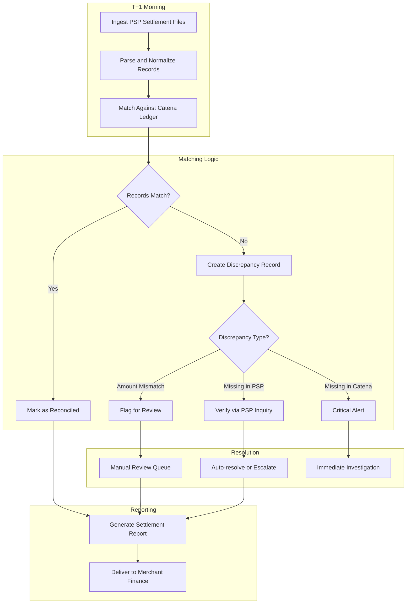

#### 3.7.2 Three-Way Match

| Data Source | Fields Compared | Tolerance |
|-------------|-----------------|-----------|
| Catena Ledger | payment_id, amount, currency, status | Exact match |
| PSP Settlement | psp_reference, amount, currency, status | Exact match |
| Merchant Records (optional) | order_id, amount | Exact match |

#### 3.7.3 Discrepancy Types

| Type | Description | Auto-Resolution |
|------|-------------|-----------------|
| `amount_mismatch` | Amounts differ between systems | No - manual review |
| `currency_mismatch` | Currency codes differ | No - manual review |
| `status_mismatch` | State differs (e.g., Catena says captured, PSP says refunded) | Query PSP for latest |
| `missing_in_psp` | Catena has record, PSP doesn't | Re-query after 24h, then escalate |
| `missing_in_catena` | PSP has record, Catena doesn't | Critical - immediate investigation |
| `timing_difference` | Transaction crossed settlement cutoff | Auto-include in next day |

#### 3.7.4 Settlement Report Delivery

| Method | Timing | Format |
|--------|--------|--------|
| API | Real-time | JSON |
| Dashboard | T+1 9 AM merchant local time | Interactive |
| File Transfer | T+1 6 AM UTC | CSV |
| Email | T+1 9 AM merchant local time | PDF summary + CSV attachment |

**Reconciliation is a batch process** that runs daily and must process all transactions from the prior settlement window. For merchants with 50M+ transactions/month, this is a significant data processing job that must complete within the reporting SLA.

---

### 3.8 Multi-Region & Global Operations

Catena operates globally with merchants and customers distributed across US, EU, and APAC regions. This section defines requirements for handling the complexities of global operations.

#### 3.8.1 Global Deployment Requirements

| Requirement ID | Requirement | Acceptance Criteria |
|----------------|-------------|---------------------|
| GLOBAL-001 | Merchants can choose their primary data region (US, EU, APAC) | Region selection available at merchant onboarding |
| GLOBAL-002 | EU merchant data must never leave EU boundaries | GDPR compliance verified by audit |
| GLOBAL-003 | API requests routed to nearest region for latency | Geographic routing |
| GLOBAL-004 | System remains operational if any single region fails | Automatic failover < 30 seconds |
| GLOBAL-005 | Merchants see consistent data regardless of which region serves their request | Read-your-writes consistency guaranteed |

#### 3.8.2 Scenario: Cross-Border Payment (EU Merchant, US Customer)

**Context:** German merchant (data must stay in EU) processes payment from US customer using a US-issued card.

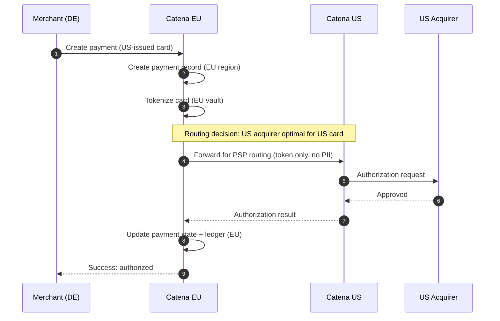

**Requirements:**

| Requirement ID | Requirement | Acceptance Criteria |
|----------------|-------------|---------------------|
| XBORDER-001 | Customer PII remains in merchant's designated region | PAN, email, address never cross region boundary |
| XBORDER-002 | Tokens can be resolved cross-region for PSP calls | Token lookup works from any region |
| XBORDER-003 | Payment state always authoritative in merchant's region | No split-brain on payment status |
| XBORDER-004 | Cross-region latency overhead < 100ms | Measured end-to-end |

#### 3.8.3 Scenario: Regional Failover During Active Transaction

**Context:** EU region experiences complete outage while payments are in-flight.

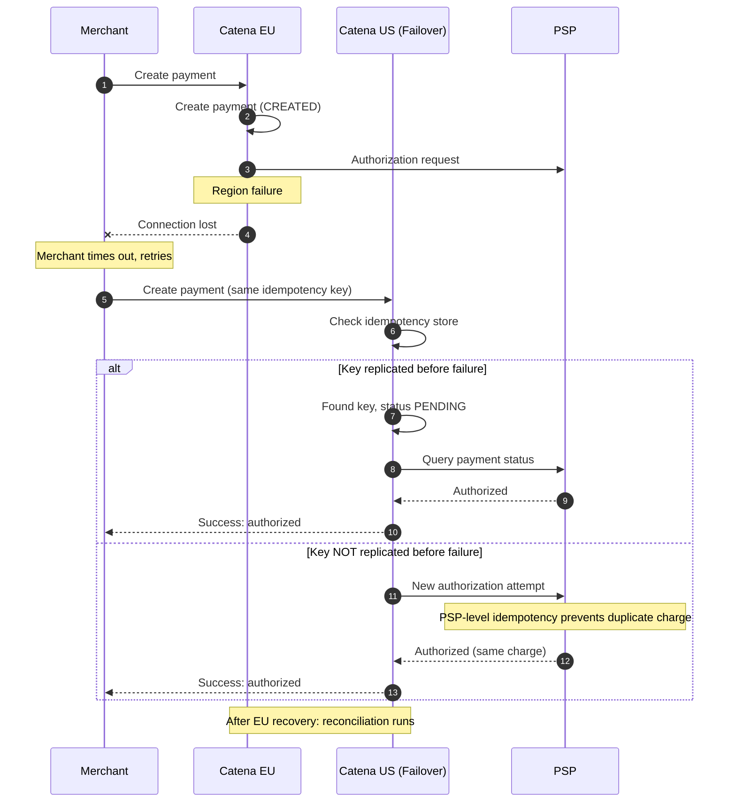

**Requirements:**

| Requirement ID | Requirement | Acceptance Criteria |
|----------------|-------------|---------------------|
| FAILOVER-001 | No duplicate charges during regional failover | PSP-level idempotency as backup |
| FAILOVER-002 | Merchant receives definitive response within 5 minutes | Either success, failure, or actionable status |
| FAILOVER-003 | Failover region can serve read requests for any merchant | Read replicas available cross-region |
| FAILOVER-004 | Failover region can process writes for critical operations | Writes may be degraded but not blocked |
| FAILOVER-005 | Post-recovery reconciliation identifies all affected transactions | Automated scan within 1 hour of recovery |

#### 3.8.4 Scenario: Network Partition Between Regions

**Context:** Network connectivity lost between US and EU regions, but both regions remain operational internally. This is the classic split-brain problem.

**Split-Brain Problem:** Both regions might accept writes for the same merchant, leading to conflicting states.

**Product Decisions for CAP Trade-offs During Partition:**

| Operation | Behavior During Partition | Rationale |
|----------|--------------------------|-----------|
| Payment creation | **Favor availability** (accept in both partitions) | Customer experience; PSP idempotency prevents duplicate charges |
| Capture / Void / Refund | **Favor consistency** (reject in minority partition) | Financial accuracy critical; can retry after partition heals |
| Read operations | **Favor availability** (serve potentially stale data) | Eventual consistency acceptable for reads |
| Ledger writes | **Favor consistency** (reject in minority partition) | Financial audit trail must be accurate |

**Requirements:**

| Requirement ID | Requirement | Acceptance Criteria |
|----------------|-------------|---------------------|
| PARTITION-001 | System applies the CAP decisions above per operation type | Explicit, tested per-operation behavior |
| PARTITION-002 | If availability chosen: Conflicts must be detectable post-partition | Conflict detection within 1 hour of partition healing |
| PARTITION-003 | If consistency chosen: Writes rejected in minority partition with clear error | Merchant receives actionable error message |
| PARTITION-004 | Partition detection time < 30 seconds | System detects and adapts quickly |
| PARTITION-005 | Merchant dashboard shows degraded status during partition | Visible indicator |

#### 3.8.5 Scenario: Read-After-Write Consistency

**Context:** Merchant creates a payment, then immediately queries it. Request may be routed to a replica that hasn't received the write yet.

**Problem:** Merchant gets a 404 for a payment they just created.

**Requirements:**

| Requirement ID | Requirement | Acceptance Criteria |
|----------------|-------------|---------------------|
| RYW-001 | Merchant always sees their own writes immediately | Read-your-writes consistency guaranteed |
| RYW-002 | Solution must not significantly impact read latency | P99 read latency < 50ms overhead |
| RYW-003 | Solution must work across regional failover | Consistency maintained post-failover |

**Acceptable Approaches (Product Perspective -- architect to decide implementation):**
1. Route merchant's reads to the same node that handled their recent write
2. Include a consistency token in write response; require it on subsequent reads
3. Block read until replication confirmed

#### 3.8.6 Scenario: Merchant Data Migration Between Regions

**Context:** Large merchant (processing 10,000 TPS) needs to move from US to EU region due to regulatory change.

**Requirements:**

| Requirement ID | Requirement | Acceptance Criteria |
|----------------|-------------|---------------------|
| MIGRATE-001 | Migration with zero downtime | No payment failures during migration |
| MIGRATE-002 | Historical data fully migrated | All ledger entries, events, and payment records |
| MIGRATE-003 | Migration duration < 72 hours for largest merchants | Regardless of data volume |
| MIGRATE-004 | Rollback capability | Can revert within 4 hours |
| MIGRATE-005 | Merchant receives progress updates | Dashboard shows migration status |

**Migration Phases (Product View):**

| Phase | Duration | Merchant Impact |
|-------|----------|-----------------|
| 1. Historical data copy | 24-48h | None - background process |
| 2. Dual-write enabled | 1-4h | Slightly higher latency |
| 3. Traffic cutover | < 1 minute | Potential brief latency spike |
| 4. Old region cleanup | 24h | None - background process |

---

### 3.9 High-Volume Merchant Scenarios

#### 3.9.1 Scenario: Flash Sale (Single Merchant Traffic Spike)

**Context:** One merchant goes from 100 TPS baseline to 30,000 TPS in 60 seconds (60% of Catena's total capacity).

**Problem: Noisy Neighbor.** One merchant's spike must not degrade service for other merchants.

**Requirements:**

| Requirement ID | Requirement | Acceptance Criteria |
|----------------|-------------|---------------------|
| FLASH-001 | One merchant's spike must not degrade service for others | P99 latency for other merchants unchanged |
| FLASH-002 | Per-merchant rate limits must be configurable | Limits set per merchant tier |
| FLASH-003 | Overflow traffic must queue, not drop | Queue depth visible; shed only after threshold |
| FLASH-004 | Merchants can pre-register expected flash sales | Capacity reserved 24h in advance |
| FLASH-005 | System scales automatically for registered spikes | No manual intervention needed |

**Isolation Requirements:**

| Resource | Isolation Requirement |
|----------|----------------------|
| API Gateway | Per-merchant rate limiting |
| Database connections | No cross-merchant connection exhaustion |
| PSP capacity | Large merchant PSP failures don't affect others |
| Queue processing | Small merchants get guaranteed throughput |

#### 3.9.2 Scenario: Merchant Dashboard Query (Large Data Volume)

**Context:** Finance team queries "all payments from last month" for a merchant with 50 million transactions/month.

**Problem:** This query could overwhelm the database, time out, or crash the client.

**Requirements:**

| Requirement ID | Requirement | Acceptance Criteria |
|----------------|-------------|---------------------|
| QUERY-001 | Dashboard queries must not impact real-time payment processing | Read workload isolated from write workload |
| QUERY-002 | Large result sets must be paginated | Max 1,000 records per page |
| QUERY-003 | Queries bounded by time range | Max 31 days per query |
| QUERY-004 | Export for larger datasets | Async export job with download link |
| QUERY-005 | Query performance predictable | Response time scales linearly with result size |

**Query Patterns:**

| Query Type | Max Scope | Response Time SLA | Delivery |
|------------|-----------|-------------------|----------|
| Real-time search | 1,000 records | < 2 seconds | Synchronous |
| Paginated list | 10,000 records | < 5 seconds per page | Synchronous |
| Date range export | 31 days | < 5 minutes | Async job |
| Full history export | Unlimited | < 24 hours | Scheduled batch job |

#### 3.9.3 Scenario: Webhook Backlog (Merchant Endpoint Slow)

**Context:** Large merchant's webhook endpoint becomes slow. Catena queues 100,000+ pending webhooks.

**Requirements:**

| Requirement ID | Requirement | Acceptance Criteria |
|----------------|-------------|---------------------|
| WEBHOOK-001 | Webhook backlog for one merchant must not affect others | Per-merchant webhook queues |
| WEBHOOK-002 | Maximum webhook queue depth per merchant | 1 million events max |
| WEBHOOK-003 | Merchant notified when queue depth exceeds threshold | Alert at 10k, 100k, 500k |
| WEBHOOK-004 | Old webhooks eventually expire with notification | 72-hour TTL, then dead-letter |
| WEBHOOK-005 | Merchants can retrieve missed webhooks via API | Event replay endpoint available |

#### 3.9.4 Scenario: Midnight Reconciliation Storm

**Context:** At midnight UTC, all merchants run reconciliation reports simultaneously. Each report queries aggregate account balances.

**Problem:** 10,000 merchants x complex aggregation query = read amplification on the database.

**Requirements:**

| Requirement ID | Requirement | Acceptance Criteria |
|----------------|-------------|---------------------|
| BALANCE-001 | Balance queries must return within 5 seconds | Even during peak reconciliation |
| BALANCE-002 | Pre-computed daily snapshots available | Snapshot as of 23:59:59 UTC |
| BALANCE-003 | Real-time balance available but rate-limited | Bounded query rate per merchant |
| BALANCE-004 | Balance accuracy during compute window | "As of" timestamp included |

#### 3.9.5 Scenario: Bulk Operations (Mass Refund)

**Context:** Merchant discovers fraud and needs to refund 100,000 transactions immediately.

**Requirements:**

| Requirement ID | Requirement | Acceptance Criteria |
|----------------|-------------|---------------------|
| BULK-001 | Bulk refund API accepts up to 10,000 payment IDs per call | Single API call |
| BULK-002 | Bulk operations processed with fair scheduling | Other merchants not impacted |
| BULK-003 | Progress tracking for bulk operations | Percentage complete, estimated time |
| BULK-004 | Partial failure handling | Report which refunds failed and why |
| BULK-005 | Bulk operations can be cancelled mid-flight | Unprocessed items stopped |

---

### 3.10 Analytics & Derived Data

**Purpose:** Catena must support real-time and historical analytics derived from the payment event stream, without impacting the operational transaction processing path.

#### 3.10.1 Real-Time Analytics Requirements

| Requirement ID | Requirement | Acceptance Criteria |
|----------------|-------------|---------------------|
| ANALYTICS-001 | Real-time dashboard showing PSP health, authorization rates, and error rates | Data freshness < 5 seconds |
| ANALYTICS-002 | Per-merchant transaction volume and success rate visible in near-real-time | Data freshness < 30 seconds |
| ANALYTICS-003 | Alert triggers based on streaming metrics (e.g., sudden drop in auth rate for a card brand) | Alert within 60 seconds of anomaly |
| ANALYTICS-004 | Analytics workload must not degrade transactional performance | Separate read path for analytics |

#### 3.10.2 Historical Analytics & Reporting

| Requirement ID | Requirement | Acceptance Criteria |
|----------------|-------------|---------------------|
| ANALYTICS-005 | Merchants can query historical trends (auth rates by card brand, by region, by time period) | Interactive queries on up to 12 months of data |
| ANALYTICS-006 | Interchange cost analysis by card type, issuer, and region | Monthly cost breakdown reports |
| ANALYTICS-007 | Settlement reports aggregated across PSPs | Daily and monthly settlement summaries |
| ANALYTICS-008 | Historical data accessible for ad-hoc queries without impacting production | Analytical data store separate from operational store |

#### 3.10.3 Derived Data Systems

The system maintains several derived views from the primary event log:

| Derived View | Purpose | Freshness Requirement |
|-------------|---------|----------------------|
| Search index | Full-text search across payments by merchant | < 30 seconds |
| Materialized balances | Running account balances for dashboard | < 5 seconds |
| PSP performance metrics | Routing optimization input | Real-time (sub-second) |
| Reconciliation views | Daily settlement matching | Batch (T+1) |
| Compliance audit log | Regulatory reporting | < 1 minute |
| Fraud signals | Risk scoring input | Real-time (sub-second) |

**Key Requirement:** All derived views must be rebuildable from the event log. If a derived view becomes corrupted or a new view is needed, it must be possible to reprocess the event log to reconstruct it.

---

### 3.11 Schema Evolution & API Versioning

**Purpose:** Catena must evolve its data formats and API contracts over time without breaking existing integrations. Merchants integrate once and expect stability; Catena deploys continuously.

#### 3.11.1 API Versioning Requirements

| Requirement ID | Requirement | Acceptance Criteria |
|----------------|-------------|---------------------|
| SCHEMA-001 | API versions are immutable once published | No breaking changes to a published version |
| SCHEMA-002 | At least 2 API versions supported concurrently | Old version supported for 12 months after new version launch |
| SCHEMA-003 | New fields can be added to responses without version bump | Additive changes are backward-compatible |
| SCHEMA-004 | Webhook payload format versioned independently of API | Merchants can pin to a webhook schema version |

#### 3.11.2 Internal Data Evolution Requirements

| Requirement ID | Requirement | Acceptance Criteria |
|----------------|-------------|---------------------|
| SCHEMA-005 | Internal data format changes must not require downtime | Rolling deployments where old and new code coexist |
| SCHEMA-006 | Old data remains readable after schema changes | Backward compatibility: new code reads old data |
| SCHEMA-007 | New data remains readable by old code during rolling deploy | Forward compatibility: old code reads new data (ignores unknown fields) |
| SCHEMA-008 | Event log format supports schema evolution | Events written with one schema version readable by consumers expecting another |

---

## 4. Non-Functional Requirements & SLOs

### 4.1 Definitions

| Term | Definition |
|------|------------|
| **Availability** | Percentage of time the system is operational and accepting requests |
| **Latency** | Time from request receipt to response sent, measured at edge |
| **Throughput** | Number of transactions processed per second |
| **Durability** | Probability that stored data is not lost |
| **RPO (Recovery Point Objective)** | Maximum acceptable data loss measured in time |
| **RTO (Recovery Time Objective)** | Maximum acceptable time to restore service |

### 4.2 Performance SLOs

| Metric | Target | Measurement Point |
|--------|--------|-------------------|
| **API Availability** | 99.99% monthly (4.3 min downtime/month max) | Edge load balancer |
| **P50 Latency** | < 200ms | Edge to edge (excluding PSP round-trip) |
| **P95 Latency** | < 400ms | Edge to edge (excluding PSP round-trip) |
| **P99 Latency** | < 800ms | Edge to edge (excluding PSP round-trip) |
| **P99.9 Latency** | < 2000ms | Edge to edge (tail latency bound) |
| **Peak Throughput** | 50,000 TPS | Sustained for 60 seconds |
| **Scale Velocity** | 10k to 50k TPS in < 60 seconds | Auto-scaling trigger to capacity |
| **Burst Tolerance** | 100k TPS for 10 seconds | No request drops |

### 4.3 Reliability & Durability SLOs

| Metric | Target | Notes |
|--------|--------|-------|
| **Data Durability** | 99.999999999% (11 nines) | No data loss for any committed transaction |
| **RPO (Payment State)** | 0 seconds | No data loss for payment state on regional failure |
| **RPO (Ledger)** | 0 seconds | No data loss for financial records |
| **RPO (Events)** | < 1 second | Async replication acceptable for events |
| **RTO (Regional Failure)** | < 30 seconds | Automatic failover |
| **RTO (Full Disaster)** | < 4 hours | Manual intervention acceptable |

### 4.4 Consistency Requirements

| Data Type | Consistency Model | Rationale |
|-----------|-------------------|-----------|
| Payment State | Strong (Linearizable) | Prevents double-charging, ensures exactly one state transition at a time |
| Ledger Entries | Strong (Serializable) | Financial accuracy, balanced journals |
| Idempotency Keys | Strong (Linearizable) | Prevents duplicate payments |
| Webhooks | Eventual (At-least-once) | Retries handle delivery failures |
| Analytics / Dashboards | Eventual (< 5 min lag) | Near-real-time acceptable |
| Search Index | Eventual (< 30 sec lag) | User experience acceptable |

### 4.5 Observability Requirements

| Capability | Specification |
|------------|---------------|
| **Distributed Tracing** | 100% of requests traced with correlation ID across all services |
| **Log Retention** | 90 days hot, 7 years cold (compliance) |
| **Metrics Resolution** | 10-second granularity |
| **Alert Response** | P1: 5 min ack, 15 min response |
| **Dashboard Availability** | Real-time operational dashboards for internal SRE team |

---

## 5. System Constraints & Context

### 5.1 External System Dependencies

| System | Type | Characteristics | SLA from Provider |
|--------|------|-----------------|-------------------|
| PSP A (e.g., Stripe) | Downstream | REST API, async webhooks, 99.99% SLA claimed | ~99.95% observed |
| PSP B (e.g., Adyen) | Downstream | REST API, batch settlement files, strong EU presence | ~99.95% observed |
| PSP C (e.g., Chase) | Downstream | SOAP/XML legacy API, US-only | ~99.9% observed |
| Card Networks (Visa/MC/Amex) | Downstream (via PSP) | Not directly integrated; accessed through PSPs | N/A |
| Issuing Banks | Downstream (via PSP) | Highly variable latency and reliability | N/A |

**Constraint:** Catena does not directly integrate with card networks. All network communication goes through PSPs. PSP APIs are the primary external dependency and their behavior (latency, error codes, idiosyncrasies) must be abstracted behind Catena's unified interface.

### 5.2 Organizational Constraints

| Constraint | Description |
|-----------|-------------|
| **Team Size** | 3 engineers (initially) -- architecture must account for small team maintainability |
| **Budget** | Startup-grade -- cost efficiency matters; avoid over-engineering but design for growth |
| **Timeline** | MVP in 3 months -- core payment flow, single region, 2 PSPs |
| **Deployment** | Cloud-native (target: major cloud provider). No on-premise requirement |
| **Operational Maturity** | Team will own operations (no dedicated SRE team initially). System must be operable by the same team that builds it |

### 5.3 Technology Constraints

| Constraint | Rationale |
|-----------|-----------|
| Multi-region deployment required | Data residency (GDPR) and latency requirements |
| PSP APIs are REST/HTTP based | All downstream communication is HTTP |
| Settlement files delivered as batch CSV/SFTP | PSPs deliver settlement data daily in batch format |
| HSM required for PAN encryption | PCI-DSS Level 1 mandate |

### 5.4 Regulatory Constraints

| Regulation | Impact on Architecture |
|-----------|----------------------|
| GDPR | EU customer data must stay in EU. Right to deletion. Data processing agreements required |
| PCI-DSS Level 1 | PAN must be isolated in a Cardholder Data Environment (CDE). Annual QSA audit. Network segmentation required |
| SOC 2 Type II | Annual certification. Requires audit trails, access controls, and change management |
| CCPA | California privacy rights support |

---

## 6. Data Requirements & Compliance

### 6.1 Data Classification

| Data Type | Classification | Retention | Deletion Policy |
|-----------|---------------|-----------|-----------------|
| PAN (Primary Account Number) | PCI Restricted | Only while active token exists | Crypto-shred on deletion |
| CVV | PCI Restricted | Never stored | In-memory only, discarded immediately |
| Customer Email | PII | Duration of merchant relationship | Delete on GDPR request within 72 hours |
| Customer Address | PII | Duration of merchant relationship | Delete on GDPR request within 72 hours |
| Payment Records | Financial | 7 years (regulatory) | Anonymize PII, retain financial data |
| Ledger Entries | Financial | 7 years (regulatory) | Never deleted (append-only, immutable) |
| Event Log | Operational | 7 years cold storage | Archived, not deleted |
| API Access Logs | Audit | 7 years | Archived |
| Analytics Data | Internal | 2 years hot, 7 years cold | Aggregated data can be retained longer |

### 6.2 Data Entity Volumes & Access Patterns

| Entity | Key Access Patterns | Volume Estimate (at scale) |
|--------|--------------------|-----------------------------|
| Payments | Lookup by ID, list by merchant + date range, status queries | 500M records/year |
| Ledger Entries | Query by account + date range, journal balance checks | 2B records/year (4 entries per payment average) |
| Events | Replay by payment, query by merchant + type + date range | 2B records/year |
| Tokens | Exact lookup by token value | 50M active tokens |
| Idempotency Keys | Exact lookup by (merchant_id, key) | High write throughput, 24h TTL |
| Merchants | Lookup by ID, configuration queries | 10,000 merchants |

### 6.3 Data Integrity Rules

| Rule | Description |
|------|-------------|
| **Ledger Balance Invariant** | For every journal, SUM(debits) = SUM(credits). Enforced at write time, never violated |
| **Payment Amount Invariant** | amount_refunded <= amount_captured <= amount_authorized |
| **Idempotency Uniqueness** | (merchant_id, idempotency_key) is unique within TTL window |
| **Token-Merchant Binding** | A token can only be used by the merchant it was created for |
| **Append-Only Ledger** | No updates or deletes to ledger entries. Only compensating entries for corrections |
| **Event Ordering** | Events for a single payment are strictly ordered (causal ordering) |

### 6.4 GDPR Compliance Requirements

| Requirement | Specification |
|-------------|---------------|
| Right to Access | Provide all data for a given customer within 72 hours of request |
| Right to Deletion | Delete or anonymize all PII within 72 hours; financial records anonymized but retained |
| Data Portability | Export customer data in machine-readable format |
| Data Residency | EU customer data stored only in EU regions |
| Processing Records | Maintain records of all data processing activities |

---

## 7. Traffic & Capacity Forecasts

### 7.1 Growth Projections

| Metric | Year 1 | Year 2 | Year 3 |
|--------|--------|--------|--------|
| Merchants | 100 | 1,000 | 10,000 |
| Daily Transactions | 1M | 20M | 200M |
| Peak TPS (steady state) | 500 | 5,000 | 30,000 |
| Peak TPS (burst/flash sale) | 2,000 | 20,000 | 100,000 |
| Data Storage (payments + ledger) | 50 GB | 2 TB | 30 TB |
| Event Log Storage | 100 GB | 5 TB | 80 TB |

### 7.2 Seasonal Traffic Patterns

| Period | Traffic Multiplier | Duration | Advance Notice |
|--------|-------------------|----------|----------------|
| Black Friday / Cyber Monday | 10-15x baseline | 4 days | 2 weeks |
| Holiday Season (Nov-Dec) | 3-5x baseline | 6 weeks | Predictable annually |
| Flash Sales (merchant-specific) | 50-100x merchant baseline | 1-4 hours | 24 hours (pre-registration) |
| End-of-Month Reconciliation | 5x read load | 2 hours (midnight UTC) | Predictable daily |
| New Merchant Onboarding Batch | Gradual ramp from 0 to full | Days | Coordinated |

### 7.3 Cost Targets

| Cost Category | Target | Notes |
|--------------|--------|-------|
| Infrastructure per transaction | < $0.001 | Amortized across compute, storage, network |
| PSP cost per transaction | Pass-through + markup | Interchange + Catena fee |
| Storage cost per GB/month | Minimize via tiered storage | Hot/warm/cold tiers for different data ages |
| Cross-region data transfer | Minimize | Only tokens and routing metadata cross regions |

---

## 8. Security & Compliance Requirements

### 8.1 Threat Model (High-Level)

| Threat | Impact | Required Mitigation |
|--------|--------|---------------------|
| PAN exposure in logs/traces | PCI non-compliance, card fraud | Tokenization at edge, log scrubbing |
| API key compromise | Unauthorized transactions | Key rotation, IP allowlisting, rate limiting |
| Insider access to cardholder data | PCI non-compliance | Vault isolation, access logging, principle of least privilege |
| PSP credential theft | Unauthorized PSP operations | Credential encryption, rotation, dedicated vault |
| DDoS on API | Service unavailability | Rate limiting, WAF, auto-scaling |
| SQL injection | Data breach | Parameterized queries, input validation |
| Man-in-the-middle | Data interception | TLS 1.3 minimum for all connections |
| Webhook spoofing | Merchant processes fake events | Cryptographic signatures on all webhooks |

### 8.2 Encryption Requirements

| Data Type | At Rest | In Transit | Key Management |
|-----------|---------|------------|----------------|
| PAN | AES-256 or equivalent | TLS 1.3 | HSM-backed, 90-day rotation |
| API Keys | One-way hash (not reversible) | TLS 1.3 | N/A (hashed) |
| Webhook Secrets | Encrypted | TLS 1.3 | 90-day rotation |
| Ledger Data | Encrypted | TLS 1.3 | Annual rotation |

### 8.3 Access Control Requirements

| Principle | Requirement |
|-----------|-------------|
| Least Privilege | Every service and user gets minimum required permissions |
| Separation of Duties | No single person can deploy and access production data |
| Audit Trail | All access to sensitive data logged with actor, timestamp, and action |
| Key Rotation | All secrets rotated on schedule; emergency rotation capability |

### 8.4 Certification Requirements

| Certification | Scope | Frequency |
|--------------|-------|-----------|
| PCI-DSS Level 1 | All systems handling cardholder data | Annual QSA audit |
| SOC 2 Type II | All production infrastructure | Annual |
| Penetration Test | API and infrastructure | Annual (third-party) |

---

## 9. Testing Plan & Acceptance Criteria

### 9.1 Testing Strategy

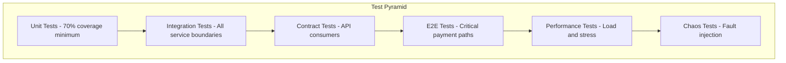

### 9.2 Acceptance Criteria Checklist

#### 9.2.1 Payment Lifecycle (Must Pass: 100%)

| ID | Test Case | Expected Result |
|----|-----------|-----------------|
| PL-001 | Create payment with valid card | Payment in AUTHORIZED state |
| PL-002 | Create payment with invalid card number | 400 error |
| PL-003 | Create payment with expired card | 402 with `expired_card` |
| PL-004 | Create payment with insufficient funds | 402 with `insufficient_funds` |
| PL-005 | Capture authorized payment | CAPTURED state |
| PL-006 | Capture with amount > authorized | 422 error |
| PL-007 | Capture already captured payment | Idempotent success |
| PL-008 | Void authorized payment | VOIDED state |
| PL-009 | Void captured payment | 409 error |
| PL-010 | Full refund | REFUNDED state |
| PL-011 | Partial refund | PARTIAL_REFUNDED state |
| PL-012 | Refund more than captured | 422 error |
| PL-013 | Auth expires after 7 days | AUTH_EXPIRED state |
| PL-014 | 3DS flow completes | REQUIRES_ACTION then AUTHORIZED |
| PL-015 | 3DS times out | EXPIRED state |

#### 9.2.2 Idempotency (Must Pass: 100%)

| ID | Test Case | Expected Result |
|----|-----------|-----------------|
| ID-001 | Retry with same key + same params | Cached response, no PSP call |
| ID-002 | Retry with same key + different params | 409 Conflict |
| ID-003 | Retry while original in progress | Block, then return result or pending |
| ID-004 | Key reuse after 24 hours | New payment created |
| ID-005 | Different merchants, same key | Independent payments |

#### 9.2.3 Concurrency & Race Conditions (Must Pass: 100%)

| ID | Test Case | Expected Result |
|----|-----------|-----------------|
| RC-001 | Simultaneous capture + void | Exactly one succeeds, other gets 409 |
| RC-002 | Double capture (same millisecond) | First succeeds, second idempotent |
| RC-003 | 100 concurrent requests same payment | Exactly one state change |

#### 9.2.4 Failure Recovery (Must Pass: 100%)

| ID | Test Case | Expected Result |
|----|-----------|-----------------|
| FR-001 | PSP timeout during auth | PROCESSING then recovery job resolves |
| FR-002 | PSP timeout during capture | CAPTURING then recovery job resolves |
| FR-003 | Database failover during transaction | Transaction rolled back, client retries |
| FR-004 | Application node crash | Other nodes take over, no data loss |

#### 9.2.5 Routing & Failover (Must Pass: 100%)

| ID | Test Case | Expected Result |
|----|-----------|-----------------|
| RF-001 | Primary PSP returns 503 | Automatic failover to secondary |
| RF-002 | PSP error rate exceeds threshold | Circuit opens |
| RF-003 | All PSPs unavailable | 503 to merchant with retry-after |

#### 9.2.6 Ledger Integrity (Must Pass: 100%)

| ID | Test Case | Expected Result |
|----|-----------|-----------------|
| LI-001 | Every financial operation creates balanced entries | SUM(debits) = SUM(credits) per journal |
| LI-002 | Ledger UPDATE attempted | Rejected (append-only) |
| LI-003 | Ledger DELETE attempted | Rejected (immutable) |
| LI-004 | Daily reconciliation vs PSP | 100% match rate |

#### 9.2.7 Multi-Region & Distributed Systems (Must Pass: 100%)

| ID | Test Case | Expected Result |
|----|-----------|-----------------|
| MR-001 | Cross-border payment (EU merchant, US card) | PAN stays in EU, PSP via US, success |
| MR-002 | Regional failover: read request | Failover region serves read |
| MR-003 | Regional failover: write request | No duplicate charge |
| MR-004 | Network partition between regions | Per-operation CAP decisions applied |
| MR-005 | Read-after-write same merchant | Payment visible immediately |
| MR-006 | Post-partition reconciliation | All conflicts identified within 1 hour |
| MR-007 | Cross-region idempotency key | Same key honored regardless of region |
| MR-008 | Merchant migration US to EU | Zero downtime |

#### 9.2.8 High-Volume Scenarios (Must Pass: 100%)

| ID | Test Case | Expected Result |
|----|-----------|-----------------|
| HV-001 | Flash sale: single merchant 100x spike | Other merchants unaffected |
| HV-002 | Dashboard query: 50M txn/month merchant | < 5 seconds (paginated) |
| HV-003 | Webhook endpoint slow | Backlog isolated to that merchant |
| HV-004 | Bulk refund: 10,000 payments | Completed with progress tracking |
| HV-005 | Midnight reconciliation: all merchants | All queries < 5 seconds |

#### 9.2.9 Security (Must Pass: 100%)

| ID | Test Case | Expected Result |
|----|-----------|-----------------|
| SE-001 | PAN appears in any log | Never (tokenized before logging) |
| SE-002 | CVV stored anywhere | Never |
| SE-003 | Invalid API key | 401 |
| SE-004 | Cross-merchant token usage | 404 |
| SE-005 | Rate limit exceeded | 429 with retry-after |

#### 9.2.10 Data Evolution (Must Pass: 100%)

| ID | Test Case | Expected Result |
|----|-----------|-----------------|
| DE-001 | New field added to payment response | Old clients unaffected (backward compatible) |
| DE-002 | Rolling deploy: old and new code coexist | Both read/write data correctly |
| DE-003 | Event log replay after schema change | Events still deserializable |

### 9.3 Performance Test Scenarios

| Scenario | Duration | Load Profile | Success Criteria |
|----------|----------|--------------|------------------|
| Baseline | 1 hour | 10,000 TPS constant | P99 < 500ms, Error rate < 0.01% |
| Ramp-up | 30 min | 1k to 50k TPS linear | No errors during scale |
| Flash sale | 10 min | 50k TPS constant | P99 < 800ms |
| Burst | 10 sec | 100k TPS spike | No dropped requests |
| Endurance | 24 hours | 20k TPS constant | No memory leaks, stable latency |
| Failover under load | 1 hour | 30k TPS with PSP kill | < 1% error rate during failover |

### 9.4 Chaos Engineering Tests

| Test | Injection | Expected Behavior | Learning Focus |
|------|-----------|-------------------|----------------|
| PSP network partition | Block traffic to primary PSP | Route to secondary within 5s | Fault tolerance |
| Database leader failure | Kill primary DB node | Replica promoted, no data loss | Replication, failover |
| Application node crash | Kill random node | Load redistributed | Stateless design |
| Full AZ failure | Disable availability zone | Traffic to other AZ | High availability |
| Cross-region partition | Block traffic between US and EU | Per-operation CAP decisions | CAP theorem |
| Replication lag simulation | Introduce delay on replicas | Read-your-writes maintained | Consistency |
| Split-brain scenario | Both regions believe they are primary | Conflict detection fires | Consensus |
| Hot partition simulation | 90% traffic to single shard | Graceful degradation or rebalancing | Partitioning |
| Clock skew | Introduce clock drift | System detects and handles | Distributed clocks |
| Webhook queue overflow | Fill queue for one merchant | Other merchants unaffected | Isolation |
| Long-running transaction | Hold locks for extended time | Deadlock detection, rollback | Transactions |
| Recovery worker partition | Worker can't reach PSP | Backoff, no infinite retry | Failure handling |

### 9.5 Sign-off Criteria

**Feature cannot ship unless ALL of the following are true:**

1. All acceptance criteria tests pass (100%)
2. Performance baseline met under load
3. Chaos tests pass with no data loss
4. Security scan: no critical/high vulnerabilities
5. API documentation complete and reviewed
6. Runbook for all P1 scenarios reviewed
7. Monitoring dashboards operational
8. Alerts configured for all SLO violations
9. Rollback procedure tested

---

## Appendix A: Glossary Quick Reference

| Acronym | Full Form |
|---------|-----------|
| PSP | Payment Service Provider |
| PAN | Primary Account Number |
| 3DS | 3D Secure |
| TPS | Transactions Per Second |
| RPO | Recovery Point Objective |
| RTO | Recovery Time Objective |
| HSM | Hardware Security Module |
| AZ | Availability Zone |
| CDE | Cardholder Data Environment |
| CDC | Change Data Capture |
| SLO | Service Level Objective |
| SLA | Service Level Agreement |

## Appendix B: Document History

| Version | Date | Changes |
|---------|------|---------|
| 1.0 | 2026-01-15 | First draft |
| 2.0 | 2026-02-04 | Complete restructure per learning goals |
| 3.0 | 2026-02-07 | Separated concerns (PRD vs TRD). Added: NFR/SLO spec, system constraints, data requirements, traffic forecasts, security requirements. Added analytics/derived data and schema evolution requirements. Removed implementation details (moved to TRD) |
