# Product Requirement Document: Catena Core Platform

**Version:** 2.1  
**Last Updated:** 2026-02-04  
**Scope:** Core Payment Switch, Ledger & Reconciliation  
**Status:** Draft for Engineering Review  
**Related Documents:** [Technical Requirements Document (TRD.md)](TRD.md)

---

## Table of Contents

1. [Business Context & Problem Statement](#1-business-context--problem-statement)
2. [User Personas](#2-user-personas)
3. [Functional Requirements](#3-functional-requirements)
   - [3.1 Domain Model & Glossary](#31-domain-model--glossary)
   - [3.2 Payment Lifecycle (State Machine)](#32-payment-lifecycle-state-machine)
   - [3.3 Core Capabilities](#33-core-capabilities)
   - [3.4 End-to-End Flows](#34-end-to-end-flows)
   - [3.5 API Contracts](#35-api-contracts)
   - [3.6 Event & Webhook System](#36-event--webhook-system)
   - [3.7 Reconciliation & Settlement](#37-reconciliation--settlement)
   - [3.8 Multi-Region & Global Operations](#38-multi-region--global-operations)
   - [3.9 High-Volume Merchant Scenarios](#39-high-volume-merchant-scenarios)
4. [Non-Functional Requirements](#4-non-functional-requirements)
5. [Testing Plan & Acceptance Criteria](#5-testing-plan--acceptance-criteria)

---

## 1. Business Context & Problem Statement

### 1.1 The Problem

Online commerce is global, but banking infrastructure is fragmented and local. When a merchant in Germany sells to a customer in India, the transaction traverses multiple systems:

```
┌─────────────┐    ┌─────────────┐    ┌─────────────┐    ┌─────────────┐
│  Merchant   │───▶│   Gateway   │───▶│  Acquirer   │───▶│ Card Network│
│  (Germany)  │    │   (???)     │    │   (India)   │    │ (Visa/MC)   │
└─────────────┘    └─────────────┘    └─────────────┘    └─────────────┘
```

**Current Pain Points:**

| Problem | Impact | Frequency |
|---------|--------|-----------|
| Network timeouts during authorization | Customer charged but merchant unaware → duplicate charges or lost sales | 2-5% of cross-border transactions |
| Single gateway dependency | Complete outage during provider incidents | 3-4 major incidents/year/provider |
| No intelligent routing | Higher interchange fees, lower auth rates | Every transaction |
| Black-box failures | "Payment failed" with no actionable reason → customer abandonment | 15-30% of declines are recoverable |
| Flash sale collapse | Systems crumble under 10x traffic spikes | Every major sale event |
| Ledger inconsistencies | Money "disappears" between systems → manual reconciliation | 0.01-0.1% of transactions |

### 1.2 The Solution

**Catena** is a payment orchestration platform that acts as an intelligent routing layer between merchants and the fragmented banking ecosystem.

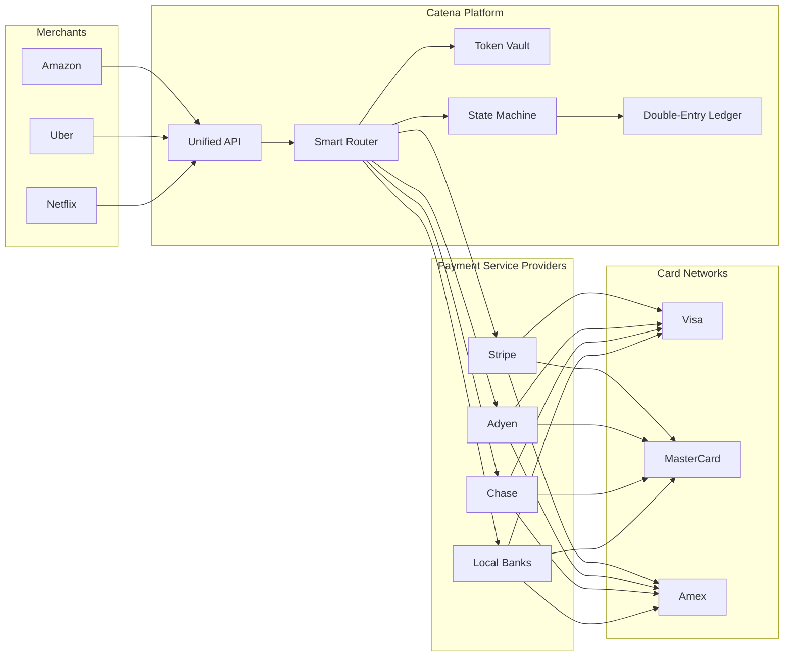
```mermaid
flowchart LR
    subgraph Merchants
        M1[Amazon]
        M2[Uber]
        M3[Netflix]
    end
    
    subgraph Catena["Catena Platform"]
        API[Unified API]
        Router[Smart Router]
        Vault[Token Vault]
        Ledger[Double-Entry Ledger]
        SM[State Machine]
    end
    
    subgraph PSPs["Payment Service Providers"]
        P1[Stripe]
        P2[Adyen]
        P3[Chase]
        P4[Local Banks]
    end
    
    subgraph Networks["Card Networks"]
        N1[Visa]
        N2[MasterCard]
        N3[Amex]
    end
    
    M1 & M2 & M3 --> API
    API --> Router
    Router --> Vault
    Router --> SM
    SM --> Ledger
    Router --> P1 & P2 & P3 & P4
    P1 & P2 & P3 & P4 --> N1 & N2 & N3
```

### 1.3 Core Value Propositions

| Value | Description | Measurable Outcome |
|-------|-------------|-------------------|
| **Reliability** | Multi-provider failover with automatic rerouting | 99.99% effective availability (vs 99.9% single-provider) |
| **Optimization** | Cost-based and success-rate-based routing | +5% authorization rate uplift, -15% interchange costs |
| **Consistency** | Double-entry ledger with guaranteed reconciliation | 100% ledger-to-bank match rate |
| **Transparency** | Structured decline reasons and real-time status | 40% reduction in support tickets |
| **Scale** | Elastic infrastructure for burst traffic | 50,000 TPS peak capacity |

### 1.4 System Actors

| Actor | Type | Responsibility |
|-------|------|----------------|
| **Merchant System** | External (Upstream) | Initiates payment requests, receives webhooks, queries status |
| **Catena Platform** | Internal | Orchestrates, routes, records, and reconciles all transactions |
| **Payment Service Provider (PSP)** | External (Downstream) | Connects to card networks, processes authorizations |
| **Card Network** | External (Downstream) | Visa/MasterCard/Amex schemes that route to issuing banks |
| **Issuing Bank** | External (Downstream) | Customer's bank that approves/declines the transaction |

### 1.5 Business KPIs

These are business-level success metrics (distinct from technical NFRs in Section 4):

| KPI | Target | Measurement Method |
|-----|--------|-------------------|
| Authorization Rate | ≥95% for domestic, ≥85% for cross-border | (Successful auths / Total auth attempts) × 100 |
| Routing Optimization Savings | ≥15% cost reduction vs single-provider | Comparison of actual interchange vs baseline |
| Merchant Integration Time | ≤5 business days to first transaction | Time from API key issuance to first live payment |
| Reconciliation Accuracy | 100% match rate | (Matched transactions / Total transactions) × 100 |
| Dispute Rate | ≤0.1% of transactions | (Disputes / Total captured transactions) × 100 |

---

## 2. User Personas

### 2.1 Primary Personas

#### Persona 1: Enterprise Integration Engineer (Merchant Developer)

| Attribute | Description |
|-----------|-------------|
| **Role** | Backend engineer at a high-volume merchant (Nike, Shopify, Ticketmaster) |
| **Technical Level** | Senior engineer, comfortable with REST APIs, webhooks, distributed systems |
| **Goals** | Integrate payments with minimal friction, handle edge cases gracefully, debug issues quickly |
| **Frustrations** | Undocumented error codes, inconsistent webhook delivery, no sandbox for edge cases |

**Key Jobs-to-be-Done:**
1. Integrate Catena API into checkout flow within 1 sprint
2. Handle payment failures gracefully with actionable error messages
3. Implement idempotent retry logic for network failures
4. Set up webhook receivers with proper acknowledgment
5. Query transaction status when webhooks are missed

#### Persona 2: Financial Controller (Merchant Finance Team)

| Attribute | Description |
|-----------|-------------|
| **Role** | Head of Payments / CFO at merchant organization |
| **Technical Level** | Non-technical, relies on dashboards and CSV exports |
| **Goals** | Accurate daily reconciliation, minimize chargebacks, optimize payment costs |
| **Frustrations** | Discrepancies between systems, delayed settlement reports, opaque fees |

**Key Jobs-to-be-Done:**
1. Download daily settlement reports by 9 AM local time
2. Identify and resolve discrepancies within 24 hours
3. Track interchange costs by card type and region
4. Monitor chargeback rates by merchant category
5. Generate audit-ready transaction logs

#### Persona 3: Platform Operations Engineer (Catena Internal)

| Attribute | Description |
|-----------|-------------|
| **Role** | SRE/DevOps engineer responsible for Catena platform health |
| **Technical Level** | Expert in distributed systems, observability, incident response |
| **Goals** | Maintain 99.99% uptime, detect anomalies before they impact merchants, rapid incident resolution |
| **Frustrations** | Alert fatigue, incomplete traces, unclear runbooks |

**Key Jobs-to-be-Done:**
1. Detect PSP degradation within 30 seconds
2. Execute automatic failover without manual intervention
3. Trace any transaction across all services within 2 minutes
4. Generate incident post-mortems with root cause analysis

#### Persona 4: Compliance Officer (Catena Internal)

| Attribute | Description |
|-----------|-------------|
| **Role** | Data protection and PCI-DSS compliance auditor |
| **Technical Level** | Moderate technical understanding, expert in regulatory frameworks |
| **Goals** | Maintain PCI-DSS Level 1 certification, ensure GDPR compliance, pass audits |
| **Frustrations** | Unclear data flows, missing access logs, cross-border data transfers |

**Key Jobs-to-be-Done:**
1. Demonstrate PAN isolation during annual PCI audit
2. Respond to GDPR data subject access requests within 72 hours
3. Verify data residency compliance for EU transactions
4. Generate access logs for any sensitive operation

### 2.2 Secondary Personas

#### Persona 5: End Customer (Shopper)

| Attribute | Description |
|-----------|-------------|
| **Role** | Consumer making a purchase on a merchant website |
| **Technical Level** | Non-technical |
| **Goals** | Complete purchase quickly, understand why payment failed (if it fails) |
| **Frustrations** | Generic "Payment failed" messages, being charged twice, slow redirects |

*Note: End customers never interact with Catena directly. They interact with the merchant's checkout UI. However, Catena's behavior directly impacts their experience through response times, decline reasons, and 3DS flows.*

---

## 3. Functional Requirements

### 3.1 Domain Model & Glossary

#### 3.1.1 Core Entities

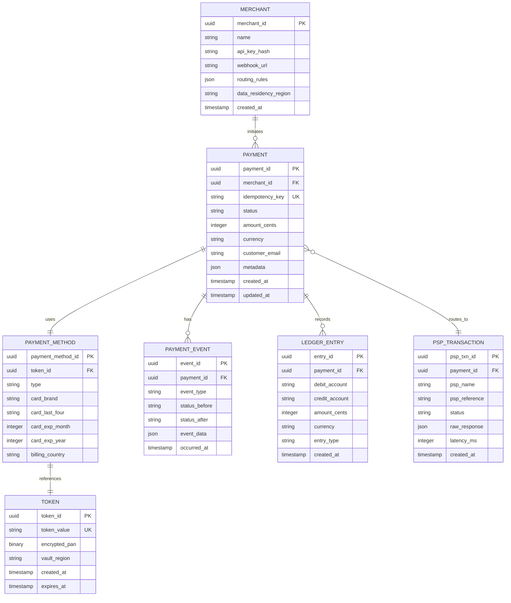
```mermaid
erDiagram
    MERCHANT ||--o{ PAYMENT : initiates
    PAYMENT ||--|| PAYMENT_METHOD : uses
    PAYMENT ||--o{ PAYMENT_EVENT : has
    PAYMENT ||--o{ LEDGER_ENTRY : records
    PAYMENT }o--|| PSP_TRANSACTION : routes_to
    PAYMENT_METHOD ||--|| TOKEN : references
    
    MERCHANT {
        uuid merchant_id PK
        string name
        string api_key_hash
        string webhook_url
        json routing_rules
        string data_residency_region
        timestamp created_at
    }
    
    PAYMENT {
        uuid payment_id PK
        uuid merchant_id FK
        string idempotency_key UK
        string status
        integer amount_cents
        string currency
        string customer_email
        json metadata
        timestamp created_at
        timestamp updated_at
    }
    
    PAYMENT_METHOD {
        uuid payment_method_id PK
        uuid token_id FK
        string type
        string card_brand
        string card_last_four
        integer card_exp_month
        integer card_exp_year
        string billing_country
    }
    
    TOKEN {
        uuid token_id PK
        string token_value UK
        binary encrypted_pan
        string vault_region
        timestamp created_at
        timestamp expires_at
    }
    
    PAYMENT_EVENT {
        uuid event_id PK
        uuid payment_id FK
        string event_type
        string status_before
        string status_after
        json event_data
        timestamp occurred_at
    }
    
    LEDGER_ENTRY {
        uuid entry_id PK
        uuid payment_id FK
        string debit_account
        string credit_account
        integer amount_cents
        string currency
        string entry_type
        timestamp created_at
    }
    
    PSP_TRANSACTION {
        uuid psp_txn_id PK
        uuid payment_id FK
        string psp_name
        string psp_reference
        string status
        json raw_response
        integer latency_ms
        timestamp created_at
    }
```

#### 3.1.2 Glossary of Terms

| Term | Definition | Example |
|------|------------|---------|
| **Payment** | A single financial transaction representing a customer's intent to pay | `pay_8hf93hf9h3f` |
| **Authorization (Auth)** | Bank's approval to reserve funds on customer's card; funds not yet transferred | Auth for $100 holds funds for 7 days |
| **Capture** | Request to transfer previously authorized funds from customer to merchant | Capturing $100 after shipping goods |
| **Void** | Cancellation of an authorization before capture; releases held funds | Voiding auth when order is cancelled |
| **Refund** | Return of captured funds to customer | Refunding $50 for returned item |
| **Chargeback** | Customer disputes transaction through their bank; forced reversal | Customer claims fraud, bank reverses payment |
| **PSP (Payment Service Provider)** | Third-party that processes payments and connects to card networks | Stripe, Adyen, Chase Paymentech |
| **Acquirer** | Bank that processes card transactions on behalf of merchant | Chase, Wells Fargo |
| **Issuer** | Customer's bank that issued their card | Bank of America, Citi |
| **Interchange Fee** | Fee paid by acquirer to issuer for each transaction | 1.5% + $0.10 per transaction |
| **PAN (Primary Account Number)** | The 16-digit card number | 4111111111111111 |
| **Token** | Non-sensitive substitute for PAN used within Catena | `tok_visa_4242_exp1225` |
| **Idempotency Key** | Client-provided unique identifier to prevent duplicate processing | `order_123_attempt_1` |
| **3D Secure (3DS)** | Two-factor authentication protocol for card payments | SMS code sent by bank |
| **Settlement** | Actual transfer of funds between banks (T+1 to T+3) | Funds deposited in merchant account |

#### 3.1.3 Currency Handling

All monetary amounts in Catena are represented as integers in the **smallest currency unit**:

| Currency | Smallest Unit | $10.00 Representation |
|----------|--------------|----------------------|
| USD | Cent | `1000` |
| EUR | Cent | `1000` |
| GBP | Penny | `1000` |
| JPY | Yen | `10` (no subunit) |
| BHD | Fils | `10000` (3 decimal places) |

**Rule:** API consumers must convert display amounts to smallest-unit integers before API calls. Catena never accepts or returns floating-point monetary values.

---

### 3.2 Payment Lifecycle (State Machine)

#### 3.2.1 State Definitions

| State | Description | Terminal? | Allowed Transitions |
|-------|-------------|-----------|---------------------|
| `CREATED` | Payment record created, not yet submitted to PSP | No | `PROCESSING`, `CANCELLED` |
| `PROCESSING` | Submitted to PSP, awaiting response | No | `REQUIRES_ACTION`, `AUTHORIZED`, `FAILED` |
| `REQUIRES_ACTION` | Awaiting customer action (e.g., 3DS authentication) | No | `PROCESSING`, `FAILED`, `EXPIRED` |
| `AUTHORIZED` | Funds reserved on customer's card | No | `CAPTURING`, `VOIDED`, `AUTH_EXPIRED` |
| `CAPTURING` | Capture request submitted to PSP | No | `CAPTURED`, `CAPTURE_FAILED` |
| `CAPTURED` | Funds transferred to merchant (pending settlement) | Yes* | `REFUNDING`, `DISPUTED` |
| `VOIDED` | Authorization cancelled, funds released | Yes | None |
| `FAILED` | Payment definitively failed (non-retryable) | Yes | None |
| `EXPIRED` | Customer action timeout or auth expiration | Yes | None |
| `REFUNDING` | Refund request submitted to PSP | No | `REFUNDED`, `PARTIAL_REFUNDED`, `REFUND_FAILED` |
| `REFUNDED` | Full refund completed | Yes | None |
| `PARTIAL_REFUNDED` | Partial refund completed, remaining balance captured | Yes* | `REFUNDING` |
| `DISPUTED` | Chargeback initiated by customer's bank | No | `DISPUTE_WON`, `DISPUTE_LOST` |

*Terminal for primary flow, but can transition for post-capture events.

#### 3.2.2 State Machine Diagram

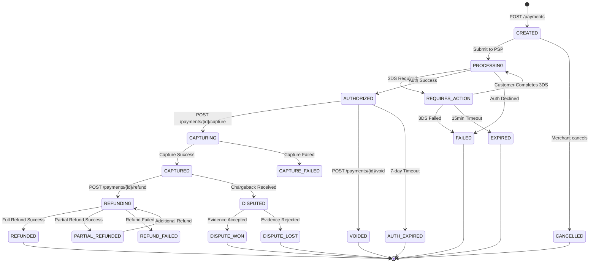
```mermaid
stateDiagram-v2
    [*] --> CREATED: POST /payments
    
    CREATED --> PROCESSING: Submit to PSP
    CREATED --> CANCELLED: Merchant cancels
    
    PROCESSING --> REQUIRES_ACTION: 3DS Required
    PROCESSING --> AUTHORIZED: Auth Success
    PROCESSING --> FAILED: Auth Declined
    
    REQUIRES_ACTION --> PROCESSING: Customer Completes 3DS
    REQUIRES_ACTION --> FAILED: 3DS Failed
    REQUIRES_ACTION --> EXPIRED: 15min Timeout
    
    AUTHORIZED --> CAPTURING: POST /payments/{id}/capture
    AUTHORIZED --> VOIDED: POST /payments/{id}/void
    AUTHORIZED --> AUTH_EXPIRED: 7-day Timeout
    
    CAPTURING --> CAPTURED: Capture Success
    CAPTURING --> CAPTURE_FAILED: Capture Failed
    
    CAPTURED --> REFUNDING: POST /payments/{id}/refund
    CAPTURED --> DISPUTED: Chargeback Received
    
    REFUNDING --> REFUNDED: Full Refund Success
    REFUNDING --> PARTIAL_REFUNDED: Partial Refund Success
    REFUNDING --> REFUND_FAILED: Refund Failed
    
    PARTIAL_REFUNDED --> REFUNDING: Additional Refund
    
    DISPUTED --> DISPUTE_WON: Evidence Accepted
    DISPUTED --> DISPUTE_LOST: Evidence Rejected
    
    CANCELLED --> [*]
    VOIDED --> [*]
    FAILED --> [*]
    EXPIRED --> [*]
    AUTH_EXPIRED --> [*]
    REFUNDED --> [*]
    DISPUTE_WON --> [*]
    DISPUTE_LOST --> [*]
```

#### 3.2.3 State Transition Rules

**Invariant 1: No State Skipping**
A payment MUST pass through intermediate states. Direct transitions like `CREATED → CAPTURED` are forbidden.

**Invariant 2: Terminal State Immutability**
Once a payment reaches a terminal state (except `CAPTURED`), no further state changes are permitted. The only exception is `CAPTURED`, which can transition to `REFUNDING` or `DISPUTED`.

**Invariant 3: Concurrent Transition Protection**
Only one state transition may be in progress at any time. Concurrent requests (e.g., simultaneous `capture` and `void`) must be serialized via distributed locking.

**Transition Failure Handling:**

| Scenario | Current State | Action | Behavior |
|----------|--------------|--------|----------|
| Capture timeout | `AUTHORIZED` | Capture request sent, no response | Transition to `CAPTURING`, background job polls PSP |
| Void during capture | `CAPTURING` | Void requested | Return `409 Conflict` - cannot void during capture |
| Refund on voided | `VOIDED` | Refund requested | Return `422 Unprocessable` - no funds to refund |
| Double capture | `CAPTURED` | Capture requested | Return idempotent success with original response |

---

### 3.3 Core Capabilities

#### 3.3.1 Idempotency Engine

**Purpose:** Ensure exactly-once processing semantics for payment operations despite network failures, client retries, or distributed system partitions.

**Requirements:**

| Requirement ID | Requirement | Acceptance Criteria |
|----------------|-------------|---------------------|
| IDEM-001 | System MUST accept `Idempotency-Key` header on all mutating endpoints | All POST/PUT/DELETE endpoints accept the header |
| IDEM-002 | Key format: 1-256 characters, alphanumeric plus `-` and `_` | Regex: `^[a-zA-Z0-9_-]{1,256}$` |
| IDEM-003 | Keys are scoped to merchant (same key, different merchants = different operations) | Composite key: `(merchant_id, idempotency_key)` |
| IDEM-004 | Key TTL: 24 hours from first use | After 24h, same key creates new operation |
| IDEM-005 | Matching key + matching params = return cached response | Response body, status code, and headers identical |
| IDEM-006 | Matching key + different params = return `409 Conflict` | Error includes original params hash for debugging |
| IDEM-007 | Matching key + operation in-progress = block up to 30s, then return current state | Client receives either completed result or `202 Accepted` |
| IDEM-008 | Idempotency must work across regional failovers | If Region A fails mid-request, retry to Region B must recognize the key |

**Idempotency Decision Tree:**

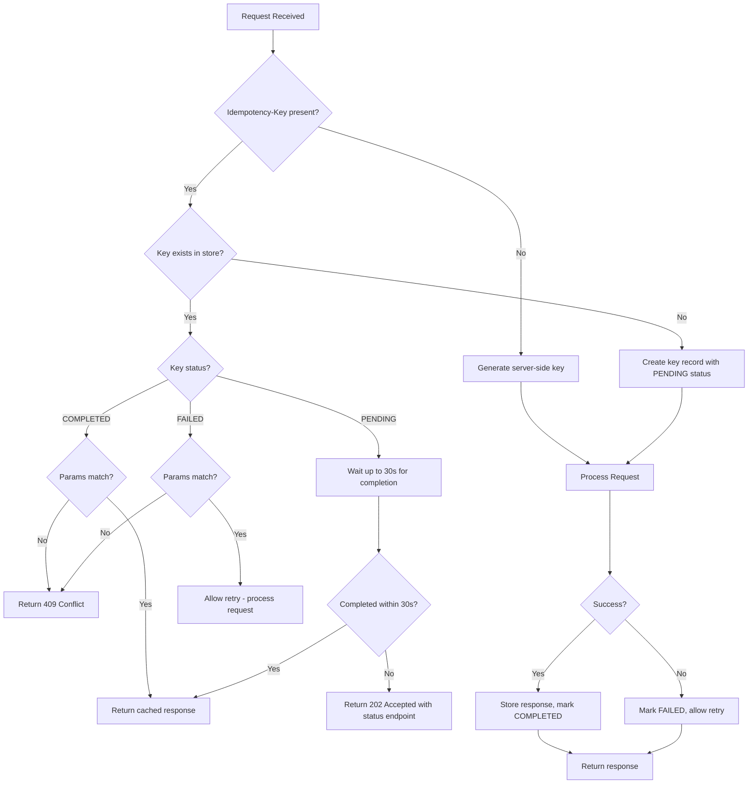
```mermaid
flowchart TD
    A[Request Received] --> B{Idempotency-Key present?}
    B -->|No| C[Generate server-side key]
    B -->|Yes| D{Key exists in store?}
    C --> E[Process Request]
    D -->|No| F[Create key record with PENDING status]
    F --> E
    D -->|Yes| G{Key status?}
    G -->|COMPLETED| H{Params match?}
    G -->|PENDING| I[Wait up to 30s for completion]
    G -->|FAILED| J{Params match?}
    H -->|Yes| K[Return cached response]
    H -->|No| L[Return 409 Conflict]
    I --> M{Completed within 30s?}
    M -->|Yes| K
    M -->|No| N[Return 202 Accepted with status endpoint]
    J -->|Yes| O[Allow retry - process request]
    J -->|No| L
    E --> P{Success?}
    P -->|Yes| Q[Store response, mark COMPLETED]
    P -->|No| R[Mark FAILED, allow retry]
    Q --> S[Return response]
    R --> S
```

> **Technical Details:** See [TRD Section 1.1 - Idempotency Key Storage](TRD.md#11-idempotency-key-storage) for schema and implementation considerations.

#### 3.3.2 Token Vault (PCI-DSS Compliance)

**Purpose:** Isolate sensitive cardholder data (PAN, CVV) in a separate security domain, providing tokens for internal use.

**Architecture:**

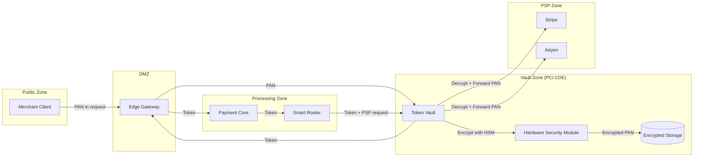
```mermaid
flowchart LR
    subgraph "Public Zone"
        Client[Merchant Client]
    end
    
    subgraph "DMZ"
        Edge[Edge Gateway]
    end
    
    subgraph "Processing Zone"
        Core[Payment Core]
        Router[Smart Router]
    end
    
    subgraph "Vault Zone (PCI CDE)"
        Vault[Token Vault]
        HSM[Hardware Security Module]
        VaultDB[(Encrypted Storage)]
    end
    
    subgraph "PSP Zone"
        PSP1[Stripe]
        PSP2[Adyen]
    end
    
    Client -->|PAN in request| Edge
    Edge -->|PAN| Vault
    Vault -->|Encrypt with HSM| HSM
    HSM -->|Encrypted PAN| VaultDB
    Vault -->|Token| Edge
    Edge -->|Token| Core
    Core -->|Token| Router
    Router -->|Token + PSP request| Vault
    Vault -->|Decrypt + Forward PAN| PSP1
    Vault -->|Decrypt + Forward PAN| PSP2
```

**Requirements:**

| Requirement ID | Requirement | Acceptance Criteria |
|----------------|-------------|---------------------|
| VAULT-001 | PAN enters system only at Edge Gateway | No PAN in any log, metric, or trace outside Vault |
| VAULT-002 | Token format: `tok_{brand}_{last4}_exp{MMYY}_{random}` | Example: `tok_visa_4242_exp1225_k8f9h3` |
| VAULT-003 | Tokens are merchant-scoped (cannot be used across merchants) | Token includes encrypted merchant_id |
| VAULT-004 | CVV never stored, only forwarded in same request | CVV exists in memory for <100ms |
| VAULT-005 | Vault zone has dedicated network segment with firewall rules | Only Edge and Router can reach Vault |
| VAULT-006 | All PAN storage encrypted with HSM-managed keys | AES-256-GCM with key rotation every 90 days |
| VAULT-007 | Token lookup latency P99 < 10ms | Measured at Vault service boundary |
| VAULT-008 | Token expiration matches card expiration | Token unusable after card expires |
| VAULT-009 | Vault must remain available even if one region is completely offline | Regional isolation with cross-region token resolution |

**Token Lifecycle:**

| Event | Token State | Action |
|-------|-------------|--------|
| Card tokenized | ACTIVE | Token usable for payments |
| Card updated (new expiry) | ACTIVE | New token created, old token deprecated |
| Card deleted by customer | DELETED | Token returns "not found" |
| Card expired | EXPIRED | Token returns "card expired" |
| Fraud detected | BLOCKED | Token returns "card blocked" |

> **Technical Details:** See [TRD Section 3.2 - Token Vault Architecture](TRD.md#32-token-vault-architecture) for infrastructure specifications.

#### 3.3.3 Smart Router

**Purpose:** Select optimal PSP for each transaction based on cost, success rate, latency, and availability.

**Routing Decision Factors:**

| Factor | Weight | Data Source | Update Frequency |
|--------|--------|-------------|------------------|
| PSP Health Score | 30% | Real-time circuit breaker metrics | Continuous (1s window) |
| Historical Success Rate | 25% | Analytics DB (card brand × issuer × PSP) | Hourly |
| Interchange Cost | 25% | Static configuration + card BIN lookup | Daily |
| Latency P95 | 10% | Real-time metrics | Continuous (1m window) |
| Merchant Preference | 10% | Merchant routing rules | On change |

> **Technical Details:** See [TRD Section 2.1 - PSP Health Score Calculation](TRD.md#21-psp-health-score-calculation) for algorithm specification.

**Circuit Breaker Behavior:**

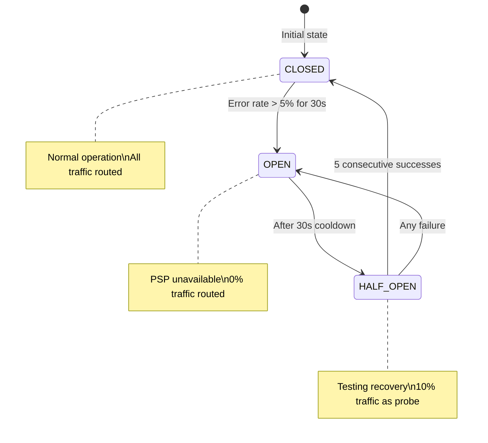
```mermaid
stateDiagram-v2
    [*] --> CLOSED: Initial state
    
    CLOSED --> OPEN: Error rate > 5% for 30s
    OPEN --> HALF_OPEN: After 30s cooldown
    HALF_OPEN --> CLOSED: 5 consecutive successes
    HALF_OPEN --> OPEN: Any failure
    
    note right of CLOSED: Normal operation\nAll traffic routed
    note right of OPEN: PSP unavailable\n0% traffic routed
    note right of HALF_OPEN: Testing recovery\n10% traffic as probe
```

**Routing Requirements:**

| Requirement ID | Requirement | Acceptance Criteria |
|----------------|-------------|---------------------|
| ROUTE-001 | Router selects PSP within 20ms | P99 routing decision time < 20ms |
| ROUTE-002 | Unhealthy PSP receives 0 traffic within 5s of detection | Circuit opens in ≤5s of threshold breach |
| ROUTE-003 | Merchant can override routing with PSP preference | `preferred_psp` field in request honored if PSP healthy |
| ROUTE-004 | Fallback PSP used if primary unavailable | At least 2 PSPs configured per card brand |
| ROUTE-005 | Routing decision logged for analytics | Every payment includes `routing_reason` in metadata |
| ROUTE-006 | Cost optimization saves ≥15% vs random routing | A/B test over 30 days shows savings |

**Retry Logic (Smart Retries):**

| PSP Response | Retryable? | Retry Behavior |
|--------------|------------|----------------|
| Network timeout | Yes | Retry same PSP once, then failover |
| Connection refused | Yes | Immediate failover to backup PSP |
| HTTP 500 Internal Error | Yes | Retry same PSP once after 100ms |
| HTTP 502/503/504 | Yes | Immediate failover to backup PSP |
| HTTP 400 Bad Request | No | Return error to merchant |
| HTTP 402 Requires Action | No | Return 3DS redirect to merchant |
| Decline: Insufficient Funds | No | Return structured decline |
| Decline: Stolen Card | No | Return structured decline, flag for fraud |
| Decline: Do Not Honor | Maybe | Retry on different PSP (different acquirer) |

#### 3.3.4 Double-Entry Ledger

**Purpose:** Maintain an immutable, auditable record of all financial movements with guaranteed consistency.

**Accounting Model:**

Every financial event creates exactly two ledger entries (debit and credit) that must balance:

| Account Type | Normal Balance | Examples |
|--------------|---------------|----------|
| Asset | Debit | `merchant_receivable`, `psp_settlement_pending` |
| Liability | Credit | `customer_payable`, `merchant_balance` |
| Revenue | Credit | `catena_fee_revenue` |
| Expense | Debit | `interchange_expense`, `chargeback_loss` |

**Standard Journal Entries:**

| Event | Debit Account | Credit Account | Amount |
|-------|---------------|----------------|--------|
| Authorization | `customer_auth_hold` | `merchant_pending_auth` | Full amount |
| Capture | `psp_settlement_pending` | `customer_auth_hold` | Full amount |
| Capture | `merchant_pending_auth` | `merchant_balance` | Full amount |
| Capture | `merchant_balance` | `catena_fee_revenue` | Catena fee |
| Void | `merchant_pending_auth` | `customer_auth_hold` | Full amount (reversal) |
| Refund | `merchant_balance` | `psp_settlement_pending` | Refund amount |
| Chargeback | `chargeback_loss` | `merchant_balance` | Dispute amount |

**Ledger Requirements:**

| Requirement ID | Requirement | Acceptance Criteria |
|----------------|-------------|---------------------|
| LEDGER-001 | All entries are append-only | No UPDATE or DELETE on ledger tables |
| LEDGER-002 | Every entry has a balancing counter-entry | `SUM(debits) = SUM(credits)` for each transaction |
| LEDGER-003 | Entries created atomically with state change | Single DB transaction for state + ledger |
| LEDGER-004 | Ledger queryable by time range and account | Index on `(account, created_at)` |
| LEDGER-005 | Running balance calculable in <100ms | Materialized view or cached balance |
| LEDGER-006 | Audit trail includes actor and reason | `created_by`, `reason` fields required |
| LEDGER-007 | Ledger must never show inconsistent state, even during regional failures | Strong consistency required for all writes |
| LEDGER-008 | Historical ledger queries must return point-in-time accurate data | No dirty reads or phantom reads |

> **Technical Details:** See [TRD Section 1.2 - Ledger Entry Schema](TRD.md#12-ledger-entry-schema) for database schema and constraints.

---

### 3.4 End-to-End Flows

#### 3.4.1 Flow 1: Simple Card Payment (Happy Path)

**Scenario:** Customer purchases $50 item on merchant website with a Visa card. No 3DS required. Single PSP attempt succeeds.

**Actors:** Merchant System, Catena, PSP (Stripe), Visa Network, Issuing Bank

**Preconditions:**
- Merchant has valid API credentials
- Customer has valid Visa card with sufficient funds
- PSP (Stripe) is healthy

**Sequence Diagram:**

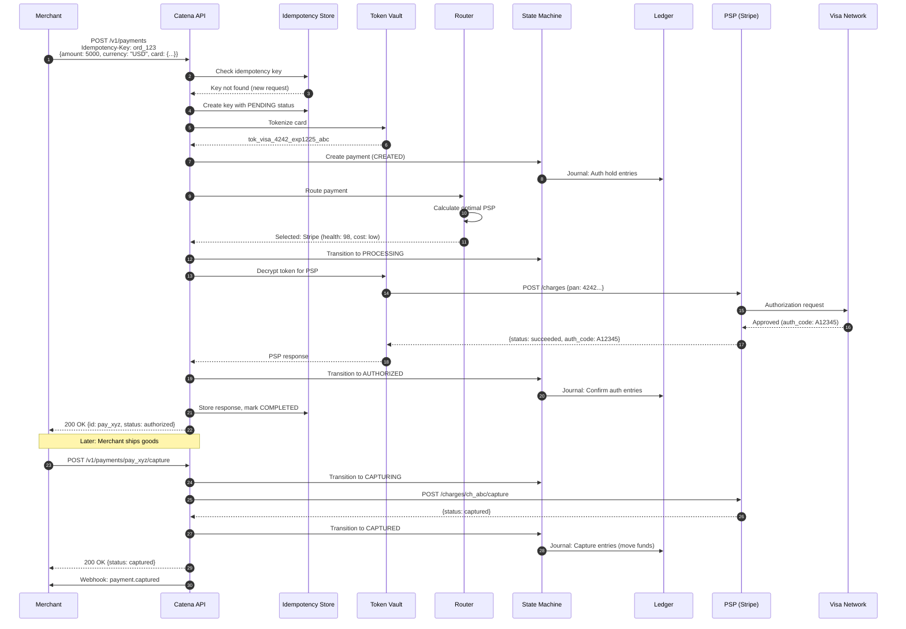
```mermaid
sequenceDiagram
    autonumber
    participant M as Merchant
    participant C as Catena API
    participant I as Idempotency Store
    participant V as Token Vault
    participant R as Router
    participant S as State Machine
    participant L as Ledger
    participant P as PSP (Stripe)
    participant N as Visa Network
    
    M->>C: POST /v1/payments<br/>Idempotency-Key: ord_123<br/>{amount: 5000, currency: "USD", card: {...}}
    C->>I: Check idempotency key
    I-->>C: Key not found (new request)
    C->>I: Create key with PENDING status
    C->>V: Tokenize card
    V-->>C: tok_visa_4242_exp1225_abc
    C->>S: Create payment (CREATED)
    S->>L: Journal: Auth hold entries
    C->>R: Route payment
    R->>R: Calculate optimal PSP
    R-->>C: Selected: Stripe (health: 98, cost: low)
    C->>S: Transition to PROCESSING
    C->>V: Decrypt token for PSP
    V->>P: POST /charges {pan: 4242...}
    P->>N: Authorization request
    N-->>P: Approved (auth_code: A12345)
    P-->>V: {status: succeeded, auth_code: A12345}
    V-->>C: PSP response
    C->>S: Transition to AUTHORIZED
    S->>L: Journal: Confirm auth entries
    C->>I: Store response, mark COMPLETED
    C-->>M: 200 OK {id: pay_xyz, status: authorized}
    
    Note over M,C: Later: Merchant ships goods
    
    M->>C: POST /v1/payments/pay_xyz/capture
    C->>S: Transition to CAPTURING
    C->>P: POST /charges/ch_abc/capture
    P-->>C: {status: captured}
    C->>S: Transition to CAPTURED
    S->>L: Journal: Capture entries (move funds)
    C-->>M: 200 OK {status: captured}
    C->>M: Webhook: payment.captured
```

**Request/Response Examples:**

**1. Create Payment Request:**
```http
POST /v1/payments HTTP/1.1
Host: api.catena.io
Authorization: Bearer sk_live_abc123
Idempotency-Key: ord_123_attempt_1
Content-Type: application/json

{
  "amount": 5000,
  "currency": "USD",
  "payment_method": {
    "type": "card",
    "card": {
      "number": "4242424242424242",
      "exp_month": 12,
      "exp_year": 2025,
      "cvc": "123"
    }
  },
  "customer": {
    "email": "customer@example.com"
  },
  "metadata": {
    "order_id": "ord_123"
  },
  "capture_method": "manual"
}
```

**2. Create Payment Response:**
```http
HTTP/1.1 200 OK
Content-Type: application/json
Idempotency-Key: ord_123_attempt_1
Request-Id: req_8hf93hf9h3f

{
  "id": "pay_xyz789",
  "object": "payment",
  "status": "authorized",
  "amount": 5000,
  "currency": "USD",
  "payment_method": {
    "id": "pm_abc123",
    "type": "card",
    "card": {
      "brand": "visa",
      "last4": "4242",
      "exp_month": 12,
      "exp_year": 2025,
      "funding": "credit",
      "country": "US"
    }
  },
  "customer_email": "customer@example.com",
  "metadata": {
    "order_id": "ord_123"
  },
  "created_at": "2026-02-04T10:30:00Z",
  "authorized_at": "2026-02-04T10:30:01Z",
  "captured_at": null,
  "capture_before": "2026-02-11T10:30:01Z",
  "routing": {
    "psp": "stripe",
    "psp_reference": "ch_abc123",
    "reason": "lowest_cost"
  }
}
```

**3. Capture Request:**
```http
POST /v1/payments/pay_xyz789/capture HTTP/1.1
Host: api.catena.io
Authorization: Bearer sk_live_abc123
Idempotency-Key: capture_ord_123

{
  "amount": 5000
}
```

**4. Capture Response:**
```http
HTTP/1.1 200 OK
Content-Type: application/json

{
  "id": "pay_xyz789",
  "status": "captured",
  "amount": 5000,
  "amount_captured": 5000,
  "captured_at": "2026-02-04T14:00:00Z"
}
```

**Ledger Entries Created:**

| Step | Journal ID | Account | Type | Amount | Reason |
|------|------------|---------|------|--------|--------|
| Auth | j_001 | `customer_auth_hold:pay_xyz` | DEBIT | $50.00 | Authorization approved |
| Auth | j_001 | `merchant_pending_auth:m_abc` | CREDIT | $50.00 | Authorization approved |
| Capture | j_002 | `psp_settlement:stripe` | DEBIT | $50.00 | Capture confirmed |
| Capture | j_002 | `customer_auth_hold:pay_xyz` | CREDIT | $50.00 | Auth hold released |
| Capture | j_002 | `merchant_pending_auth:m_abc` | DEBIT | $50.00 | Pending auth cleared |
| Capture | j_002 | `merchant_balance:m_abc` | CREDIT | $48.55 | Net after fees |
| Capture | j_002 | `catena_fee_revenue` | CREDIT | $1.45 | 2.9% processing fee |

---

#### 3.4.2 Flow 2: Payment with 3D Secure (Happy Path)

**Scenario:** Customer's bank requires 3DS authentication. Customer completes authentication successfully.

**Sequence Diagram:**

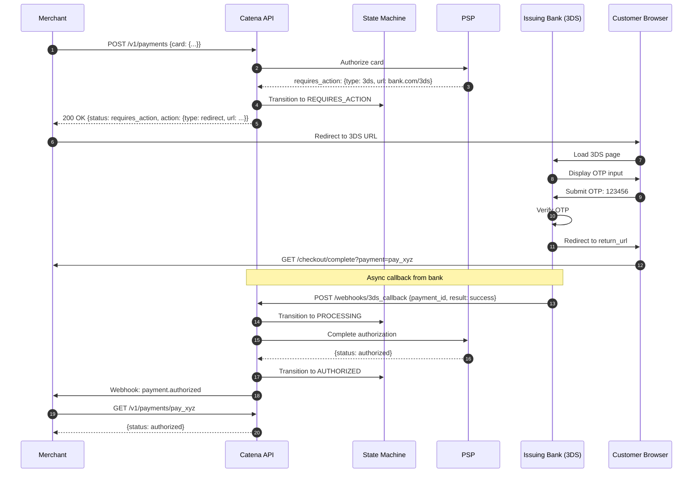
```mermaid
sequenceDiagram
    autonumber
    participant M as Merchant
    participant C as Catena API
    participant S as State Machine
    participant P as PSP
    participant B as Issuing Bank (3DS)
    participant U as Customer Browser
    
    M->>C: POST /v1/payments {card: {...}}
    C->>P: Authorize card
    P-->>C: requires_action: {type: 3ds, url: bank.com/3ds}
    C->>S: Transition to REQUIRES_ACTION
    C-->>M: 200 OK {status: requires_action, action: {type: redirect, url: ...}}
    
    M->>U: Redirect to 3DS URL
    U->>B: Load 3DS page
    B->>U: Display OTP input
    U->>B: Submit OTP: 123456
    B->>B: Verify OTP
    B->>U: Redirect to return_url
    U->>M: GET /checkout/complete?payment=pay_xyz
    
    Note over B,C: Async callback from bank
    B->>C: POST /webhooks/3ds_callback {payment_id, result: success}
    C->>S: Transition to PROCESSING
    C->>P: Complete authorization
    P-->>C: {status: authorized}
    C->>S: Transition to AUTHORIZED
    C->>M: Webhook: payment.authorized
    
    M->>C: GET /v1/payments/pay_xyz
    C-->>M: {status: authorized}
```

**3DS Action Response:**
```json
{
  "id": "pay_xyz789",
  "status": "requires_action",
  "next_action": {
    "type": "redirect_to_url",
    "redirect_to_url": {
      "url": "https://bank.com/3ds/auth?session=abc123",
      "return_url": "https://merchant.com/checkout/complete"
    }
  },
  "action_expires_at": "2026-02-04T10:45:00Z"
}
```

**3DS Timeout Handling:**

| Condition | Timeout | System Behavior |
|-----------|---------|-----------------|
| Customer hasn't started 3DS | 15 minutes | Transition to `EXPIRED`, notify merchant |
| Customer started but abandoned | 15 minutes from start | Transition to `EXPIRED`, notify merchant |
| Bank callback never received | 30 minutes | Poll bank status API, then expire or complete |

---

#### 3.4.3 Flow 3: Network Timeout with Recovery (Unhappy Path)

**Scenario:** Catena sends authorization to PSP, but network fails before response. Customer may or may not be charged.

**This is the "Zombie Transaction" problem.**

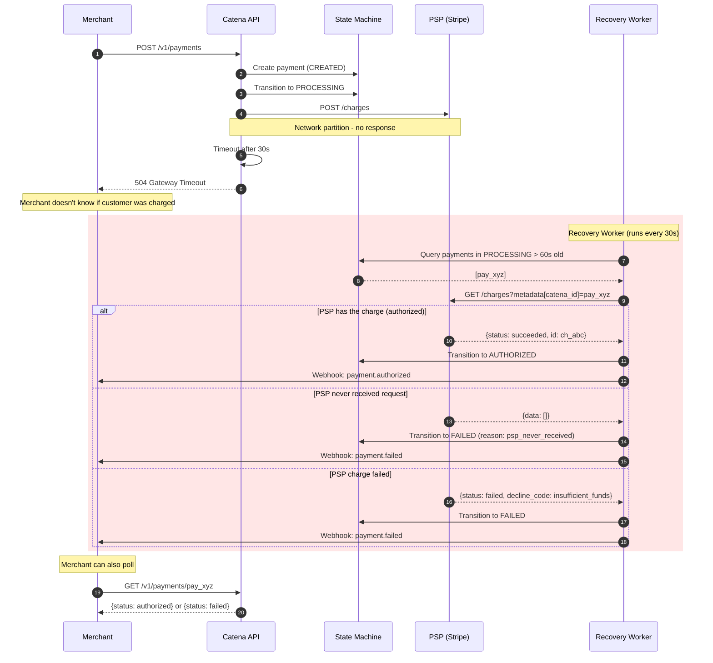
```mermaid
sequenceDiagram
    autonumber
    participant M as Merchant
    participant C as Catena API
    participant S as State Machine
    participant P as PSP (Stripe)
    participant W as Recovery Worker
    
    M->>C: POST /v1/payments
    C->>S: Create payment (CREATED)
    C->>S: Transition to PROCESSING
    C->>P: POST /charges
    
    Note over C,P: Network partition - no response
    
    C->>C: Timeout after 30s
    C-->>M: 504 Gateway Timeout
    
    Note over M: Merchant doesn't know if customer was charged
    
    rect rgb(255, 230, 230)
        Note over W: Recovery Worker (runs every 30s)
        W->>S: Query payments in PROCESSING > 60s old
        S-->>W: [pay_xyz]
        W->>P: GET /charges?metadata[catena_id]=pay_xyz
        
        alt PSP has the charge (authorized)
            P-->>W: {status: succeeded, id: ch_abc}
            W->>S: Transition to AUTHORIZED
            W->>M: Webhook: payment.authorized
        else PSP never received request
            P-->>W: {data: []}
            W->>S: Transition to FAILED (reason: psp_never_received)
            W->>M: Webhook: payment.failed
        else PSP charge failed
            P-->>W: {status: failed, decline_code: insufficient_funds}
            W->>S: Transition to FAILED
            W->>M: Webhook: payment.failed
        end
    end
    
    Note over M: Merchant can also poll
    M->>C: GET /v1/payments/pay_xyz
    C-->>M: {status: authorized} or {status: failed}
```

**Merchant Retry via Idempotency Key:**

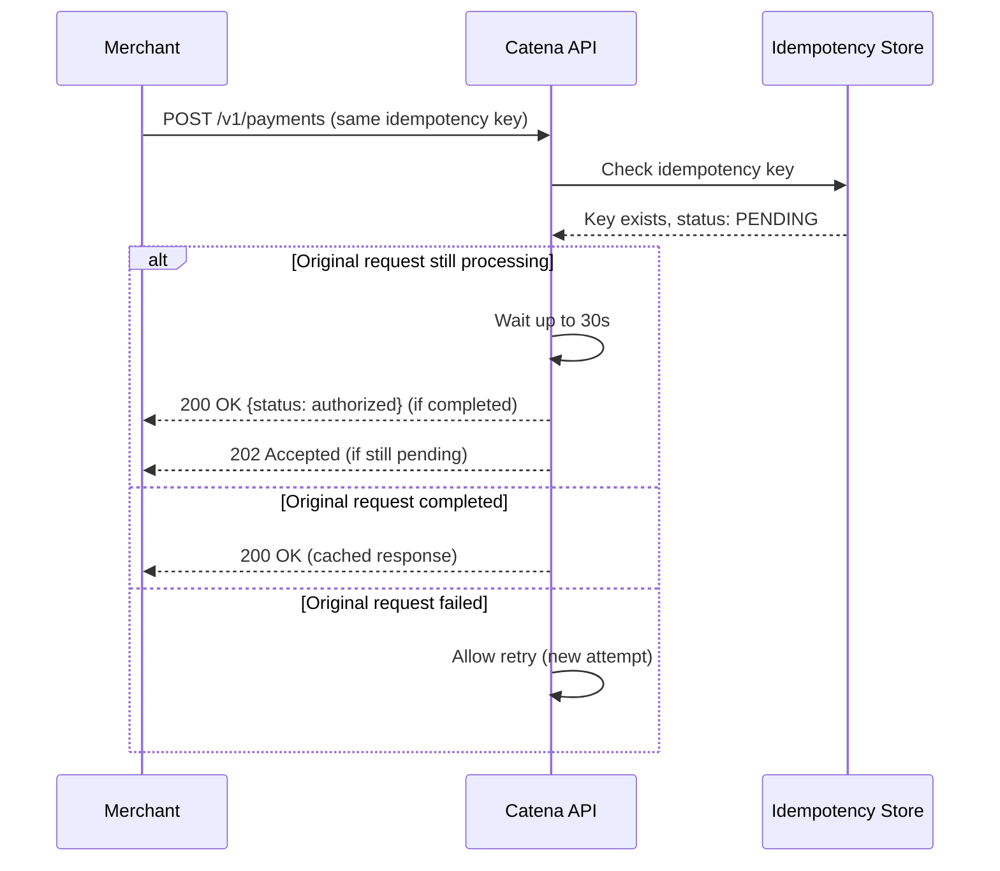
```mermaid
sequenceDiagram
    participant M as Merchant
    participant C as Catena API
    participant I as Idempotency Store
    
    M->>C: POST /v1/payments (same idempotency key)
    C->>I: Check idempotency key
    I-->>C: Key exists, status: PENDING
    
    alt Original request still processing
        C->>C: Wait up to 30s
        C-->>M: 200 OK {status: authorized} (if completed)
        C-->>M: 202 Accepted (if still pending)
    else Original request completed
        C-->>M: 200 OK (cached response)
    else Original request failed
        C->>C: Allow retry (new attempt)
    end
```

**Recovery Worker Requirements:**

| Requirement ID | Requirement | Acceptance Criteria |
|----------------|-------------|---------------------|
| RECOVERY-001 | Scan for stuck payments every 30 seconds | Worker heartbeat visible in metrics |
| RECOVERY-002 | Payment stuck > 60s triggers PSP inquiry | PSP status API called within 90s of original request |
| RECOVERY-003 | PSP inquiry uses idempotent identifier | Query by Catena payment ID, not retry auth |
| RECOVERY-004 | Final state determined within 5 minutes | No payment in PROCESSING > 5 minutes |
| RECOVERY-005 | Webhook sent after recovery | Merchant notified of final state |

---

#### 3.4.4 Flow 4: Concurrent Capture and Void (Race Condition)

**Scenario:** Merchant system bug sends capture and void simultaneously.

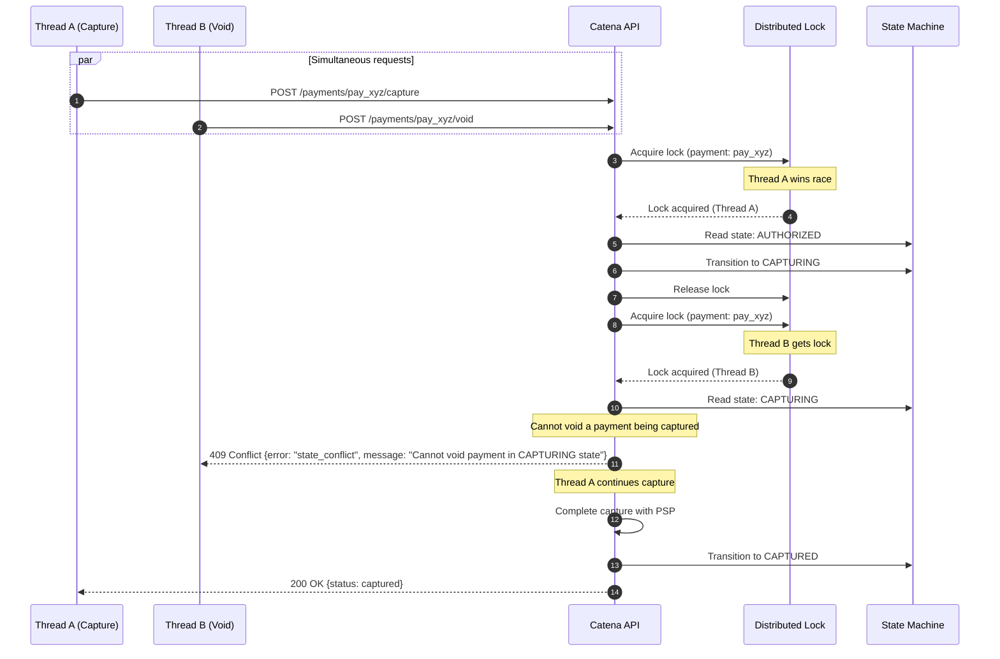
```mermaid
sequenceDiagram
    autonumber
    participant T1 as Thread A (Capture)
    participant T2 as Thread B (Void)
    participant C as Catena API
    participant L as Distributed Lock
    participant S as State Machine
    
    par Simultaneous requests
        T1->>C: POST /payments/pay_xyz/capture
        T2->>C: POST /payments/pay_xyz/void
    end
    
    C->>L: Acquire lock (payment: pay_xyz)
    Note over L: Thread A wins race
    L-->>C: Lock acquired (Thread A)
    C->>S: Read state: AUTHORIZED
    C->>S: Transition to CAPTURING
    C->>L: Release lock
    
    C->>L: Acquire lock (payment: pay_xyz)
    Note over L: Thread B gets lock
    L-->>C: Lock acquired (Thread B)
    C->>S: Read state: CAPTURING
    Note over C: Cannot void a payment being captured
    C-->>T2: 409 Conflict {error: "state_conflict", message: "Cannot void payment in CAPTURING state"}
    
    Note over C: Thread A continues capture
    C->>C: Complete capture with PSP
    C->>S: Transition to CAPTURED
    C-->>T1: 200 OK {status: captured}
```

> **Technical Details:** See [TRD Section 3.1 - Distributed Lock Specifications](TRD.md#31-distributed-lock-specifications) for lock implementation details.

**Conflict Response:**
```http
HTTP/1.1 409 Conflict
Content-Type: application/json

{
  "error": {
    "type": "state_conflict",
    "code": "payment_state_invalid",
    "message": "Cannot void payment in CAPTURING state",
    "current_state": "CAPTURING",
    "requested_action": "void",
    "allowed_actions": []
  }
}
```

---

#### 3.4.5 Flow 5: PSP Failover (Unhappy Path with Recovery)

**Scenario:** Primary PSP (Stripe) is down. Router fails over to backup PSP (Adyen).

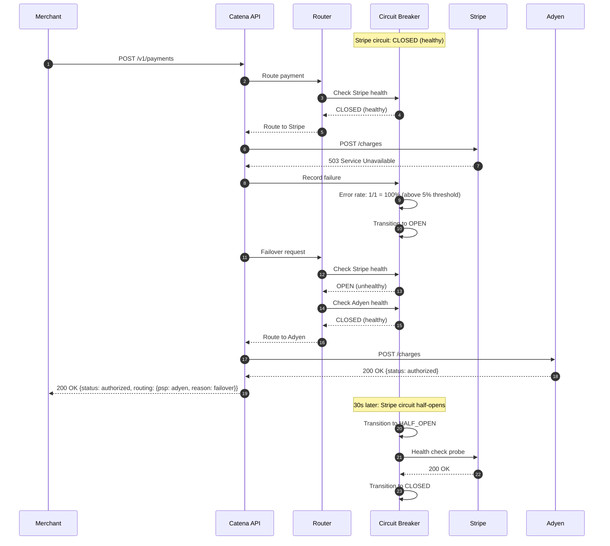
```mermaid
sequenceDiagram
    autonumber
    participant M as Merchant
    participant C as Catena API
    participant R as Router
    participant CB as Circuit Breaker
    participant S1 as Stripe
    participant S2 as Adyen
    
    Note over CB: Stripe circuit: CLOSED (healthy)
    
    M->>C: POST /v1/payments
    C->>R: Route payment
    R->>CB: Check Stripe health
    CB-->>R: CLOSED (healthy)
    R-->>C: Route to Stripe
    C->>S1: POST /charges
    S1-->>C: 503 Service Unavailable
    
    C->>CB: Record failure
    CB->>CB: Error rate: 1/1 = 100% (above 5% threshold)
    CB->>CB: Transition to OPEN
    
    C->>R: Failover request
    R->>CB: Check Stripe health
    CB-->>R: OPEN (unhealthy)
    R->>CB: Check Adyen health
    CB-->>R: CLOSED (healthy)
    R-->>C: Route to Adyen
    
    C->>S2: POST /charges
    S2-->>C: 200 OK {status: authorized}
    C-->>M: 200 OK {status: authorized, routing: {psp: adyen, reason: failover}}
    
    Note over CB: 30s later: Stripe circuit half-opens
    CB->>CB: Transition to HALF_OPEN
    CB->>S1: Health check probe
    S1-->>CB: 200 OK
    CB->>CB: Transition to CLOSED
```

**Failover Decision Matrix:**

| Primary PSP Response | Action | Reason |
|---------------------|--------|--------|
| 2xx Success | Complete | Normal flow |
| 400 Bad Request | Return error | Client error, not retryable |
| 402 Requires Action | Return to client | 3DS flow |
| 4xx Decline | Return decline | Card declined, not PSP issue |
| 500 Internal Error | Retry same PSP once | Transient error |
| 502/503/504 | Immediate failover | PSP unavailable |
| Connection refused | Immediate failover | PSP unreachable |
| Timeout (>30s) | Failover + recovery job | Unknown state |

---

#### 3.4.6 Flow 6: Full Refund

**Scenario:** Customer requests refund. Merchant initiates full refund.

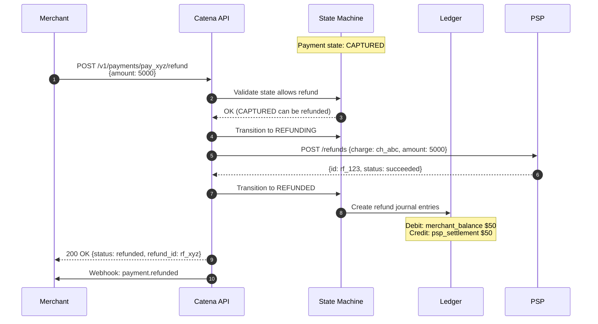
```mermaid
sequenceDiagram
    autonumber
    participant M as Merchant
    participant C as Catena API
    participant S as State Machine
    participant L as Ledger
    participant P as PSP
    
    Note over S: Payment state: CAPTURED
    
    M->>C: POST /v1/payments/pay_xyz/refund<br/>{amount: 5000}
    C->>S: Validate state allows refund
    S-->>C: OK (CAPTURED can be refunded)
    C->>S: Transition to REFUNDING
    C->>P: POST /refunds {charge: ch_abc, amount: 5000}
    P-->>C: {id: rf_123, status: succeeded}
    C->>S: Transition to REFUNDED
    
    S->>L: Create refund journal entries
    Note over L: Debit: merchant_balance $50<br/>Credit: psp_settlement $50
    
    C-->>M: 200 OK {status: refunded, refund_id: rf_xyz}
    C->>M: Webhook: payment.refunded
```

**Refund Rules:**

| Rule | Constraint |
|------|------------|
| Total refunds ≤ captured amount | Cannot refund more than captured |
| Refund currency = capture currency | No cross-currency refunds |
| Refund window | 180 days from capture |
| Partial refunds | Allowed, tracked in `amount_refunded` |
| Refund on voided payment | Not allowed (no funds captured) |

**Partial Refund Example:**

```json
// After $30 refund on $50 capture
{
  "id": "pay_xyz",
  "status": "partial_refunded",
  "amount": 5000,
  "amount_captured": 5000,
  "amount_refunded": 3000,
  "refundable_amount": 2000,
  "refunds": [
    {
      "id": "rf_001",
      "amount": 3000,
      "status": "succeeded",
      "created_at": "2026-02-04T15:00:00Z"
    }
  ]
}
```

---

#### 3.4.7 Flow 7: Chargeback (Dispute)

**Scenario:** Customer disputes charge with their bank. Bank initiates chargeback.

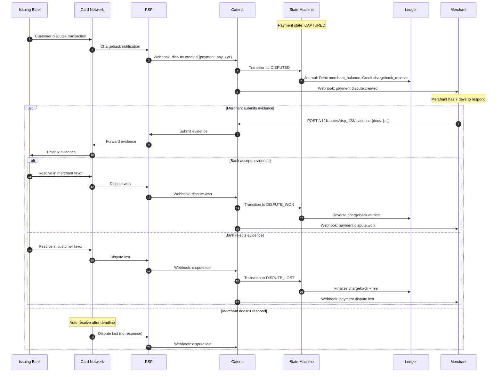
```mermaid
sequenceDiagram
    autonumber
    participant B as Issuing Bank
    participant N as Card Network
    participant P as PSP
    participant C as Catena
    participant S as State Machine
    participant L as Ledger
    participant M as Merchant
    
    Note over S: Payment state: CAPTURED
    
    B->>N: Customer disputes transaction
    N->>P: Chargeback notification
    P->>C: Webhook: dispute.created {payment: pay_xyz}
    
    C->>S: Transition to DISPUTED
    S->>L: Journal: Debit merchant_balance, Credit chargeback_reserve
    
    C->>M: Webhook: payment.dispute.created
    
    Note over M: Merchant has 7 days to respond
    
    alt Merchant submits evidence
        M->>C: POST /v1/disputes/dsp_123/evidence {docs: [...]}
        C->>P: Submit evidence
        P->>N: Forward evidence
        N->>B: Review evidence
        
        alt Bank accepts evidence
            B->>N: Resolve in merchant favor
            N->>P: Dispute won
            P->>C: Webhook: dispute.won
            C->>S: Transition to DISPUTE_WON
            S->>L: Reverse chargeback entries
            C->>M: Webhook: payment.dispute.won
        else Bank rejects evidence
            B->>N: Resolve in customer favor
            N->>P: Dispute lost
            P->>C: Webhook: dispute.lost
            C->>S: Transition to DISPUTE_LOST
            S->>L: Finalize chargeback + fee
            C->>M: Webhook: payment.dispute.lost
        end
    else Merchant doesn't respond
        Note over N: Auto-resolve after deadline
        N->>P: Dispute lost (no response)
        P->>C: Webhook: dispute.lost
    end
```

**Dispute Ledger Entries:**

| Event | Debit | Credit | Amount |
|-------|-------|--------|--------|
| Dispute created | `merchant_balance` | `chargeback_reserve` | $50.00 |
| Dispute won | `chargeback_reserve` | `merchant_balance` | $50.00 |
| Dispute lost | `chargeback_reserve` | `psp_settlement` | $50.00 |
| Dispute lost | `chargeback_fee_expense` | `merchant_balance` | $15.00 |

---

#### 3.4.8 Flow 8: Idempotent Retry (Duplicate Request)

**Scenario:** Merchant retries request due to timeout. Original request succeeded.

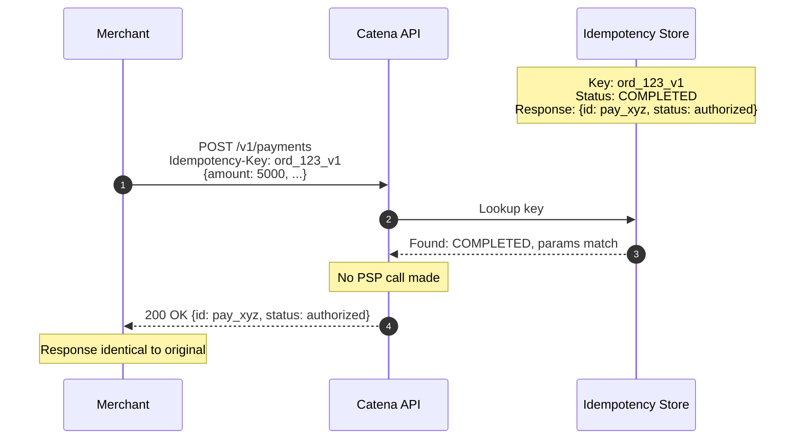
```mermaid
sequenceDiagram
    autonumber
    participant M as Merchant
    participant C as Catena API
    participant I as Idempotency Store
    
    Note over I: Key: ord_123_v1<br/>Status: COMPLETED<br/>Response: {id: pay_xyz, status: authorized}
    
    M->>C: POST /v1/payments<br/>Idempotency-Key: ord_123_v1<br/>{amount: 5000, ...}
    C->>I: Lookup key
    I-->>C: Found: COMPLETED, params match
    
    Note over C: No PSP call made
    
    C-->>M: 200 OK {id: pay_xyz, status: authorized}
    
    Note over M: Response identical to original
```

**Idempotency Key Mismatch:**

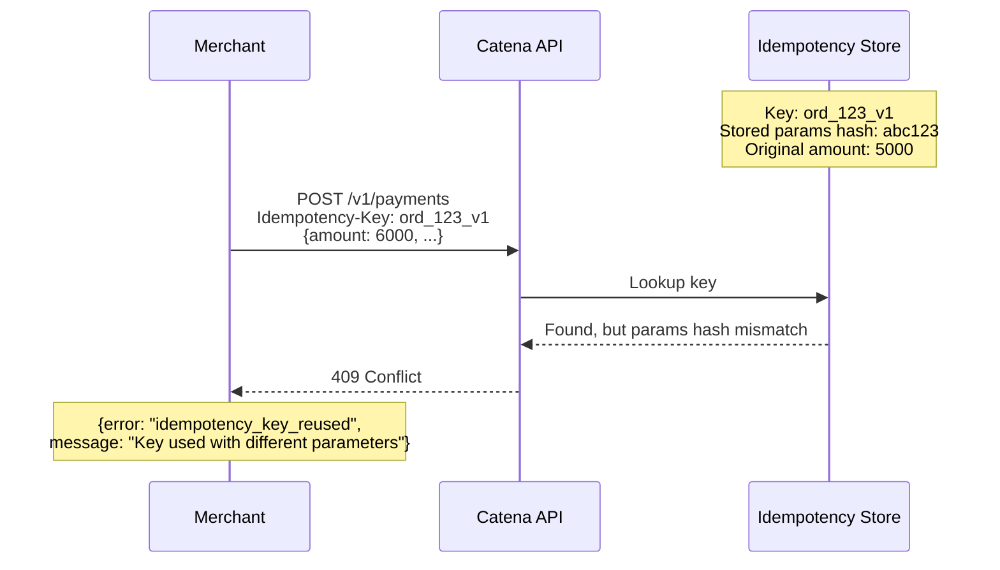
```mermaid
sequenceDiagram
    participant M as Merchant
    participant C as Catena API
    participant I as Idempotency Store
    
    Note over I: Key: ord_123_v1<br/>Stored params hash: abc123<br/>Original amount: 5000
    
    M->>C: POST /v1/payments<br/>Idempotency-Key: ord_123_v1<br/>{amount: 6000, ...}
    C->>I: Lookup key
    I-->>C: Found, but params hash mismatch
    
    C-->>M: 409 Conflict
    Note over M: {error: "idempotency_key_reused",<br/>message: "Key used with different parameters"}
```

---

### 3.5 API Contracts

#### 3.5.1 API Design Principles

| Principle | Implementation |
|-----------|----------------|
| RESTful resources | Nouns for resources, HTTP verbs for actions |
| Consistent naming | snake_case for JSON fields |
| Idempotency | All mutating endpoints accept Idempotency-Key |
| Pagination | Cursor-based for lists (not offset) |
| Versioning | URL path versioning (`/v1/`, `/v2/`) |
| Error format | Consistent error object with type, code, message |

#### 3.5.2 Authentication

All API requests must include authentication:

```http
Authorization: Bearer sk_live_abc123xyz
```

| Key Type | Format | Use Case |
|----------|--------|----------|
| Secret Key | `sk_live_*` or `sk_test_*` | Server-to-server API calls |
| Publishable Key | `pk_live_*` or `pk_test_*` | Client-side tokenization only |

#### 3.5.3 Endpoint Specifications

##### POST /v1/payments

Create a new payment.

**Request:**

| Field | Type | Required | Description |
|-------|------|----------|-------------|
| `amount` | integer | Yes | Amount in smallest currency unit |
| `currency` | string | Yes | ISO 4217 currency code (e.g., "USD") |
| `payment_method` | object | Yes | Payment instrument details |
| `payment_method.type` | string | Yes | "card" or "bank_transfer" |
| `payment_method.card.number` | string | Conditional | Card number (if not using token) |
| `payment_method.card.exp_month` | integer | Conditional | 1-12 |
| `payment_method.card.exp_year` | integer | Conditional | 4-digit year |
| `payment_method.card.cvc` | string | Conditional | 3 or 4 digit code |
| `payment_method.token` | string | Conditional | Previously created token |
| `customer.email` | string | No | Customer email for receipts |
| `capture_method` | string | No | "automatic" (default) or "manual" |
| `metadata` | object | No | Up to 50 key-value pairs |

**Response Codes:**

| Code | Condition |
|------|-----------|
| 200 | Payment created successfully |
| 400 | Invalid request parameters |
| 401 | Invalid or missing API key |
| 402 | Card declined |
| 409 | Idempotency key conflict |
| 429 | Rate limit exceeded |
| 500 | Internal server error |

##### POST /v1/payments/{id}/capture

Capture an authorized payment.

**Request:**

| Field | Type | Required | Description |
|-------|------|----------|-------------|
| `amount` | integer | No | Amount to capture (default: full auth) |

**Response Codes:**

| Code | Condition |
|------|-----------|
| 200 | Capture successful |
| 400 | Invalid capture amount |
| 404 | Payment not found |
| 409 | Payment not in capturable state |
| 422 | Capture amount exceeds authorization |

##### POST /v1/payments/{id}/void

Void an authorized payment.

**Response Codes:**

| Code | Condition |
|------|-----------|
| 200 | Void successful |
| 404 | Payment not found |
| 409 | Payment not in voidable state |

##### POST /v1/payments/{id}/refund

Refund a captured payment.

**Request:**

| Field | Type | Required | Description |
|-------|------|----------|-------------|
| `amount` | integer | No | Refund amount (default: remaining) |
| `reason` | string | No | "duplicate", "fraudulent", "requested_by_customer" |

**Response Codes:**

| Code | Condition |
|------|-----------|
| 200 | Refund successful |
| 400 | Invalid refund amount |
| 404 | Payment not found |
| 409 | Payment not refundable |
| 422 | Refund exceeds captured amount |

##### GET /v1/payments/{id}

Retrieve payment details.

**Response:**

```json
{
  "id": "pay_xyz789",
  "object": "payment",
  "status": "captured",
  "amount": 5000,
  "currency": "USD",
  "amount_captured": 5000,
  "amount_refunded": 0,
  "payment_method": {
    "type": "card",
    "card": {
      "brand": "visa",
      "last4": "4242",
      "exp_month": 12,
      "exp_year": 2025
    }
  },
  "created_at": "2026-02-04T10:30:00Z",
  "captured_at": "2026-02-04T14:00:00Z",
  "events": [
    {"type": "payment.created", "at": "2026-02-04T10:30:00Z"},
    {"type": "payment.authorized", "at": "2026-02-04T10:30:01Z"},
    {"type": "payment.captured", "at": "2026-02-04T14:00:00Z"}
  ]
}
```

##### GET /v1/payments

List payments with filtering.

**Query Parameters:**

| Parameter | Type | Description |
|-----------|------|-------------|
| `limit` | integer | Max results (1-100, default 10) |
| `starting_after` | string | Cursor for pagination |
| `created[gte]` | timestamp | Filter by creation date |
| `created[lte]` | timestamp | Filter by creation date |
| `status` | string | Filter by status |

#### 3.5.4 Error Response Format

All errors follow this structure:

```json
{
  "error": {
    "type": "invalid_request_error",
    "code": "parameter_invalid",
    "message": "Amount must be a positive integer",
    "param": "amount",
    "doc_url": "https://docs.catena.io/errors/parameter_invalid"
  }
}
```

**Error Types:**

| Type | HTTP Code | Description |
|------|-----------|-------------|
| `invalid_request_error` | 400 | Invalid parameters |
| `authentication_error` | 401 | Invalid API key |
| `card_error` | 402 | Card was declined |
| `rate_limit_error` | 429 | Too many requests |
| `api_error` | 500 | Internal error |
| `idempotency_error` | 409 | Idempotency key conflict |
| `state_error` | 409 | Invalid state transition |

**Decline Codes (card_error):**

| Code | Description | Customer Message |
|------|-------------|------------------|
| `insufficient_funds` | Not enough balance | "Your card has insufficient funds" |
| `card_declined` | Generic decline | "Your card was declined" |
| `expired_card` | Card expired | "Your card has expired" |
| `incorrect_cvc` | CVC mismatch | "Your card's security code is incorrect" |
| `processing_error` | Bank processing error | "An error occurred, please try again" |
| `lost_card` | Card reported lost | "Your card was declined" |
| `stolen_card` | Card reported stolen | "Your card was declined" |
| `fraud_detected` | Fraud suspicion | "Your card was declined" |

---

### 3.6 Event & Webhook System

#### 3.6.1 Event Types

| Event Type | Trigger | Key Fields |
|------------|---------|------------|
| `payment.created` | Payment record created | `payment_id`, `amount`, `currency` |
| `payment.processing` | Submitted to PSP | `payment_id`, `psp` |
| `payment.authorized` | Authorization approved | `payment_id`, `auth_code` |
| `payment.requires_action` | 3DS or other action needed | `payment_id`, `action_type`, `action_url` |
| `payment.captured` | Capture completed | `payment_id`, `amount_captured` |
| `payment.voided` | Authorization voided | `payment_id` |
| `payment.failed` | Payment failed | `payment_id`, `failure_code`, `failure_message` |
| `payment.refunded` | Refund completed | `payment_id`, `refund_id`, `amount_refunded` |
| `payment.dispute.created` | Chargeback initiated | `payment_id`, `dispute_id`, `amount` |
| `payment.dispute.won` | Dispute resolved for merchant | `payment_id`, `dispute_id` |
| `payment.dispute.lost` | Dispute resolved for customer | `payment_id`, `dispute_id` |

#### 3.6.2 Webhook Delivery Specification

**Delivery Guarantees:**

| Property | Specification |
|----------|---------------|
| Delivery semantics | At-least-once |
| Ordering | Best-effort (not guaranteed) |
| Timeout | 30 seconds per attempt |
| Success codes | 2xx |
| Retry codes | 4xx (except 410), 5xx, timeout |

**Retry Schedule:**

| Attempt | Delay After Previous |
|---------|---------------------|
| 1 | Immediate |
| 2 | 1 minute |
| 3 | 5 minutes |
| 4 | 30 minutes |
| 5 | 2 hours |
| 6 | 8 hours |
| 7 | 24 hours |
| 8 | 48 hours |
| 9 (final) | 72 hours |

**Webhook Payload:**

```json
{
  "id": "evt_abc123",
  "object": "event",
  "type": "payment.captured",
  "created_at": "2026-02-04T14:00:00Z",
  "data": {
    "object": {
      "id": "pay_xyz789",
      "object": "payment",
      "status": "captured",
      "amount": 5000,
      "amount_captured": 5000
    }
  }
}
```

**Webhook Signature:**

```http
POST /webhooks/catena HTTP/1.1
Content-Type: application/json
Catena-Signature: t=1707048000,v1=abc123signature

{...payload...}
```

Signature verification:

```
expected_signature = HMAC-SHA256(
    key = webhook_secret,
    message = timestamp + "." + raw_body
)
```

#### 3.6.3 Webhook Endpoint Requirements (Merchant)

| Requirement | Specification |
|-------------|---------------|
| Response time | < 30 seconds |
| Response code | 2xx for success |
| Idempotency | Handle duplicate deliveries |
| Signature verification | Verify `Catena-Signature` header |

---

### 3.7 Reconciliation & Settlement

#### 3.7.1 Daily Reconciliation Process

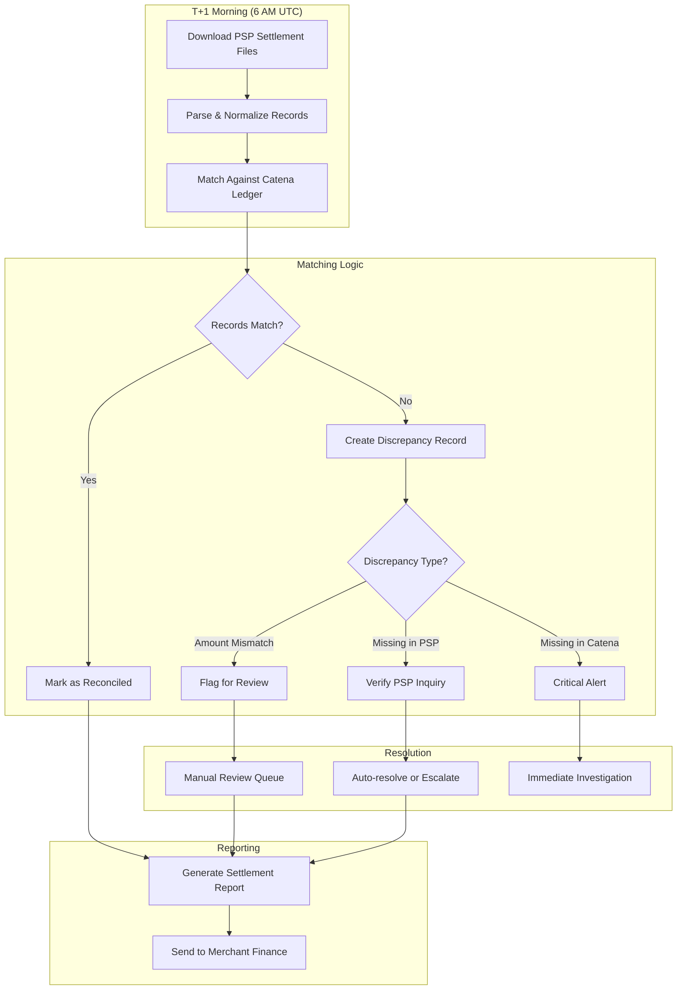
```mermaid
flowchart TD
    subgraph "T+1 Morning (6 AM UTC)"
        A[Download PSP Settlement Files] --> B[Parse & Normalize Records]
        B --> C[Match Against Catena Ledger]
    end
    
    subgraph "Matching Logic"
        C --> D{Records Match?}
        D -->|Yes| E[Mark as Reconciled]
        D -->|No| F[Create Discrepancy Record]
        F --> G{Discrepancy Type?}
        G -->|Amount Mismatch| H[Flag for Review]
        G -->|Missing in PSP| I[Verify PSP Inquiry]
        G -->|Missing in Catena| J[Critical Alert]
    end
    
    subgraph "Resolution"
        H --> K[Manual Review Queue]
        I --> L[Auto-resolve or Escalate]
        J --> M[Immediate Investigation]
    end
    
    subgraph "Reporting"
        E --> N[Generate Settlement Report]
        K --> N
        L --> N
        N --> O[Send to Merchant Finance]
    end
```

#### 3.7.2 Three-Way Match

| Data Source | Fields Compared | Tolerance |
|-------------|-----------------|-----------|
| Catena Ledger | `payment_id`, `amount`, `currency`, `status` | Exact match |
| PSP Settlement | `psp_reference`, `amount`, `currency`, `status` | Exact match |
| Merchant Records (optional) | `order_id`, `amount` | Exact match |

#### 3.7.3 Discrepancy Types

| Type | Description | Auto-Resolution |
|------|-------------|-----------------|
| `amount_mismatch` | Amounts differ between systems | No - manual review |
| `currency_mismatch` | Currency codes differ | No - manual review |
| `status_mismatch` | Catena says captured, PSP says refunded | Query PSP for latest |
| `missing_in_psp` | Catena has record, PSP doesn't | Re-query after 24h, then escalate |
| `missing_in_catena` | PSP has record, Catena doesn't | Critical - immediate investigation |
| `timing_difference` | Transaction crossed settlement cutoff | Auto-include in next day |

#### 3.7.4 Settlement Report Format

Daily settlement report (CSV):

```csv
settlement_date,payment_id,psp_reference,gross_amount,currency,interchange_fee,catena_fee,net_amount,status
2026-02-04,pay_001,ch_abc,100.00,USD,1.50,1.45,97.05,settled
2026-02-04,pay_002,ch_def,50.00,USD,0.75,0.73,48.52,settled
2026-02-04,pay_003,ch_ghi,-25.00,USD,0.00,0.00,-25.00,refund
```

**Report Delivery:**

| Method | Timing | Format |
|--------|--------|--------|
| API | Real-time | JSON |
| Dashboard | T+1 9 AM merchant local time | Interactive |
| SFTP | T+1 6 AM UTC | CSV |
| Email | T+1 9 AM merchant local time | PDF summary + CSV attachment |

---

### 3.8 Multi-Region & Global Operations

Catena operates globally with merchants and customers distributed across US, EU, and APAC regions. This section defines requirements for handling the complexities of global operations.

#### 3.8.1 Global Deployment Requirements

| Requirement ID | Requirement | Acceptance Criteria |
|----------------|-------------|---------------------|
| GLOBAL-001 | Merchants can choose their primary data region (US, EU, APAC) | Region selection available at merchant onboarding |
| GLOBAL-002 | EU merchant data must never leave EU boundaries | GDPR compliance verified by audit |
| GLOBAL-003 | API requests routed to nearest region for latency | Geo-DNS or anycast routing |
| GLOBAL-004 | System remains operational if any single region fails | Automatic failover < 30 seconds |
| GLOBAL-005 | Merchants see consistent data regardless of which region serves their request | Read-your-writes consistency guaranteed |

#### 3.8.2 Scenario: Cross-Border Payment (EU Merchant, US Customer)

**Context:** German merchant (data must stay in EU) processes payment from US customer using a US-issued card.

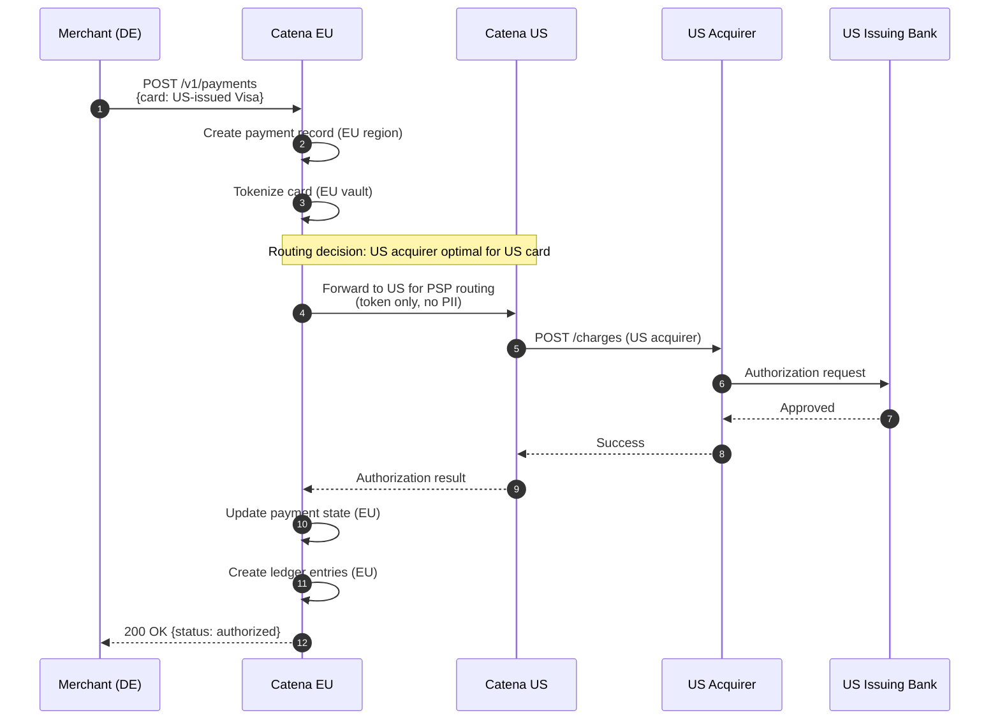
```mermaid
sequenceDiagram
    autonumber
    participant M as Merchant (DE)
    participant EU as Catena EU
    participant US as Catena US
    participant PSP as US Acquirer
    participant Bank as US Issuing Bank
    
    M->>EU: POST /v1/payments<br/>{card: US-issued Visa}
    EU->>EU: Create payment record (EU region)
    EU->>EU: Tokenize card (EU vault)
    
    Note over EU,US: Routing decision: US acquirer optimal for US card
    
    EU->>US: Forward to US for PSP routing<br/>(token only, no PII)
    US->>PSP: POST /charges (US acquirer)
    PSP->>Bank: Authorization request
    Bank-->>PSP: Approved
    PSP-->>US: Success
    US-->>EU: Authorization result
    EU->>EU: Update payment state (EU)
    EU->>EU: Create ledger entries (EU)
    EU-->>M: 200 OK {status: authorized}
```

**Requirements for this scenario:**

| Requirement ID | Requirement | Acceptance Criteria |
|----------------|-------------|---------------------|
| XBORDER-001 | Customer PII remains in merchant's designated region | PAN, email, address never cross region boundary |
| XBORDER-002 | Tokens can be resolved cross-region for PSP calls | Token lookup works from any region |
| XBORDER-003 | Payment state always authoritative in merchant's region | No split-brain on payment status |
| XBORDER-004 | Cross-region latency overhead < 100ms | Measured end-to-end |

#### 3.8.3 Scenario: Regional Failover During Active Transaction

**Context:** EU region experiences complete outage while payments are in-flight.

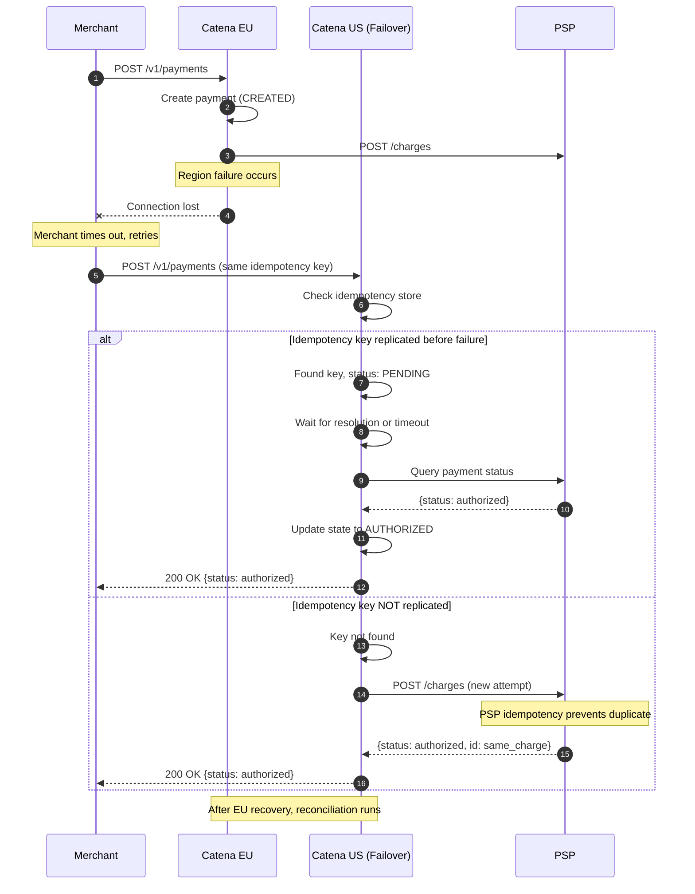
```mermaid
sequenceDiagram
    autonumber
    participant M as Merchant
    participant EU as Catena EU
    participant US as Catena US (Failover)
    participant PSP as PSP
    
    M->>EU: POST /v1/payments
    EU->>EU: Create payment (CREATED)
    EU->>PSP: POST /charges
    
    Note over EU: Region failure occurs
    
    EU--xM: Connection lost
    
    Note over M: Merchant times out, retries
    
    M->>US: POST /v1/payments (same idempotency key)
    US->>US: Check idempotency store
    
    alt Idempotency key replicated before failure
        US->>US: Found key, status: PENDING
        US->>US: Wait for resolution or timeout
        US->>PSP: Query payment status
        PSP-->>US: {status: authorized}
        US->>US: Update state to AUTHORIZED
        US-->>M: 200 OK {status: authorized}
    else Idempotency key NOT replicated
        US->>US: Key not found
        US->>PSP: POST /charges (new attempt)
        Note over PSP: PSP idempotency prevents duplicate
        PSP-->>US: {status: authorized, id: same_charge}
        US-->>M: 200 OK {status: authorized}
    end
    
    Note over EU,US: After EU recovery, reconciliation runs
```

**Requirements for this scenario:**

| Requirement ID | Requirement | Acceptance Criteria |
|----------------|-------------|---------------------|
| FAILOVER-001 | No duplicate charges during regional failover | PSP-level idempotency as backup |
| FAILOVER-002 | Merchant receives definitive response within 5 minutes | Either success, failure, or actionable status |
| FAILOVER-003 | Failover region can serve read requests for any merchant | Read replicas available cross-region |
| FAILOVER-004 | Failover region can process writes for critical operations | Writes may be degraded but not blocked |
| FAILOVER-005 | Post-recovery reconciliation identifies all affected transactions | Automated scan within 1 hour of recovery |

#### 3.8.4 Scenario: Network Partition Between Regions

**Context:** Network connectivity lost between US and EU regions, but both regions remain operational internally.

**Split-Brain Problem:** Both regions might accept writes for the same merchant, leading to conflicting states.

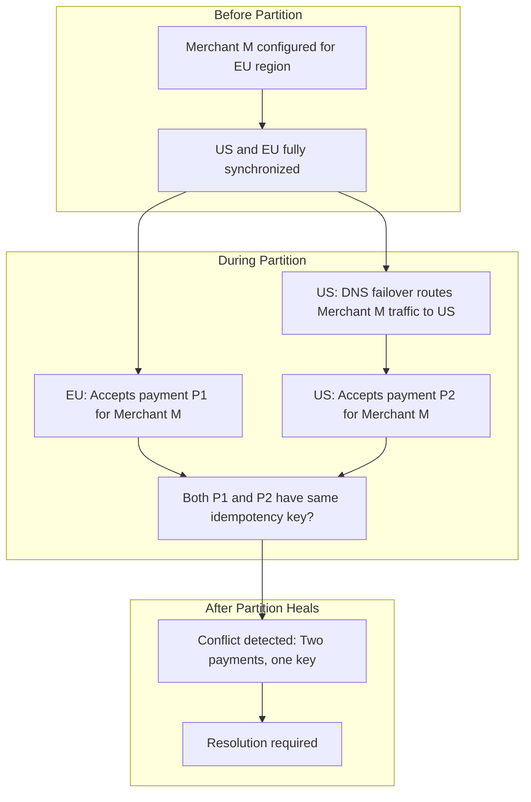
```mermaid
flowchart TD
    subgraph "Before Partition"
        A[Merchant M configured for EU region]
        B[US and EU fully synchronized]
    end
    
    subgraph "During Partition"
        C[EU: Accepts payment P1 for Merchant M]
        D[US: DNS failover routes Merchant M traffic to US]
        E[US: Accepts payment P2 for Merchant M]
        F[Both P1 and P2 have same idempotency key?]
    end
    
    subgraph "After Partition Heals"
        G[Conflict detected: Two payments, one key]
        H[Resolution required]
    end
    
    A --> B --> C
    B --> D --> E
    C --> F
    E --> F
    F --> G --> H
```

**Requirements for this scenario:**

| Requirement ID | Requirement | Acceptance Criteria |
|----------------|-------------|---------------------|
| PARTITION-001 | System must choose between availability and consistency during partition | Explicit product decision required |
| PARTITION-002 | If availability chosen: Conflicts must be detectable post-partition | Conflict detection within 1 hour |
| PARTITION-003 | If consistency chosen: Writes rejected in minority partition | Clear error message to merchant |
| PARTITION-004 | Partition detection time < 30 seconds | Heartbeat/gossip protocol |
| PARTITION-005 | Merchant dashboard shows partition status | "Degraded" indicator visible |

**Product Decision Required:**

| Scenario | Recommended Behavior | Rationale |
|----------|---------------------|-----------|
| Payment creation | Favor availability (accept in both) | Customer experience; PSP idempotency prevents duplicate charges |
| Capture/Void/Refund | Favor consistency (reject in minority) | Financial accuracy critical; can retry after partition heals |
| Read operations | Favor availability (serve stale) | Eventual consistency acceptable for reads |
| Ledger writes | Favor consistency (reject in minority) | Financial audit trail must be accurate |

#### 3.8.5 Scenario: Read-After-Write Consistency

**Context:** Merchant creates a payment, then immediately queries it. Request may be routed to a replica that hasn't received the write yet.

```mermaid
sequenceDiagram
    autonumber
    participant M as Merchant
    participant W as Write Node (Leader)
    participant R as Read Replica
    
    M->>W: POST /v1/payments
    W->>W: Create payment pay_xyz
    W-->>M: 201 Created {id: pay_xyz}
    W--)R: Async replication (may be delayed)
    
    Note over M: Immediate query (< 10ms later)
    
    M->>R: GET /v1/payments/pay_xyz
    
    alt Replication completed
        R-->>M: 200 OK {id: pay_xyz, status: authorized}
    else Replication delayed
        R-->>M: 404 Not Found
        Note over M: Merchant confused - just created this!
    end
```

**Requirements for this scenario:**

| Requirement ID | Requirement | Acceptance Criteria |
|----------------|-------------|---------------------|
| RYW-001 | Merchant always sees their own writes immediately | Read-your-writes consistency guaranteed |
| RYW-002 | Solution must not significantly impact read latency | P99 read latency < 50ms overhead |
| RYW-003 | Solution must work across regional failover | Consistency maintained post-failover |

**Acceptable Approaches (Product Perspective):**
1. Route merchant's reads to the same node that handled their recent write
2. Include a consistency token in write response; require it on subsequent reads
3. Block read until replication confirmed (higher latency, stronger guarantee)

#### 3.8.6 Scenario: Merchant Data Migration Between Regions

**Context:** Large merchant (processing 10,000 TPS) needs to move from US to EU region due to regulatory change.

**Requirements:**

| Requirement ID | Requirement | Acceptance Criteria |
|----------------|-------------|---------------------|
| MIGRATE-001 | Migration must complete with zero downtime | No payment failures during migration |
| MIGRATE-002 | Historical data must be fully migrated | All ledger entries, events, and payment records |
| MIGRATE-003 | Migration duration < 72 hours for largest merchants | Regardless of data volume |
| MIGRATE-004 | Rollback capability if issues detected | Can revert within 4 hours |
| MIGRATE-005 | Merchant receives progress updates | Dashboard shows migration status |

**Migration Phases (Product View):**

| Phase | Duration | Merchant Impact |
|-------|----------|-----------------|
| 1. Historical data copy | 24-48h | None - background process |
| 2. Dual-write enabled | 1-4h | Slightly higher latency (+50ms) |
| 3. Traffic cutover | < 1 minute | Potential brief latency spike |
| 4. Old region cleanup | 24h | None - background process |

---

### 3.9 High-Volume Merchant Scenarios

This section addresses scenarios specific to high-volume merchants ("whales") who can generate disproportionate load on the system.

#### 3.9.1 Scenario: Flash Sale (Single Merchant Traffic Spike)

**Context:** Amazon Prime Day begins. One merchant goes from 100 TPS baseline to 30,000 TPS in 60 seconds. This is 60% of Catena's total capacity consumed by a single merchant.

```mermaid
flowchart TD
    subgraph "Normal Operations"
        A[Merchant A: 100 TPS]
        B[Merchant B: 200 TPS]
        C[Merchant C: 150 TPS]
        D[Others: 500 TPS]
        E[Total: ~1,000 TPS]
    end
    
    subgraph "Flash Sale Start"
        F[Merchant A: 30,000 TPS]
        G[Merchant B: 200 TPS]
        H[Merchant C: 150 TPS]
        I[Others: 500 TPS]
        J[Total: ~31,000 TPS]
    end
    
    subgraph "Problem"
        K[Merchant A consumes 97% of resources]
        L[Merchant B, C, Others experience timeouts]
        M[Noisy Neighbor Problem]
    end
    
    E --> J --> K --> L --> M
```

**Requirements:**

| Requirement ID | Requirement | Acceptance Criteria |
|----------------|-------------|---------------------|
| FLASH-001 | Merchant A's spike must not degrade service for Merchants B, C | P99 latency for B, C unchanged |
| FLASH-002 | Per-merchant rate limits must be configurable | Limits set per merchant tier |
| FLASH-003 | Overflow traffic must queue, not drop | Queue depth visible; shed only after threshold |
| FLASH-004 | Merchants can pre-register expected flash sales | Capacity reserved 24h in advance |
| FLASH-005 | System scales automatically to handle registered spikes | No manual intervention needed |

**Isolation Requirements:**

| Resource | Isolation Strategy | Acceptance Criteria |
|----------|-------------------|---------------------|
| API Gateway | Per-merchant rate limiting | Configurable limits per tier |
| Database connections | Connection pool per merchant shard | No cross-merchant connection exhaustion |
| PSP capacity | Dedicated PSP quotas for whales | Large merchant PSP failures don't affect others |
| Queue processing | Weighted fair queuing | Small merchants get guaranteed throughput |

#### 3.9.2 Scenario: Merchant Dashboard Query (Large Data Volume)

**Context:** Merchant finance team runs a dashboard query: "Show me all payments from last month" for a merchant with 50 million transactions/month.

**Problem:** This query could:
1. Overwhelm the database, affecting real-time payment processing
2. Time out before completing
3. Return so much data it crashes the client

**Requirements:**

| Requirement ID | Requirement | Acceptance Criteria |
|----------------|-------------|---------------------|
| QUERY-001 | Dashboard queries must not impact payment processing | Separate read replicas for analytics |
| QUERY-002 | Large result sets must be paginated | Max 1,000 records per page |
| QUERY-003 | Queries bounded by time range | Max 31 days per query |
| QUERY-004 | Export for larger datasets | Async export job with download link |
| QUERY-005 | Query performance predictable | Response time scales linearly with result size |

**Query Patterns:**

| Query Type | Max Scope | Response Time SLA | Delivery Method |
|------------|-----------|-------------------|-----------------|
| Real-time search | 1,000 records | < 2 seconds | Synchronous API |
| Paginated list | 10,000 records | < 5 seconds per page | Synchronous API |
| Date range export | 31 days | < 5 minutes | Async job |
| Full history export | Unlimited | < 24 hours | Scheduled job |

#### 3.9.3 Scenario: Webhook Backlog (Merchant Endpoint Slow)

**Context:** Large merchant's webhook endpoint becomes slow (responding in 25 seconds instead of <1 second). Catena queues 100,000 pending webhooks for this merchant.

**Problem:** Should Catena:
1. Keep retrying and grow the queue indefinitely?
2. Drop old webhooks to prevent queue overflow?
3. Slow down payment processing for this merchant?

**Requirements:**

| Requirement ID | Requirement | Acceptance Criteria |
|----------------|-------------|---------------------|
| WEBHOOK-001 | Webhook backlog for Merchant A must not affect Merchant B | Per-merchant webhook queues |
| WEBHOOK-002 | Maximum webhook queue depth per merchant | 1 million events max |
| WEBHOOK-003 | Merchant notified when queue depth exceeds threshold | Alert at 10,000, 100,000, 500,000 |
| WEBHOOK-004 | Old webhooks eventually expire with notification | 72-hour TTL, then dead-letter |
| WEBHOOK-005 | Merchants can retrieve missed webhooks via API | Event replay endpoint available |

#### 3.9.4 Scenario: Merchant Account Balance Query During Reconciliation

**Context:** At midnight UTC, all merchants run reconciliation reports simultaneously. Each report queries aggregate account balances.

**Problem:** 10,000 merchants × complex aggregation query = database overload

**Requirements:**

| Requirement ID | Requirement | Acceptance Criteria |
|----------------|-------------|---------------------|
| BALANCE-001 | Balance queries must return within 5 seconds | Even during peak reconciliation |
| BALANCE-002 | Pre-computed daily snapshots available | Snapshot as of 23:59:59 UTC |
| BALANCE-003 | Real-time balance available but rate-limited | 1 query per merchant per minute |
| BALANCE-004 | Balance accuracy during compute window | "As of" timestamp included |

#### 3.9.5 Scenario: Bulk Operations (Mass Refund)

**Context:** Merchant discovers fraud and needs to refund 100,000 transactions immediately.

**Requirements:**

| Requirement ID | Requirement | Acceptance Criteria |
|----------------|-------------|---------------------|
| BULK-001 | Bulk refund API accepts up to 10,000 payment IDs | Single API call |
| BULK-002 | Bulk operations processed with fair scheduling | Other merchants not impacted |
| BULK-003 | Progress tracking for bulk operations | Percentage complete, estimated time |
| BULK-004 | Partial failure handling | Report which refunds failed and why |
| BULK-005 | Bulk operations can be cancelled mid-flight | Unprocessed items stopped |

**Bulk API Contract:**

```http
POST /v1/bulk/refunds HTTP/1.1
Content-Type: application/json

{
  "payment_ids": ["pay_001", "pay_002", ... "pay_10000"],
  "reason": "fraudulent",
  "notify_customer": false
}
```

**Response:**
```json
{
  "bulk_operation_id": "bulk_abc123",
  "status": "processing",
  "total": 10000,
  "processed": 0,
  "succeeded": 0,
  "failed": 0,
  "estimated_completion": "2026-02-04T15:30:00Z",
  "status_url": "/v1/bulk/refunds/bulk_abc123"
}
```

---

## 4. Non-Functional Requirements

### 4.1 Definitions

| Term | Definition |
|------|------------|
| **Availability** | Percentage of time the system is operational and accepting requests |
| **Latency** | Time from request receipt to response sent, measured at edge |
| **Throughput** | Number of transactions processed per second |
| **Durability** | Probability that stored data is not lost |
| **RPO (Recovery Point Objective)** | Maximum acceptable data loss measured in time |
| **RTO (Recovery Time Objective)** | Maximum acceptable time to restore service |

### 4.2 Performance Requirements

| Metric | Requirement | Measurement Point |
|--------|-------------|-------------------|
| **API Availability** | 99.99% monthly | Edge load balancer |
| **P50 Latency** | < 200ms | Edge to edge (excluding PSP) |
| **P95 Latency** | < 400ms | Edge to edge (excluding PSP) |
| **P99 Latency** | < 800ms | Edge to edge (excluding PSP) |
| **Peak Throughput** | 50,000 TPS | Sustained for 60 seconds |
| **Scale Velocity** | 10k → 50k TPS in < 60 seconds | Auto-scaling trigger to capacity |
| **Burst Tolerance** | 100k TPS for 10 seconds | No request drops |

### 4.3 Reliability Requirements

| Metric | Requirement | Notes |
|--------|-------------|-------|
| **Data Durability** | 99.999999999% (11 nines) | S3-equivalent durability |
| **RPO (Payment State)** | 0 seconds | Synchronous replication |
| **RPO (Ledger)** | 0 seconds | Synchronous replication |
| **RPO (Events)** | < 1 second | Async replication acceptable |
| **RTO (Regional Failure)** | < 30 seconds | Automatic failover |
| **RTO (Full Disaster)** | < 4 hours | Manual intervention acceptable |

### 4.4 Consistency Requirements

| Data Type | Consistency Model | Rationale |
|-----------|-------------------|-----------|
| Payment State | Strong (Linearizable) | Prevents double-charging |
| Ledger Entries | Strong (Serializable) | Financial accuracy |
| Idempotency Keys | Strong (Linearizable) | Prevents duplicates |
| Webhooks | Eventual (At-least-once) | Retries handle failures |
| Analytics | Eventual (< 5 min lag) | Near-real-time acceptable |
| Search Index | Eventual (< 30 sec lag) | User experience acceptable |

### 4.5 Security Requirements

| Requirement | Specification |
|-------------|---------------|
| **PCI-DSS** | Level 1 Service Provider certification |
| **Encryption at Rest** | AES-256-GCM for all PII and financial data |
| **Encryption in Transit** | TLS 1.3 minimum, TLS 1.2 for legacy |
| **Key Management** | HSM-backed, 90-day rotation |
| **Access Control** | RBAC with principle of least privilege |
| **Audit Logging** | All access to sensitive data logged |
| **Penetration Testing** | Annual third-party assessment |

### 4.6 Compliance Requirements

| Regulation | Requirement |
|------------|-------------|
| **GDPR** | Data residency options for EU, right to deletion |
| **SOC 2 Type II** | Annual certification |
| **PCI-DSS** | Annual QSA audit |
| **CCPA** | California privacy rights support |

### 4.7 Observability Requirements

| Capability | Specification |
|------------|---------------|
| **Distributed Tracing** | 100% of requests traced with correlation ID |
| **Log Retention** | 90 days hot, 7 years cold (compliance) |
| **Metrics Resolution** | 10-second granularity |
| **Alert Response** | P1: 5 min ack, 15 min response |
| **Dashboard Availability** | Real-time operational dashboards |

### 4.8 Data Residency Requirements

| Region | Data Types Stored | Latency to Users |
|--------|------------------|------------------|
| US (us-east-1, us-west-2) | US merchant and customer data | < 50ms |
| EU (eu-west-1, eu-central-1) | EU merchant and customer data (GDPR) | < 50ms |
| APAC (ap-southeast-1) | APAC merchant and customer data | < 100ms |

**Data Pinning Rules:**

| Merchant Region | Customer Region | Data Stored In |
|-----------------|-----------------|----------------|
| US | Any | US |
| EU | Any | EU (GDPR requirement) |
| APAC | Any | APAC |
| Any | EU citizen | EU (GDPR requirement) |

---

## 5. Testing Plan & Acceptance Criteria

### 5.1 Testing Strategy

```mermaid
flowchart TD
    subgraph "Test Pyramid"
        A[Unit Tests<br/>70% coverage minimum]
        B[Integration Tests<br/>All service boundaries]
        C[Contract Tests<br/>API consumers]
        D[E2E Tests<br/>Critical paths]
        E[Performance Tests<br/>Load & stress]
        F[Chaos Tests<br/>Fault injection]
    end
    
    A --> B --> C --> D --> E --> F
```

### 5.2 Acceptance Criteria Checklist

#### 5.2.1 Payment Lifecycle (Must Pass: 100%)

| ID | Test Case | Expected Result | Status |
|----|-----------|-----------------|--------|
| PL-001 | Create payment with valid card | Payment created in AUTHORIZED state | ☐ |
| PL-002 | Create payment with invalid card number | 400 error with `parameter_invalid` | ☐ |
| PL-003 | Create payment with expired card | 402 error with `expired_card` | ☐ |
| PL-004 | Create payment with insufficient funds | 402 error with `insufficient_funds` | ☐ |
| PL-005 | Capture authorized payment | Payment transitions to CAPTURED | ☐ |
| PL-006 | Capture with amount > authorized | 422 error with amount exceeds auth | ☐ |
| PL-007 | Capture already captured payment | Idempotent success (same response) | ☐ |
| PL-008 | Void authorized payment | Payment transitions to VOIDED | ☐ |
| PL-009 | Void captured payment | 409 error with `state_invalid` | ☐ |
| PL-010 | Refund captured payment (full) | Payment transitions to REFUNDED | ☐ |
| PL-011 | Refund captured payment (partial) | Payment transitions to PARTIAL_REFUNDED | ☐ |
| PL-012 | Refund more than captured | 422 error with amount exceeds captured | ☐ |
| PL-013 | Authorization expires after 7 days | Payment transitions to AUTH_EXPIRED | ☐ |
| PL-014 | 3DS flow completes successfully | Payment transitions REQUIRES_ACTION → AUTHORIZED | ☐ |
| PL-015 | 3DS flow times out after 15 minutes | Payment transitions to EXPIRED | ☐ |

#### 5.2.2 Idempotency (Must Pass: 100%)

| ID | Test Case | Expected Result | Status |
|----|-----------|-----------------|--------|
| ID-001 | Retry with same key + same params | Return cached response, no PSP call | ☐ |
| ID-002 | Retry with same key + different params | 409 Conflict error | ☐ |
| ID-003 | Retry while original in progress | Block up to 30s, then return result | ☐ |
| ID-004 | Key reuse after 24 hours | New payment created | ☐ |
| ID-005 | Different merchants, same key | Independent payments created | ☐ |
| ID-006 | Key with invalid characters | 400 error with key format invalid | ☐ |

#### 5.2.3 Concurrency & Race Conditions (Must Pass: 100%)

| ID | Test Case | Expected Result | Status |
|----|-----------|-----------------|--------|
| RC-001 | Simultaneous capture + void | One succeeds, one gets 409 | ☐ |
| RC-002 | Double capture (same millisecond) | First succeeds, second idempotent | ☐ |
| RC-003 | Refund during capture | Refund waits for capture to complete | ☐ |
| RC-004 | 100 concurrent requests same payment | Exactly one state change, others rejected/queued | ☐ |

#### 5.2.4 Failure Recovery (Must Pass: 100%)

| ID | Test Case | Expected Result | Status |
|----|-----------|-----------------|--------|
| FR-001 | PSP timeout during auth | Payment marked PROCESSING, recovery job resolves | ☐ |
| FR-002 | PSP timeout during capture | Payment marked CAPTURING, recovery job resolves | ☐ |
| FR-003 | Network partition to all PSPs | Requests queued, processed when restored | ☐ |
| FR-004 | Database failover during transaction | Transaction rolled back, client can retry | ☐ |
| FR-005 | Catena node crash during processing | Other nodes take over, no data loss | ☐ |

#### 5.2.5 Routing & Failover (Must Pass: 100%)

| ID | Test Case | Expected Result | Status |
|----|-----------|-----------------|--------|
| RF-001 | Primary PSP returns 503 | Automatic failover to secondary | ☐ |
| RF-002 | PSP error rate exceeds 5% | Circuit breaker opens within 30s | ☐ |
| RF-003 | Circuit half-opens after 30s | Probe traffic sent to PSP | ☐ |
| RF-004 | All PSPs unavailable | 503 returned to merchant with retry-after | ☐ |
| RF-005 | Lowest cost PSP selected | Routing logs show cost-based selection | ☐ |

#### 5.2.6 Ledger Integrity (Must Pass: 100%)

| ID | Test Case | Expected Result | Status |
|----|-----------|-----------------|--------|
| LI-001 | Every auth creates balanced entries | SUM(debits) = SUM(credits) | ☐ |
| LI-002 | Every capture creates balanced entries | SUM(debits) = SUM(credits) | ☐ |
| LI-003 | Every refund creates balanced entries | SUM(debits) = SUM(credits) | ☐ |
| LI-004 | Ledger entry UPDATE attempted | Operation rejected (append-only) | ☐ |
| LI-005 | Ledger entry DELETE attempted | Operation rejected (immutable) | ☐ |
| LI-006 | Daily reconciliation matches PSP | 100% match rate | ☐ |

#### 5.2.7 Webhook Delivery (Must Pass: 100%)

| ID | Test Case | Expected Result | Status |
|----|-----------|-----------------|--------|
| WH-001 | Payment authorized triggers webhook | Webhook delivered within 5s | ☐ |
| WH-002 | Webhook endpoint returns 500 | Retry after 1 minute | ☐ |
| WH-003 | Webhook endpoint down for 1 hour | Retries continue, delivered when restored | ☐ |
| WH-004 | Webhook endpoint returns 410 Gone | No further retries | ☐ |
| WH-005 | Signature verification | Valid signature passes, invalid fails | ☐ |
| WH-006 | Duplicate webhook delivery | Merchant can identify via event ID | ☐ |

#### 5.2.8 Performance (Must Pass: 100%)

| ID | Test Case | Expected Result | Status |
|----|-----------|-----------------|--------|
| PF-001 | Steady-state 10k TPS for 1 hour | P99 latency < 800ms, 0 errors | ☐ |
| PF-002 | Burst from 10k to 50k TPS | Scale within 60 seconds | ☐ |
| PF-003 | 100k TPS burst for 10 seconds | No request drops | ☐ |
| PF-004 | Single PSP unavailable during load | Automatic failover, no degradation | ☐ |
| PF-005 | Database failover during load | < 5 second disruption | ☐ |

#### 5.2.9 Security (Must Pass: 100%)

| ID | Test Case | Expected Result | Status |
|----|-----------|-----------------|--------|
| SE-001 | PAN appears in logs | Never (tokenized before logging) | ☐ |
| SE-002 | CVV stored anywhere | Never (processed in memory only) | ☐ |
| SE-003 | Invalid API key | 401 Unauthorized | ☐ |
| SE-004 | Cross-merchant token usage | 404 Not Found | ☐ |
| SE-005 | SQL injection in any field | Parameterized queries prevent | ☐ |
| SE-006 | Rate limit exceeded | 429 with retry-after header | ☐ |

#### 5.2.10 Compliance (Must Pass: 100%)

| ID | Test Case | Expected Result | Status |
|----|-----------|-----------------|--------|
| CO-001 | EU customer data in EU region | Data residency verified | ☐ |
| CO-002 | GDPR deletion request | All PII deleted within 72 hours | ☐ |
| CO-003 | Audit log for payment access | Every access logged with actor | ☐ |
| CO-004 | PCI key rotation | Keys rotated every 90 days | ☐ |

#### 5.2.11 Multi-Region & Global Operations (Must Pass: 100%)

| ID | Test Case | Expected Result | Status |
|----|-----------|-----------------|--------|
| MR-001 | Cross-border payment (EU merchant, US card) | PAN stays in EU, PSP call via US, success | ☐ |
| MR-002 | EU region fails, merchant queries payment | Failover region serves read request | ☐ |
| MR-003 | EU region fails, merchant creates payment | Failover handles write, no duplicate | ☐ |
| MR-004 | Network partition between US and EU | Partition detected < 30s, appropriate behavior per operation type | ☐ |
| MR-005 | Read-after-write same merchant | Payment visible immediately after creation | ☐ |
| MR-006 | Read-after-write during replication lag | Consistency maintained (no 404) | ☐ |
| MR-007 | Merchant migrates US → EU | Zero downtime during migration | ☐ |
| MR-008 | Merchant migrates US → EU rollback | Rollback completes within 4 hours | ☐ |
| MR-009 | Concurrent operations during partition | Only one succeeds per CAP decision | ☐ |
| MR-010 | Post-partition reconciliation | All conflicts identified within 1 hour | ☐ |
| MR-011 | Cross-region idempotency key lookup | Same key honored regardless of region | ☐ |
| MR-012 | Regional failover < 30 seconds | Traffic routes to backup within SLA | ☐ |

#### 5.2.12 High-Volume Merchant Scenarios (Must Pass: 100%)

| ID | Test Case | Expected Result | Status |
|----|-----------|-----------------|--------|
| HV-001 | Flash sale: Single merchant 100x spike | Other merchants unaffected (noisy neighbor isolation) | ☐ |
| HV-002 | Rate limit exceeded | 429 returned, other merchants unaffected | ☐ |
| HV-003 | Pre-registered flash sale capacity | Reserved capacity available at spike start | ☐ |
| HV-004 | Dashboard query: 50M transactions/month merchant | Query completes < 5 seconds (paginated) | ☐ |
| HV-005 | Export query: Full month for large merchant | Async job completes < 24 hours | ☐ |
| HV-006 | Webhook endpoint slow (25s response) | Backlog isolated to that merchant | ☐ |
| HV-007 | Webhook queue exceeds 1M events | Oldest events expire, merchant notified | ☐ |
| HV-008 | Midnight reconciliation: 10k merchants simultaneously | All queries complete < 5 seconds | ☐ |
| HV-009 | Bulk refund: 10,000 payments | Completed with progress tracking | ☐ |
| HV-010 | Bulk refund cancelled mid-flight | Unprocessed items stopped | ☐ |
| HV-011 | Connection pool exhaustion by whale | Other merchants maintain connectivity | ☐ |
| HV-012 | PSP quota exhausted by whale | Other merchants use separate quota | ☐ |

### 5.3 Performance Test Scenarios

| Scenario | Duration | Load Profile | Success Criteria |
|----------|----------|--------------|------------------|
| Baseline | 1 hour | 10,000 TPS constant | P99 < 500ms, Error rate < 0.01% |
| Ramp-up | 30 min | 1k → 50k TPS linear | No errors during scale |
| Flash sale | 10 min | 50k TPS constant | P99 < 800ms, Error rate < 0.1% |
| Burst | 10 sec | 100k TPS spike | No dropped requests |
| Endurance | 24 hours | 20k TPS constant | No memory leaks, stable latency |
| Failover | 1 hour | 30k TPS with PSP kill | < 1% error rate during failover |

### 5.4 Chaos Engineering Tests

| Test | Injection | Expected Behavior |
|------|-----------|-------------------|
| PSP network partition | Block all traffic to primary PSP | Route to secondary within 5s |
| Database leader failure | Kill primary DB node | Replica promoted within 30s |
| Catena node termination | Kill random application node | Load redistributed, no data loss |
| Full AZ failure | Disable entire availability zone | Traffic routed to other AZ |
| Clock skew | Introduce 60s clock drift | System detects and rejects |
| Disk full | Fill disk to 100% | Graceful degradation, alerts fired |

### 5.5 Distributed Systems Chaos Tests

| Test | Injection | Expected Behavior | Learning Focus |
|------|-----------|-------------------|----------------|
| Cross-region network partition | Block traffic between US and EU | Per-operation CAP decisions applied | CAP theorem |
| Replication lag simulation | Introduce 5s delay on replicas | Read-your-writes consistency maintained | Replication |
| Leader election during write | Kill leader mid-transaction | Transaction rolled back, no partial state | Transactions |
| Split-brain scenario | Both regions believe they are primary | Conflict detection fires, alerts raised | Consensus |
| Hot partition simulation | Route 90% traffic to single shard | Automatic rebalancing or graceful shed | Partitioning |
| Cross-partition query timeout | Slow one partition during aggregate | Query completes with partial data warning | Partitioning |
| Replication lag + failover | Primary fails while replicas behind | Data loss quantified, recovery SLA met | Replication |
| Concurrent writes same key | Submit same idempotency key to both regions | Exactly one write succeeds | Distributed locking |
| Long-running transaction | Transaction holds locks for 30s | Deadlock detection triggers, rollback | Transactions |
| Webhook queue overflow | Fill queue to 100% for one merchant | Isolation confirmed, others unaffected | Partitioning |
| Recovery job partition | Recovery job can't reach PSP | Exponential backoff, no infinite retry | Failure handling |
| Token vault unavailable | Vault service times out | Graceful degradation, cached tokens used | Availability |

### 5.6 Sign-off Criteria

**Feature cannot ship unless ALL of the following are true:**

1. ☐ All acceptance criteria tests pass (100%)
2. ☐ Performance baseline met under load
3. ☐ Chaos tests pass with no data loss
4. ☐ Security scan shows no critical/high vulnerabilities
5. ☐ API documentation complete and reviewed
6. ☐ Runbook for all P1 scenarios reviewed by on-call
7. ☐ Monitoring dashboards operational
8. ☐ Alerts configured for all SLO violations
9. ☐ Rollback procedure tested

---

## Appendix A: Mermaid Diagram Reference

All diagrams in this document use Mermaid syntax and render natively on GitHub. To preview locally:

```bash
# Install mermaid-cli
npm install -g @mermaid-js/mermaid-cli

# Convert to PNG
mmdc -i diagram.mmd -o diagram.png
```

## Appendix B: Glossary Quick Reference

| Acronym | Full Form |
|---------|-----------|
| PSP | Payment Service Provider |
| PAN | Primary Account Number |
| 3DS | 3D Secure |
| TPS | Transactions Per Second |
| RPO | Recovery Point Objective |
| RTO | Recovery Time Objective |
| HSM | Hardware Security Module |
| AZ | Availability Zone |

## Appendix C: Document History

| Version | Date | Author | Changes |
|---------|------|--------|---------|
| 1.0 | 2026-01-15 | Initial | First draft |
| 2.0 | 2026-02-04 | Revised | Complete restructure per learning goals |