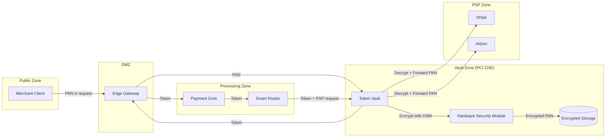
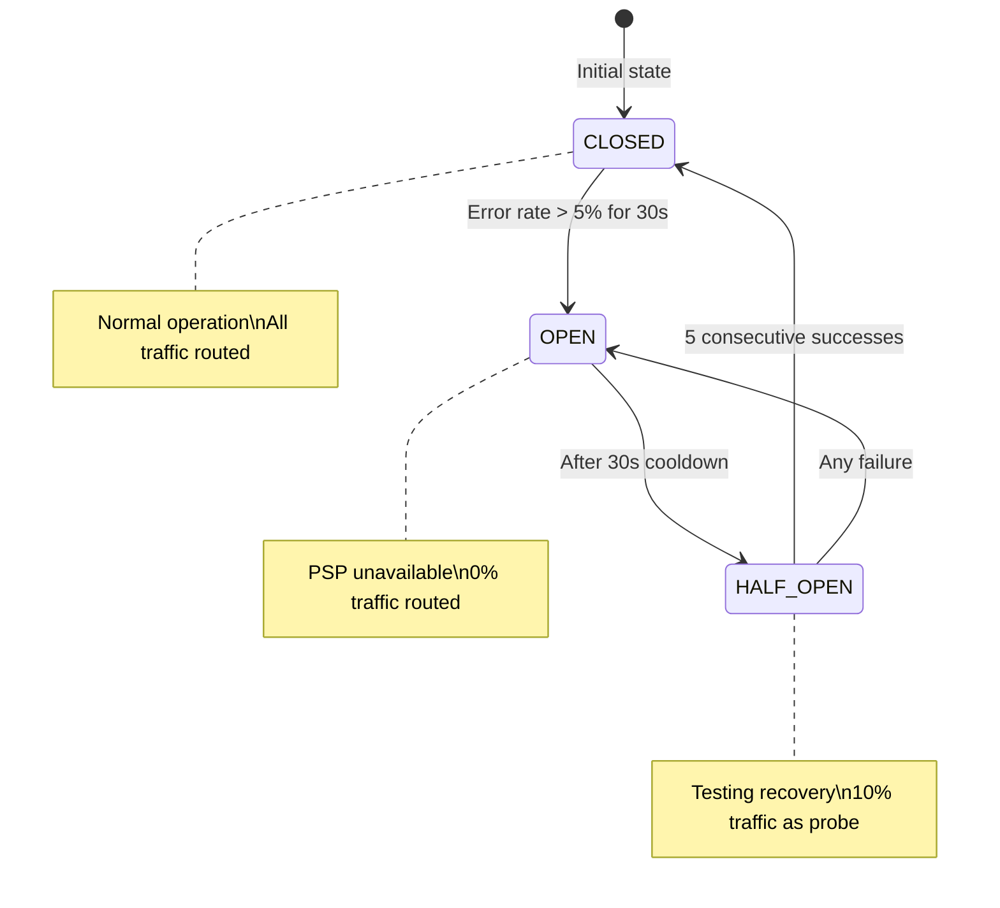

# Technical Requirements Document: Catena Core Platform

**Version:** 1.0  
**Last Updated:** 2026-02-04  
**Status:** Draft - To Be Developed During Architecture Phase  
**Parent Document:** [PRD.md](PRD.md)

---

## Purpose

This document captures technical implementation details, schemas, algorithms, and architectural specifications that support the product requirements defined in the PRD. This is a **living document** that will be expanded during the architecture and design phases.

> **Note:** This document currently contains technical details extracted from the PRD to maintain separation between "what" (PRD) and "how" (TRD). The full technical design will emerge from applying concepts from *Designing Data-Intensive Applications* and *Fundamentals of Software Architecture* to the product requirements.

---

## Table of Contents

1. [Data Schemas](#1-data-schemas)
2. [Algorithm Specifications](#2-algorithm-specifications)
3. [Infrastructure Specifications](#3-infrastructure-specifications)
4. [Security Architecture](#4-security-architecture)
5. [Open Technical Questions](#5-open-technical-questions)

---

## 1. Data Schemas

*Referenced from: [PRD Section 3.3.1 - Idempotency Engine](PRD.md#331-idempotency-engine)*

### 1.1 Idempotency Key Storage

```sql
CREATE TABLE idempotency_keys (
    merchant_id     UUID NOT NULL,
    idempotency_key VARCHAR(256) NOT NULL,
    request_hash    VARCHAR(64) NOT NULL,  -- SHA-256 of normalized request body
    status          VARCHAR(20) NOT NULL,  -- PENDING, COMPLETED, FAILED
    response_code   INTEGER,
    response_body   JSONB,
    created_at      TIMESTAMP NOT NULL DEFAULT NOW(),
    completed_at    TIMESTAMP,
    PRIMARY KEY (merchant_id, idempotency_key)
);

CREATE INDEX idx_idempotency_cleanup ON idempotency_keys (created_at) 
    WHERE created_at < NOW() - INTERVAL '24 hours';
```

**Design Considerations (To Be Addressed):**
- Partitioning strategy for high-volume merchants
- Replication topology for cross-region idempotency
- TTL enforcement mechanism

---

*Referenced from: [PRD Section 3.3.4 - Double-Entry Ledger](PRD.md#334-double-entry-ledger)*

### 1.2 Ledger Entry Schema

```sql
CREATE TABLE ledger_entries (
    entry_id        UUID PRIMARY KEY DEFAULT gen_random_uuid(),
    payment_id      UUID NOT NULL REFERENCES payments(payment_id),
    journal_id      UUID NOT NULL,  -- Groups related entries
    account         VARCHAR(100) NOT NULL,
    entry_type      VARCHAR(20) NOT NULL,  -- DEBIT or CREDIT
    amount_cents    BIGINT NOT NULL CHECK (amount_cents > 0),
    currency        VARCHAR(3) NOT NULL,
    created_at      TIMESTAMP NOT NULL DEFAULT NOW(),
    created_by      VARCHAR(100) NOT NULL,  -- System or user ID
    reason          VARCHAR(500) NOT NULL,
    idempotency_key VARCHAR(256),
    
    CONSTRAINT ledger_entries_type_check CHECK (entry_type IN ('DEBIT', 'CREDIT'))
);

-- Ensure every journal balances
CREATE OR REPLACE FUNCTION check_journal_balance()
RETURNS TRIGGER AS $$
BEGIN
    IF (
        SELECT SUM(CASE WHEN entry_type = 'DEBIT' THEN amount_cents ELSE -amount_cents END)
        FROM ledger_entries
        WHERE journal_id = NEW.journal_id
    ) != 0 THEN
        RAISE EXCEPTION 'Journal % does not balance', NEW.journal_id;
    END IF;
    RETURN NEW;
END;
$$ LANGUAGE plpgsql;
```

**Design Considerations (To Be Addressed):**
- Append-only enforcement at database level
- Partitioning by time vs. merchant for query patterns
- Archival strategy for older entries
- Cross-region consistency for ledger writes

---

## 2. Algorithm Specifications

*Referenced from: [PRD Section 3.3.3 - Smart Router](PRD.md#333-smart-router)*

### 2.1 PSP Health Score Calculation

```
Health Score = 100 - (Error Rate × 100) - (Timeout Rate × 50) - (Latency Penalty)

Where:
- Error Rate = (5xx responses + Connection failures) / Total requests [1-minute window]
- Timeout Rate = Timeouts / Total requests [1-minute window]
- Latency Penalty = max(0, (P95 Latency - 500ms) / 10)  [caps at 50 points]
```

**Design Considerations (To Be Addressed):**
- Data structure for sliding window metrics
- Cross-region health score synchronization
- Circuit breaker state machine implementation

---

### 2.2 Webhook Signature Verification

```
expected_signature = HMAC-SHA256(
    key = webhook_secret,
    message = timestamp + "." + raw_body
)
```

---

## 3. Infrastructure Specifications

*Referenced from: [PRD Section 3.4.4 - Concurrent Capture and Void](PRD.md#344-flow-4-concurrent-capture-and-void-race-condition)*

### 3.1 Distributed Lock Specifications

| Property | Value |
|----------|-------|
| Lock key format | `payment_lock:{payment_id}` |
| Lock TTL | 30 seconds (auto-release on crash) |
| Lock acquisition timeout | 5 seconds |
| Lock backend | Redis with Redlock algorithm |

**Design Considerations (To Be Addressed):**
- Redlock vs. single-instance trade-offs
- Lock fencing tokens for distributed safety
- Handling lock expiry during long PSP calls

---

*Referenced from: [PRD Section 3.3.2 - Token Vault](PRD.md#332-token-vault-pci-dss-compliance)*

### 3.2 Token Vault Architecture



**Design Considerations (To Be Addressed):**
- HSM failover and key ceremony procedures
- Token vault replication across regions
- Latency impact of HSM operations

---

### 3.3 Circuit Breaker State Machine

*Referenced from: [PRD Section 3.3.3 - Smart Router](PRD.md#333-smart-router)*



---

## 4. Security Architecture

### 4.1 Encryption Specifications

| Data Type | At Rest | In Transit | Key Management |
|-----------|---------|------------|----------------|
| PAN | AES-256-GCM | TLS 1.3 | HSM, 90-day rotation |
| API Keys | bcrypt hash | TLS 1.3 | N/A (hashed) |
| Webhook Secrets | AES-256-GCM | TLS 1.3 | 90-day rotation |
| Ledger Data | AES-256-GCM | TLS 1.3 | Annual rotation |

---

## 5. Open Technical Questions

These questions will be addressed during the architecture phase, applying concepts from the reference materials.

> **Learning Prompt:** For each question, think about how DDIA concepts apply. What are the trade-offs? What would the system behavior be under failure conditions?

### 5.1 Replication & Consistency

*Related PRD sections: [3.8.3 Regional Failover](PRD.md#383-scenario-regional-failover-during-active-transaction), [3.8.5 Read-After-Write](PRD.md#385-scenario-read-after-write-consistency)*

| Question | Context | DDIA Concepts |
|----------|---------|---------------|
| What replication topology supports zero RPO for payment state? | Cross-region deployment with EU data residency requirements | Single-leader vs multi-leader, synchronous vs async replication |
| How do we handle replication lag for read-after-write? | Merchant creates payment, immediately queries it | Read-your-writes consistency, session consistency |
| What happens during a network partition between regions? | PRD Section 3.8.4 defines requirements | CAP theorem, partition tolerance |
| How does cross-region idempotency work during partition? | Same key submitted to both regions | Conflict detection, vector clocks |
| What's the failover procedure when primary region fails? | 30-second failover SLA per PRD | Leader election, fencing tokens |

**Scenarios to Design For:**
1. EU region fails mid-payment with synchronous replication
2. EU region fails mid-payment with asynchronous replication
3. Network partition heals and conflicting writes detected
4. Merchant reads from replica during replication lag

---

### 5.2 Partitioning

*Related PRD sections: [3.9.1 Flash Sale](PRD.md#391-scenario-flash-sale-single-merchant-traffic-spike), [3.9.2 Dashboard Query](PRD.md#392-scenario-merchant-dashboard-query-large-data-volume)*

| Question | Context | DDIA Concepts |
|----------|---------|---------------|
| How do we partition payments to avoid hot spots? | Single merchant can spike to 30k TPS (60% of capacity) | Hash partitioning, consistent hashing |
| What's the rebalancing strategy when adding capacity? | Zero-downtime merchant migration per PRD 3.8.6 | Virtual nodes, partition handoff |
| How do we handle cross-partition queries? | Dashboard queries aggregate across all partitions | Scatter-gather, parallel queries |
| How do we ensure isolation between merchants? | Noisy neighbor problem (PRD 3.9.1) | Partition-level resource limits |
| How does partitioning interact with replication? | Each partition needs its own replicas | Partition-leader combinations |

**Partitioning Decision Matrix:**

| Data Type | Partition Key Options | Query Patterns | Recommendation Pending |
|-----------|----------------------|----------------|------------------------|
| Payments | merchant_id vs payment_id | Merchant dashboard, single payment lookup | TBD |
| Ledger entries | time vs merchant_id vs account | Date range, merchant reconciliation | TBD |
| Idempotency keys | merchant_id + key hash | Exact lookup only | TBD |
| Events/webhooks | merchant_id | Merchant event history | TBD |

---

### 5.3 Distributed Transactions

*Related PRD sections: [3.4.1 Authorization](PRD.md#341-flow-1-authorization), [3.4.4 Concurrent Capture/Void](PRD.md#344-flow-4-concurrent-capture-and-void-race-condition)*

| Question | Context | DDIA Concepts |
|----------|---------|---------------|
| How do we maintain atomicity across payment + ledger + webhook? | Single payment creates entries in multiple tables/services | ACID vs BASE, saga pattern |
| What saga/compensation patterns apply to refunds? | Refund can fail at PSP after ledger updated | Compensating transactions |
| How do we handle partial failures? | Capture succeeds at PSP but ledger write fails | Outbox pattern, eventual consistency |
| What's our distributed lock strategy? | Concurrent capture + void (PRD 3.4.4) | Redlock, fencing tokens |
| How do we prevent double-processing during recovery? | Recovery job may run on multiple nodes | Idempotency, claim checks |

**Transaction Boundary Analysis:**

| Operation | Current Atomicity | Cross-Service? | Pattern Needed |
|-----------|------------------|----------------|----------------|
| Create payment | Single DB transaction | No | Standard ACID |
| Authorize | Payment state + PSP call | Yes | Saga/Compensating |
| Capture | Payment state + Ledger + PSP | Yes | Saga with outbox |
| Refund | Payment state + Ledger + PSP + Webhook | Yes | Choreography saga |
| Settlement | Batch ledger updates | No (batch) | Batch processing |

---

### 5.4 CAP Theorem Trade-offs

*Related PRD sections: [3.8.4 Network Partition](PRD.md#384-scenario-network-partition-between-regions)*

PRD Section 3.8.4 defines specific product decisions for CAP trade-offs during network partitions:

| Operation | PRD Decision | Rationale | Technical Implementation |
|-----------|--------------|-----------|-------------------------|
| Payment creation | Availability | Customer experience, PSP idempotency backup | TBD |
| Capture/Void/Refund | Consistency | Financial accuracy | TBD |
| Read operations | Availability | Eventual consistency acceptable | TBD |
| Ledger writes | Consistency | Audit trail accuracy | TBD |

**Questions to Address:**

| Question | Context | DDIA Concepts |
|----------|---------|---------------|
| How do we detect partition vs slow network? | False positive detection is costly | Failure detectors, phi accrual |
| How do we implement CP mode for captures? | Reject writes in minority partition | Quorum writes, fencing |
| How do we implement AP mode for creates? | Accept writes in both partitions | Conflict detection, LWW/vector clocks |
| What's the conflict resolution for split-brain? | Two payments created with same key | CRDTs, operational transforms |

---

### 5.5 Recovery & Consistency Verification

| Question | Context | DDIA Concepts |
|----------|---------|---------------|
| How do we verify ledger consistency post-recovery? | After partition heals | Merkle trees, anti-entropy |
| How do we reconcile divergent state? | Both regions processed same payment | Conflict resolution, version vectors |
| What's the read repair strategy? | Stale data detected on read | Read repair, hinted handoff |
| How long can we tolerate inconsistency? | SLA for eventual consistency | Consistency windows |

---

## 6. Technical Decision Log

*Document key architectural decisions as they're made. Use ADR (Architecture Decision Record) format.*

### 6.1 Template

```markdown
## ADR-XXX: [Title]

**Status:** Proposed | Accepted | Deprecated | Superseded

**Context:** What is the issue that we're seeing that motivates this decision?

**Decision:** What is the change that we're proposing?

**Consequences:** What are the trade-offs? What becomes easier or harder?

**Alternatives Considered:** What other options were evaluated?
```

### 6.2 Pending Decisions

| ADR # | Topic | Status | Related PRD |
|-------|-------|--------|-------------|
| ADR-001 | Replication topology | Pending | PRD 3.8.3, 3.8.5 |
| ADR-002 | Partitioning strategy | Pending | PRD 3.9.1 |
| ADR-003 | Distributed transaction pattern | Pending | PRD 3.4.4 |
| ADR-004 | CAP mode implementation | Pending | PRD 3.8.4 |
| ADR-005 | Ledger consistency model | Pending | PRD 3.3.4 |

---

## Appendix: Reference Architecture Patterns

*To be developed based on requirements. These patterns from DDIA will likely apply:*

- **Single-Leader Replication** - For strong consistency on writes
- **Multi-Leader Replication** - For multi-region active-active
- **Leaderless Replication** - For high availability reads
- **Hash Partitioning** - For even load distribution
- **Range Partitioning** - For time-series queries (ledger)
- **Saga Pattern** - For distributed transactions
- **Outbox Pattern** - For reliable event publishing

---

## Document History

| Version | Date | Author | Changes |
|---------|------|--------|---------|
| 1.0 | 2026-02-04 | Initial | Extracted from PRD v2.0 |
| 1.1 | 2026-02-04 | Update | Expanded Open Technical Questions to align with PRD v2.1 distributed systems scenarios; added DDIA learning prompts and decision log template |
