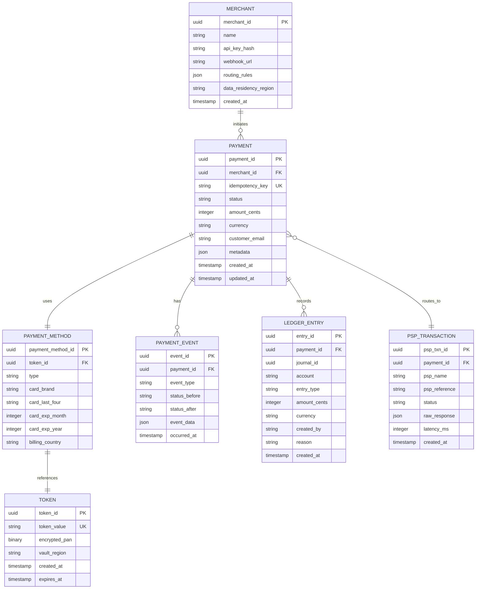
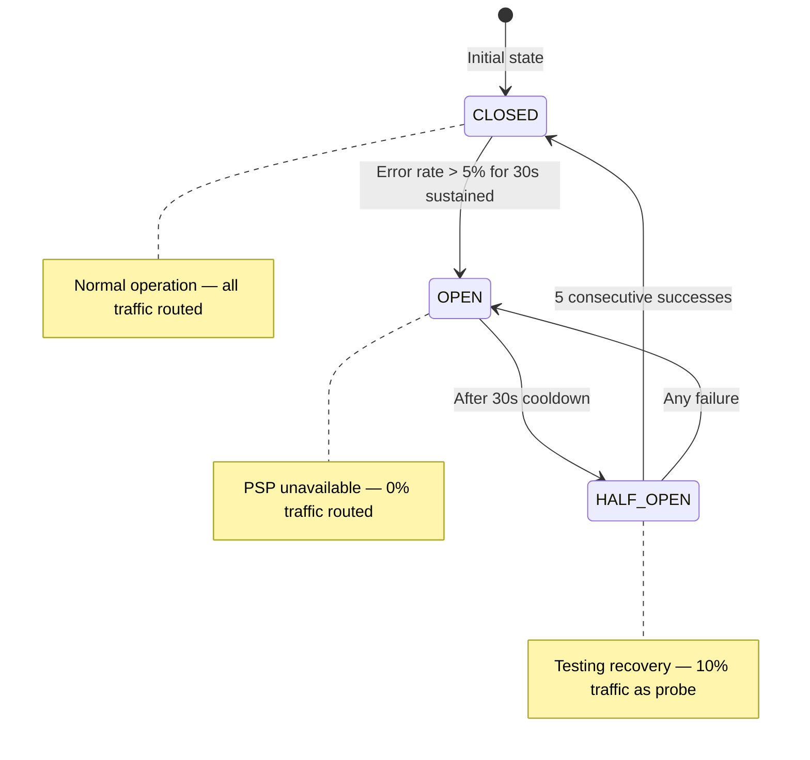

# Technical Requirements Document: Catena Core Platform

**Version:** 2.0  
**Last Updated:** 2026-02-07  
**Status:** Draft — To Be Developed During Architecture Phase  
**Parent Document:** [PRD.md](PRD.md)

---

## Purpose

This document captures **implementation details, schemas, algorithms, and architectural specifications** that support the product requirements defined in the PRD. It answers "how" the system will be built, while the PRD answers "what" and "why."

This is a **living document** that will expand during architecture and design phases. The full technical design will emerge from applying concepts from *Designing Data-Intensive Applications* and *Fundamentals of Software Architecture* to the product requirements.

---

## Table of Contents

1. [Data Schemas](#1-data-schemas)
2. [API Specifications](#2-api-specifications)
3. [Algorithm Specifications](#3-algorithm-specifications)
4. [Infrastructure Specifications](#4-infrastructure-specifications)
5. [Security Architecture](#5-security-architecture)
6. [Open Technical Questions](#6-open-technical-questions)
7. [Technical Decision Log](#7-technical-decision-log)
8. [Reference Architecture Patterns](#8-reference-architecture-patterns)

---

## 1. Data Schemas

### 1.1 Core Entity Definitions

*Referenced from: [PRD Section 3.1.1 — Domain Model](PRD.md#311-core-entities)*



---

### 1.2 Idempotency Key Storage

*Referenced from: [PRD Section 3.3.1 — Idempotency Engine](PRD.md#331-idempotency-engine)*

```sql
CREATE TABLE idempotency_keys (
    merchant_id     UUID NOT NULL,
    idempotency_key VARCHAR(256) NOT NULL,
    request_hash    VARCHAR(64) NOT NULL,  -- SHA-256 of normalized request body
    status          VARCHAR(20) NOT NULL,  -- PENDING, COMPLETED, FAILED
    response_code   INTEGER,
    response_body   JSONB,
    created_at      TIMESTAMP NOT NULL DEFAULT NOW(),
    completed_at    TIMESTAMP,
    PRIMARY KEY (merchant_id, idempotency_key)
);

-- TTL enforcement: clean up keys older than 24 hours
CREATE INDEX idx_idempotency_cleanup ON idempotency_keys (created_at)
    WHERE created_at < NOW() - INTERVAL '24 hours';
```

**Key Format Constraint:**

```
Regex: ^[a-zA-Z0-9_-]{1,256}$
```

**Design Considerations (To Be Addressed):**
- Partitioning strategy for high-volume merchants
- Replication topology for cross-region idempotency
- TTL enforcement mechanism (background job vs. database TTL feature)
- How to handle cross-region key visibility during partitions

---

### 1.3 Ledger Entry Schema

*Referenced from: [PRD Section 3.3.4 — Double-Entry Ledger](PRD.md#334-double-entry-ledger)*

```sql
CREATE TABLE ledger_entries (
    entry_id        UUID PRIMARY KEY DEFAULT gen_random_uuid(),
    payment_id      UUID NOT NULL REFERENCES payments(payment_id),
    journal_id      UUID NOT NULL,  -- Groups related debit/credit pairs
    account         VARCHAR(100) NOT NULL,
    entry_type      VARCHAR(20) NOT NULL,  -- DEBIT or CREDIT
    amount_cents    BIGINT NOT NULL CHECK (amount_cents > 0),
    currency        VARCHAR(3) NOT NULL,
    created_at      TIMESTAMP NOT NULL DEFAULT NOW(),
    created_by      VARCHAR(100) NOT NULL,  -- System or user ID
    reason          VARCHAR(500) NOT NULL,
    idempotency_key VARCHAR(256),

    CONSTRAINT ledger_entries_type_check CHECK (entry_type IN ('DEBIT', 'CREDIT'))
);

-- Indexes for reconciliation and dashboard queries
CREATE INDEX idx_ledger_account_time ON ledger_entries (account, created_at);
CREATE INDEX idx_ledger_payment ON ledger_entries (payment_id);
CREATE INDEX idx_ledger_journal ON ledger_entries (journal_id);

-- Ensure every journal balances (debits = credits)
CREATE OR REPLACE FUNCTION check_journal_balance()
RETURNS TRIGGER AS $$
BEGIN
    IF (
        SELECT SUM(CASE WHEN entry_type = 'DEBIT' THEN amount_cents ELSE -amount_cents END)
        FROM ledger_entries
        WHERE journal_id = NEW.journal_id
    ) != 0 THEN
        RAISE EXCEPTION 'Journal % does not balance', NEW.journal_id;
    END IF;
    RETURN NEW;
END;
$$ LANGUAGE plpgsql;

CREATE CONSTRAINT TRIGGER trg_check_journal_balance
    AFTER INSERT ON ledger_entries
    DEFERRABLE INITIALLY DEFERRED
    FOR EACH ROW EXECUTE FUNCTION check_journal_balance();
```

**Append-Only Enforcement:**

```sql
-- Prevent UPDATE and DELETE at the database level
CREATE RULE prevent_ledger_update AS
    ON UPDATE TO ledger_entries DO INSTEAD NOTHING;

CREATE RULE prevent_ledger_delete AS
    ON DELETE TO ledger_entries DO INSTEAD NOTHING;
```

**Example Ledger Entries for a $50 Authorization + Capture:**

| Step | Journal ID | Account | Type | Amount | Reason |
|------|------------|---------|------|--------|--------|
| Auth | j_001 | `customer_auth_hold:pay_xyz` | DEBIT | $50.00 | Authorization approved |
| Auth | j_001 | `merchant_pending_auth:m_abc` | CREDIT | $50.00 | Authorization approved |
| Capture | j_002 | `psp_settlement:stripe` | DEBIT | $50.00 | Capture confirmed |
| Capture | j_002 | `customer_auth_hold:pay_xyz` | CREDIT | $50.00 | Auth hold released |
| Capture | j_002 | `merchant_pending_auth:m_abc` | DEBIT | $50.00 | Pending auth cleared |
| Capture | j_002 | `merchant_balance:m_abc` | CREDIT | $48.55 | Net after fees |
| Capture | j_002 | `catena_fee_revenue` | CREDIT | $1.45 | 2.9% processing fee |

**Dispute Ledger Entries:**

| Event | Debit | Credit | Amount |
|-------|-------|--------|--------|
| Dispute created | `merchant_balance` | `chargeback_reserve` | $50.00 |
| Dispute won | `chargeback_reserve` | `merchant_balance` | $50.00 |
| Dispute lost | `chargeback_reserve` | `psp_settlement` | $50.00 |
| Dispute lost fee | `chargeback_fee_expense` | `merchant_balance` | $15.00 |

**Design Considerations (To Be Addressed):**
- Append-only enforcement at database level vs. application level vs. both
- Partitioning by time vs. merchant for query patterns
- Archival strategy for entries older than active reconciliation window
- Cross-region consistency model for ledger writes
- Pre-computed balance materialization strategy

---

## 2. API Specifications

*Referenced from: [PRD Section 3.5 — API Contracts](PRD.md#35-api-contracts)*

### 2.1 Authentication

All API requests must include authentication:

```http
Authorization: Bearer sk_live_abc123xyz
```

| Key Type | Format | Use Case |
|----------|--------|----------|
| Secret Key | `sk_live_*` or `sk_test_*` | Server-to-server API calls |
| Publishable Key | `pk_live_*` or `pk_test_*` | Client-side tokenization only |

---

### 2.2 Endpoint Details

#### POST /v1/payments — Create Payment

**Request Fields:**

| Field | Type | Required | Description |
|-------|------|----------|-------------|
| `amount` | integer | Yes | Amount in smallest currency unit |
| `currency` | string | Yes | ISO 4217 currency code (e.g., "USD") |
| `payment_method` | object | Yes | Payment instrument details |
| `payment_method.type` | string | Yes | `"card"` or `"bank_transfer"` |
| `payment_method.card.number` | string | Conditional | Card number (if not using token) |
| `payment_method.card.exp_month` | integer | Conditional | 1-12 |
| `payment_method.card.exp_year` | integer | Conditional | 4-digit year |
| `payment_method.card.cvc` | string | Conditional | 3 or 4 digit code |
| `payment_method.token` | string | Conditional | Previously created token |
| `customer.email` | string | No | Customer email for receipts |
| `capture_method` | string | No | `"automatic"` (default) or `"manual"` |
| `metadata` | object | No | Up to 50 key-value pairs |

**Example Request:**
```http
POST /v1/payments HTTP/1.1
Host: api.catena.io
Authorization: Bearer sk_live_abc123
Idempotency-Key: ord_123_attempt_1
Content-Type: application/json

{
  "amount": 5000,
  "currency": "USD",
  "payment_method": {
    "type": "card",
    "card": {
      "number": "4242424242424242",
      "exp_month": 12,
      "exp_year": 2025,
      "cvc": "123"
    }
  },
  "customer": {
    "email": "customer@example.com"
  },
  "metadata": {
    "order_id": "ord_123"
  },
  "capture_method": "manual"
}
```

**Example Response (Authorized):**
```http
HTTP/1.1 200 OK
Content-Type: application/json
Idempotency-Key: ord_123_attempt_1
Request-Id: req_8hf93hf9h3f

{
  "id": "pay_xyz789",
  "object": "payment",
  "status": "authorized",
  "amount": 5000,
  "currency": "USD",
  "payment_method": {
    "id": "pm_abc123",
    "type": "card",
    "card": {
      "brand": "visa",
      "last4": "4242",
      "exp_month": 12,
      "exp_year": 2025,
      "funding": "credit",
      "country": "US"
    }
  },
  "customer_email": "customer@example.com",
  "metadata": {
    "order_id": "ord_123"
  },
  "created_at": "2026-02-04T10:30:00Z",
  "authorized_at": "2026-02-04T10:30:01Z",
  "captured_at": null,
  "capture_before": "2026-02-11T10:30:01Z",
  "routing": {
    "psp": "stripe",
    "psp_reference": "ch_abc123",
    "reason": "lowest_cost"
  }
}
```

**Example Response (3DS Required):**
```json
{
  "id": "pay_xyz789",
  "status": "requires_action",
  "next_action": {
    "type": "redirect_to_url",
    "redirect_to_url": {
      "url": "https://bank.com/3ds/auth?session=abc123",
      "return_url": "https://merchant.com/checkout/complete"
    }
  },
  "action_expires_at": "2026-02-04T10:45:00Z"
}
```

**Response Codes:**

| Code | Condition |
|------|-----------|
| 200 | Payment created successfully |
| 400 | Invalid request parameters |
| 401 | Invalid or missing API key |
| 402 | Card declined |
| 409 | Idempotency key conflict |
| 429 | Rate limit exceeded |
| 500 | Internal server error |

---

#### POST /v1/payments/{id}/capture — Capture Payment

**Request Fields:**

| Field | Type | Required | Description |
|-------|------|----------|-------------|
| `amount` | integer | No | Amount to capture (default: full auth amount) |

**Example Request:**
```http
POST /v1/payments/pay_xyz789/capture HTTP/1.1
Host: api.catena.io
Authorization: Bearer sk_live_abc123
Idempotency-Key: capture_ord_123

{
  "amount": 5000
}
```

**Example Response:**
```json
{
  "id": "pay_xyz789",
  "status": "captured",
  "amount": 5000,
  "amount_captured": 5000,
  "captured_at": "2026-02-04T14:00:00Z"
}
```

**Response Codes:**

| Code | Condition |
|------|-----------|
| 200 | Capture successful |
| 400 | Invalid capture amount |
| 404 | Payment not found |
| 409 | Payment not in capturable state |
| 422 | Capture amount exceeds authorization |

---

#### POST /v1/payments/{id}/void — Void Payment

**Response Codes:**

| Code | Condition |
|------|-----------|
| 200 | Void successful |
| 404 | Payment not found |
| 409 | Payment not in voidable state |

---

#### POST /v1/payments/{id}/refund — Refund Payment

**Request Fields:**

| Field | Type | Required | Description |
|-------|------|----------|-------------|
| `amount` | integer | No | Refund amount (default: remaining capturable) |
| `reason` | string | No | `"duplicate"`, `"fraudulent"`, `"requested_by_customer"` |

**Example Partial Refund Response:**
```json
{
  "id": "pay_xyz",
  "status": "partial_refunded",
  "amount": 5000,
  "amount_captured": 5000,
  "amount_refunded": 3000,
  "refundable_amount": 2000,
  "refunds": [
    {
      "id": "rf_001",
      "amount": 3000,
      "status": "succeeded",
      "created_at": "2026-02-04T15:00:00Z"
    }
  ]
}
```

**Response Codes:**

| Code | Condition |
|------|-----------|
| 200 | Refund successful |
| 400 | Invalid refund amount |
| 404 | Payment not found |
| 409 | Payment not refundable |
| 422 | Refund exceeds captured amount |

---

#### GET /v1/payments/{id} — Retrieve Payment

**Example Response:**
```json
{
  "id": "pay_xyz789",
  "object": "payment",
  "status": "captured",
  "amount": 5000,
  "currency": "USD",
  "amount_captured": 5000,
  "amount_refunded": 0,
  "payment_method": {
    "type": "card",
    "card": {
      "brand": "visa",
      "last4": "4242",
      "exp_month": 12,
      "exp_year": 2025
    }
  },
  "created_at": "2026-02-04T10:30:00Z",
  "captured_at": "2026-02-04T14:00:00Z",
  "events": [
    {"type": "payment.created", "at": "2026-02-04T10:30:00Z"},
    {"type": "payment.authorized", "at": "2026-02-04T10:30:01Z"},
    {"type": "payment.captured", "at": "2026-02-04T14:00:00Z"}
  ]
}
```

---

#### GET /v1/payments — List Payments

**Query Parameters:**

| Parameter | Type | Description |
|-----------|------|-------------|
| `limit` | integer | Max results (1-100, default 10) |
| `starting_after` | string | Cursor for pagination |
| `created[gte]` | timestamp | Filter by creation date (greater-than-or-equal) |
| `created[lte]` | timestamp | Filter by creation date (less-than-or-equal) |
| `status` | string | Filter by payment status |

---

#### POST /v1/bulk/refunds — Bulk Refund

**Example Request:**
```http
POST /v1/bulk/refunds HTTP/1.1
Content-Type: application/json

{
  "payment_ids": ["pay_001", "pay_002", "pay_003"],
  "reason": "fraudulent",
  "notify_customer": false
}
```

**Example Response:**
```json
{
  "bulk_operation_id": "bulk_abc123",
  "status": "processing",
  "total": 10000,
  "processed": 0,
  "succeeded": 0,
  "failed": 0,
  "estimated_completion": "2026-02-04T15:30:00Z",
  "status_url": "/v1/bulk/refunds/bulk_abc123"
}
```

---

### 2.3 Error Response Format

All errors follow this structure:

```json
{
  "error": {
    "type": "invalid_request_error",
    "code": "parameter_invalid",
    "message": "Amount must be a positive integer",
    "param": "amount",
    "doc_url": "https://docs.catena.io/errors/parameter_invalid"
  }
}
```

**Conflict Response Example (State Conflict):**
```json
{
  "error": {
    "type": "state_conflict",
    "code": "payment_state_invalid",
    "message": "Cannot void payment in CAPTURING state",
    "current_state": "CAPTURING",
    "requested_action": "void",
    "allowed_actions": []
  }
}
```

**Idempotency Conflict Example:**
```json
{
  "error": {
    "type": "idempotency_error",
    "code": "idempotency_key_reused",
    "message": "Key used with different parameters"
  }
}
```

---

### 2.4 Webhook Payload Format

*Referenced from: [PRD Section 3.6 — Event & Webhook System](PRD.md#36-event--webhook-system)*

**Example Webhook Payload:**
```json
{
  "id": "evt_abc123",
  "object": "event",
  "type": "payment.captured",
  "created_at": "2026-02-04T14:00:00Z",
  "data": {
    "object": {
      "id": "pay_xyz789",
      "object": "payment",
      "status": "captured",
      "amount": 5000,
      "amount_captured": 5000
    }
  }
}
```

**Webhook Signature Header:**
```http
POST /webhooks/catena HTTP/1.1
Content-Type: application/json
Catena-Signature: t=1707048000,v1=abc123signature

{...payload...}
```

---

### 2.5 Settlement Report Format

*Referenced from: [PRD Section 3.7 — Reconciliation & Settlement](PRD.md#37-reconciliation--settlement)*

**CSV Settlement Report Example:**
```csv
settlement_date,payment_id,psp_reference,gross_amount,currency,interchange_fee,catena_fee,net_amount,status
2026-02-04,pay_001,ch_abc,100.00,USD,1.50,1.45,97.05,settled
2026-02-04,pay_002,ch_def,50.00,USD,0.75,0.73,48.52,settled
2026-02-04,pay_003,ch_ghi,-25.00,USD,0.00,0.00,-25.00,refund
```

---

## 3. Algorithm Specifications

### 3.1 PSP Health Score Calculation

*Referenced from: [PRD Section 3.3.3 — Smart Router](PRD.md#333-smart-router)*

```
Health Score = 100 - (Error Rate × 100) - (Timeout Rate × 50) - (Latency Penalty)

Where:
- Error Rate = (5xx responses + Connection failures) / Total requests [1-minute sliding window]
- Timeout Rate = Timeouts / Total requests [1-minute sliding window]
- Latency Penalty = max(0, (P95 Latency - 500ms) / 10)  [caps at 50 points]
```

**Examples:**

| Scenario | Error Rate | Timeout Rate | P95 Latency | Health Score |
|----------|-----------|-------------|-------------|-------------|
| Healthy PSP | 0.1% | 0.05% | 200ms | 97.4 |
| Degraded PSP | 2% | 1% | 800ms | 47.5 |
| Unhealthy PSP | 10% | 5% | 2000ms | -12.5 → 0 |

**Design Considerations (To Be Addressed):**
- Data structure for sliding window metrics (ring buffer, exponential decay, or HyperLogLog)
- Cross-region health score synchronization
- Weighting adjustments based on card brand and region

---

### 3.2 Webhook Signature Algorithm

*Referenced from: [PRD Section 3.6 — Webhook System](PRD.md#36-event--webhook-system)*

```
signature = HMAC-SHA256(
    key   = webhook_secret,
    message = timestamp + "." + raw_body
)

Header format:
Catena-Signature: t=<unix_timestamp>,v1=<hex_encoded_signature>
```

**Verification Steps (Merchant Implementation):**
1. Extract `t` (timestamp) and `v1` (signature) from header
2. Reject if `t` is more than 5 minutes in the past (replay protection)
3. Compute `expected = HMAC-SHA256(webhook_secret, t + "." + raw_body)`
4. Compare `expected` with `v1` using constant-time comparison

---

### 3.3 Routing Score Calculation

*Referenced from: [PRD Section 3.3.3 — Smart Router](PRD.md#333-smart-router)*

```
Routing Score = (Health × 0.30) + (Success Rate × 0.25) + (Cost Score × 0.25) + (Latency Score × 0.10) + (Preference × 0.10)

Where:
- Health = PSP Health Score (0-100) from Section 3.1
- Success Rate = Historical auth rate for (card_brand, issuer_country, PSP) [0-100]
- Cost Score = 100 - (normalized interchange cost relative to cheapest option)
- Latency Score = 100 - (normalized P95 latency relative to fastest option)
- Preference = 100 if merchant preferred PSP, 0 otherwise
```

**PSP Selection:** Select the PSP with the highest routing score. If top PSP's circuit breaker is OPEN, select next highest.

---

## 4. Infrastructure Specifications

### 4.1 Token Vault Architecture

*Referenced from: [PRD Section 3.3.2 — Token Vault](PRD.md#332-token-vault-pci-dss-compliance)*


**Token Format:**
```
tok_{brand}_{last4}_exp{MMYY}_{random}
Example: tok_visa_4242_exp1225_k8f9h3
```

**Network Segmentation:**
- Only the Edge Gateway and Smart Router can reach the Vault Zone
- Vault Zone has dedicated firewall rules (CDE boundary)
- No direct access from Processing Zone to VaultDB

**Design Considerations (To Be Addressed):**
- HSM failover and key ceremony procedures
- Token vault replication across regions
- Latency impact of HSM operations
- CVV forwarding: in-memory lifetime budget (< 100ms target)

---

### 4.2 Distributed Lock Specifications

*Referenced from: [PRD Section 3.4.4 — Concurrent Capture and Void](PRD.md#344-flow-4-concurrent-capture-and-void-race-condition)*

| Property | Value |
|----------|-------|
| Lock key format | `payment_lock:{payment_id}` |
| Lock TTL | 30 seconds (auto-release on crash) |
| Lock acquisition timeout | 5 seconds |
| Lock backend | Redis with Redlock algorithm |

**Design Considerations (To Be Addressed):**
- Redlock vs. single-instance trade-offs (see Martin Kleppmann's critique)
- Lock fencing tokens for distributed safety
- Handling lock expiry during long PSP calls (PSP P99 latency > lock TTL?)
- Degraded mode if Redis is unavailable

---

### 4.3 Circuit Breaker Configuration

*Referenced from: [PRD Section 3.3.3 — Smart Router](PRD.md#333-smart-router)*



**Circuit Breaker Parameters:**

| Parameter | Value | Notes |
|-----------|-------|-------|
| Error rate threshold | 5% | Sustained for 30s window |
| Cooldown period | 30 seconds | Time in OPEN before probing |
| Probe percentage | 10% | Traffic sent during HALF_OPEN |
| Recovery threshold | 5 consecutive successes | Promotes back to CLOSED |
| Window size | 30 seconds | Sliding window for rate calculation |

**Retry Timing (Same PSP before failover):**

| PSP Response | Retry Delay | Max Retries |
|-------------|-------------|-------------|
| HTTP 500 | 100ms | 1 |
| HTTP 502/503/504 | 0ms (immediate failover) | 0 |
| Network timeout | 0ms (immediate failover) | 0 |
| Connection refused | 0ms (immediate failover) | 0 |

---

### 4.4 Recovery Worker Specifications

*Referenced from: [PRD Section 3.4.3 — Zombie Transaction Recovery](PRD.md#343-flow-3-network-timeout-with-recovery-zombie-transaction)*

| Parameter | Value |
|-----------|-------|
| Scan interval | Every 30 seconds |
| Stuck threshold | Payment in PROCESSING > 60 seconds |
| PSP inquiry method | Query by Catena payment ID (idempotent) |
| Maximum resolution time | 5 minutes from original request |
| Concurrent worker safety | Must be idempotent (multiple workers can run safely) |

**Design Considerations (To Be Addressed):**
- Worker leader election or idempotent multi-worker design
- Exponential backoff for PSP inquiry failures
- Dead letter queue for unresolvable payments
- Metrics and alerting on stuck payment counts

---

### 4.5 Data Residency Configuration

*Referenced from: [PRD Section 3.8 — Multi-Region](PRD.md#38-multi-region--global-operations)*

| Region | Zones | Data Types Stored | Latency to Users |
|--------|-------|------------------|------------------|
| US | us-east-1, us-west-2 | US merchant and customer data | < 50ms |
| EU | eu-west-1, eu-central-1 | EU merchant and customer data (GDPR) | < 50ms |
| APAC | ap-southeast-1 | APAC merchant and customer data | < 100ms |

**Data Pinning Rules:**

| Merchant Region | Customer Region | Data Stored In |
|-----------------|-----------------|----------------|
| US | Any | US |
| EU | Any | EU (GDPR requirement) |
| APAC | Any | APAC |
| Any | EU citizen | EU (GDPR requirement) |

---

## 5. Security Architecture

### 5.1 Encryption Specifications

| Data Type | At Rest | In Transit | Key Management |
|-----------|---------|------------|----------------|
| PAN | AES-256-GCM | TLS 1.3 | HSM, 90-day rotation |
| API Keys | bcrypt hash (one-way) | TLS 1.3 | N/A (hashed) |
| Webhook Secrets | AES-256-GCM | TLS 1.3 | 90-day rotation |
| Ledger Data | AES-256-GCM | TLS 1.3 | Annual rotation |
| Customer PII | AES-256-GCM | TLS 1.3 | 90-day rotation |

### 5.2 Network Security Zones

| Zone | Components | Access From |
|------|-----------|------------|
| Public | Load Balancer | Internet |
| DMZ | Edge Gateway, WAF | Public zone |
| Processing | Payment Core, Router, State Machine, Ledger | DMZ only |
| Vault (CDE) | Token Vault, HSM, Encrypted Storage | Edge Gateway, Router only |
| PSP | Outbound PSP connections | Vault only (for card data), Processing (for non-card) |
| Data | Databases, Caches, Message Queues | Processing only |

---

## 6. Open Technical Questions

These questions will be addressed during the architecture phase, applying concepts from the reference materials.

> **Learning Prompt:** For each question, think about how DDIA concepts apply. What are the trade-offs? What would the system behavior be under failure conditions?

### 6.1 Replication & Consistency

*Related PRD sections: [3.8.3 Regional Failover](PRD.md#383-scenario-regional-failover-during-active-transaction), [3.8.5 Read-After-Write](PRD.md#385-scenario-read-after-write-consistency)*

| Question | Context | DDIA Concepts |
|----------|---------|---------------|
| What replication topology supports zero RPO for payment state? | Cross-region deployment with EU data residency requirements | Single-leader vs multi-leader, synchronous vs async replication |
| How do we handle replication lag for read-after-write? | Merchant creates payment, immediately queries it | Read-your-writes consistency, session consistency |
| What happens during a network partition between regions? | PRD Section 3.8.4 defines per-operation CAP decisions | CAP theorem, partition tolerance |
| How does cross-region idempotency work during partition? | Same key submitted to both regions | Conflict detection, vector clocks |
| What's the failover procedure when primary region fails? | 30-second failover SLA per PRD | Leader election, fencing tokens |

**Scenarios to Design For:**
1. EU region fails mid-payment with synchronous replication
2. EU region fails mid-payment with asynchronous replication
3. Network partition heals and conflicting writes detected
4. Merchant reads from replica during replication lag

---

### 6.2 Partitioning

*Related PRD sections: [3.9.1 Flash Sale](PRD.md#391-scenario-flash-sale-single-merchant-traffic-spike), [3.9.2 Dashboard Query](PRD.md#392-scenario-merchant-dashboard-query-large-data-volume)*

| Question | Context | DDIA Concepts |
|----------|---------|---------------|
| How do we partition payments to avoid hot spots? | Single merchant can spike to 30k TPS (60% of capacity) | Hash partitioning, consistent hashing |
| What's the rebalancing strategy when adding capacity? | Zero-downtime merchant migration per PRD 3.8.6 | Virtual nodes, partition handoff |
| How do we handle cross-partition queries? | Dashboard queries aggregate across all partitions | Scatter-gather, parallel queries |
| How do we ensure isolation between merchants? | Noisy neighbor problem (PRD 3.9.1) | Partition-level resource limits |
| How does partitioning interact with replication? | Each partition needs its own replicas | Partition-leader combinations |

**Partitioning Decision Matrix:**

| Data Type | Partition Key Options | Query Patterns | Recommendation Pending |
|-----------|----------------------|----------------|------------------------|
| Payments | merchant_id vs payment_id | Merchant dashboard, single payment lookup | TBD |
| Ledger entries | time vs merchant_id vs account | Date range, merchant reconciliation | TBD |
| Idempotency keys | merchant_id + key hash | Exact lookup only | TBD |
| Events/webhooks | merchant_id | Merchant event history | TBD |

---

### 6.3 Distributed Transactions

*Related PRD sections: [3.4.1 Authorization](PRD.md#341-flow-1-simple-card-payment-happy-path), [3.4.4 Concurrent Capture/Void](PRD.md#344-flow-4-concurrent-capture-and-void-race-condition)*

| Question | Context | DDIA Concepts |
|----------|---------|---------------|
| How do we maintain atomicity across payment + ledger + webhook? | Single payment creates entries in multiple tables/services | ACID vs BASE, saga pattern |
| What saga/compensation patterns apply to refunds? | Refund can fail at PSP after ledger updated | Compensating transactions |
| How do we handle partial failures? | Capture succeeds at PSP but ledger write fails | Outbox pattern, eventual consistency |
| What's our distributed lock strategy? | Concurrent capture + void (PRD 3.4.4) | Redlock, fencing tokens |
| How do we prevent double-processing during recovery? | Recovery job may run on multiple nodes | Idempotency, claim checks |

**Transaction Boundary Analysis:**

| Operation | Current Atomicity | Cross-Service? | Pattern Needed |
|-----------|------------------|----------------|----------------|
| Create payment | Single DB transaction | No | Standard ACID |
| Authorize | Payment state + PSP call | Yes | Saga/Compensating |
| Capture | Payment state + Ledger + PSP | Yes | Saga with outbox |
| Refund | Payment state + Ledger + PSP + Webhook | Yes | Choreography saga |
| Settlement | Batch ledger updates | No (batch) | Batch processing |

---

### 6.4 CAP Theorem Trade-offs

*Related PRD sections: [3.8.4 Network Partition](PRD.md#384-scenario-network-partition-between-regions)*

PRD Section 3.8.4 defines specific product decisions:

| Operation | PRD Decision | Rationale | Technical Implementation |
|-----------|--------------|-----------|-------------------------|
| Payment creation | Availability | Customer experience, PSP idempotency backup | TBD |
| Capture/Void/Refund | Consistency | Financial accuracy | TBD |
| Read operations | Availability | Eventual consistency acceptable | TBD |
| Ledger writes | Consistency | Audit trail accuracy | TBD |

**Questions to Address:**

| Question | Context | DDIA Concepts |
|----------|---------|---------------|
| How do we detect partition vs slow network? | False positive detection is costly | Failure detectors, phi accrual |
| How do we implement CP mode for captures? | Reject writes in minority partition | Quorum writes, fencing |
| How do we implement AP mode for creates? | Accept writes in both partitions | Conflict detection, LWW/vector clocks |
| What's the conflict resolution for split-brain? | Two payments created with same key | CRDTs, operational transforms |

---

### 6.5 Stream Processing & Event Architecture

*Related PRD sections: [3.6 Event System](PRD.md#36-event--webhook-system), [3.10 Analytics](PRD.md#310-analytics--derived-data)*

| Question | Context | DDIA Concepts |
|----------|---------|---------------|
| What event log technology supports replay + real-time consumption? | PRD requires immutable, ordered event log with replay | Log-based message brokers, compacted logs |
| How do we derive materialized views from the event log? | Balances, search index, analytics | Change data capture, event sourcing |
| How do we handle out-of-order events across regions? | Cross-region event propagation | Lamport timestamps, vector clocks, causal ordering |
| What's the strategy for rebuilding a derived view? | PRD requires rebuildable derived views | Event replay, snapshot + incremental |
| How do we ensure exactly-once semantics for event consumers? | Webhook delivery, analytics updates | Idempotent consumers, offsets |

---

### 6.6 Batch Processing

*Related PRD sections: [3.7 Reconciliation](PRD.md#37-reconciliation--settlement), [3.9.4 Midnight Reconciliation](PRD.md#394-scenario-midnight-reconciliation-storm)*

| Question | Context | DDIA Concepts |
|----------|---------|---------------|
| How do we process daily reconciliation for 200M txns/day? | Ingest PSP files, match against ledger, produce reports | MapReduce-style batch, partitioned processing |
| How do we handle reconciliation for 10k merchants simultaneously? | Midnight UTC storm | Staggered scheduling, pre-computed snapshots |
| What's the approach for reprocessing when reconciliation logic changes? | Need to re-run historical reconciliation | Immutable inputs, deterministic processing |

---

### 6.7 Schema Evolution

*Related PRD sections: [3.11 Schema Evolution](PRD.md#311-schema-evolution--api-versioning)*

| Question | Context | DDIA Concepts |
|----------|---------|---------------|
| What encoding format supports forward and backward compatibility? | Old and new code coexist during rolling deploys | Avro, Protobuf, JSON schema |
| How do we version the event log schema? | Events written over years must remain readable | Schema registry, reader/writer schemas |
| What's the database migration strategy for zero-downtime? | Column additions, type changes, index builds | Online DDL, expand-contract pattern |

---

### 6.9 Fraud Detection & Feature Store Architecture

*Related PRD sections: [3.12 Fraud Detection & Risk Scoring](PRD.md#312-fraud-detection--risk-scoring)*

| Question | Context | DDIA Concepts |
|----------|---------|---------------|
| How do we serve features at low latency while keeping them reasonably fresh? | Feature store must serve card velocity, merchant risk, etc. within the fraud latency budget | Derived data, caching, materialized views |
| What consistency model does the feature store need? | Stale features are tolerable, missing features are not. Cross-region staleness affects fraud detection (Scenario B in PRD 3.12.5) | Eventual consistency, bounded staleness |
| How do we handle the fraud system being unavailable? | PRD requires fail-open behavior — payments continue without risk scores. What data do we log for after-the-fact analysis? | Failure modes, graceful degradation |
| How do features get computed from the event stream? | Same event log drives both operational state and fraud features, but with different consistency requirements | Stream processing, windowed aggregations |
| How do we propagate high-risk signals (confirmed fraud) across regions faster than general features? | PRD FRAUD-018 requires tighter SLA for fraud flags | Cross-region replication, priority propagation |
| How do we deploy model updates across regions without downtime? | Models must be updatable, rollback-able, and A/B testable (PRD FRAUD-012 through FRAUD-016) | Rolling deployments, feature flags |
| How do we isolate fraud system load from the core payment pipeline? | Fraud scoring runs inline with every payment but must not increase payment latency | Backpressure, circuit breakers, sidecar vs inline |

**Feature Store Design Considerations:**

| Feature Type | Update Trigger | Staleness Tolerance | Computation Model |
|-------------|---------------|---------------------|-------------------|
| Card velocity (short window) | Every transaction | < 60 seconds | Stream processing (windowed count) |
| Card velocity (long window) | Every transaction | < 5 minutes | Stream processing or periodic batch |
| Merchant chargeback rate | Chargeback events | < 1 hour | Stream processing (ratio over window) |
| BIN risk score | Weekly fraud analysis | < 1 week | Batch processing |
| Device fingerprint history | Every transaction | < 5 minutes | Stream processing (set accumulation) |
| Customer reputation | Chargeback + refund events | < 1 hour | Stream processing (decay function) |

---

### 6.8 Recovery & Consistency Verification

| Question | Context | DDIA Concepts |
|----------|---------|---------------|
| How do we verify ledger consistency post-recovery? | After partition heals | Merkle trees, anti-entropy |
| How do we reconcile divergent state? | Both regions processed same payment | Conflict resolution, version vectors |
| What's the read repair strategy? | Stale data detected on read | Read repair, hinted handoff |
| How long can we tolerate inconsistency? | SLA for eventual consistency | Consistency windows |

---

## 7. Technical Decision Log

*Document key architectural decisions as they're made. Use ADR (Architecture Decision Record) format.*

### 7.1 ADR Template

```markdown
## ADR-XXX: [Title]

**Status:** Proposed | Accepted | Deprecated | Superseded

**Context:** What is the issue that we're seeing that motivates this decision?

**Decision:** What is the change that we're proposing?

**Consequences:** What are the trade-offs? What becomes easier or harder?

**Alternatives Considered:** What other options were evaluated?
```

### 7.2 Pending Decisions

| ADR # | Topic | Status | Related PRD | DDIA Concepts |
|-------|-------|--------|-------------|---------------|
| ADR-001 | Replication topology | Pending | PRD 3.8.3, 3.8.5 | Ch. 5 Replication |
| ADR-002 | Partitioning strategy | Pending | PRD 3.9.1 | Ch. 6 Partitioning |
| ADR-003 | Distributed transaction pattern | Pending | PRD 3.4.4 | Ch. 7 Transactions |
| ADR-004 | CAP mode implementation | Pending | PRD 3.8.4 | Ch. 9 Consistency and Consensus |
| ADR-005 | Ledger consistency model | Pending | PRD 3.3.4 | Ch. 7 Transactions |
| ADR-006 | Event log technology | Pending | PRD 3.6, 3.10 | Ch. 11 Stream Processing |
| ADR-007 | Reconciliation batch architecture | Pending | PRD 3.7 | Ch. 10 Batch Processing |
| ADR-008 | Data encoding/schema evolution | Pending | PRD 3.11 | Ch. 4 Encoding and Evolution |
| ADR-009 | Primary data store selection | Pending | PRD 6.2 | Ch. 2-3 Data Models, Storage |
| ADR-010 | Ledger storage engine | Pending | PRD 3.3.4 | Ch. 3 Storage and Retrieval |
| ADR-011 | Fraud feature store architecture | Pending | PRD 3.12 | Ch. 11 Stream Processing, Ch. 3 Storage |
| ADR-012 | Fraud system failure mode and fallback policy | Pending | PRD 3.12.5 | Ch. 8 Trouble with Distributed Systems |
| ADR-013 | Cross-border PSP routing from home region | Pending | PRD 3.8.2 | Ch. 5 Replication (routing metadata replication) |
| ADR-014 | Continent-wide failure policy (data residency vs availability) | Pending | PRD 3.8.3 | Ch. 9 Consistency and Consensus |

---

## 8. Reference Architecture Patterns

*To be developed based on requirements. These patterns from DDIA will likely apply:*

| Pattern | Use Case | DDIA Chapter |
|---------|----------|-------------|
| **Single-Leader Replication** | Strong consistency on writes (ledger, payment state) | Ch. 5 |
| **Multi-Leader Replication** | Multi-region active-active for availability | Ch. 5 |
| **Leaderless Replication** | High availability reads (analytics, search) | Ch. 5 |
| **Hash Partitioning** | Even load distribution (payments by merchant) | Ch. 6 |
| **Range Partitioning** | Time-series queries (ledger, events) | Ch. 6 |
| **Saga Pattern** | Distributed transactions (authorize → capture → ledger) | Ch. 7, 9 |
| **Outbox Pattern** | Reliable event publishing from DB writes | Ch. 11 |
| **Event Sourcing** | Immutable event log as system of record | Ch. 11 |
| **Change Data Capture** | Derived views from primary data | Ch. 11 |
| **MapReduce / Batch** | Daily reconciliation processing | Ch. 10 |
| **Materialized Views** | Feature store for fraud scoring (pre-computed aggregates) | Ch. 3, 11 |
| **Stream-Table Duality** | Fraud features as materialized stream output | Ch. 11 |
| **Graceful Degradation** | Fraud system unavailability fallback | Ch. 8 |

---

## Document History

| Version | Date | Changes |
|---------|------|---------|
| 1.0 | 2026-02-04 | Initial — Extracted from PRD v2.0 |
| 1.1 | 2026-02-04 | Expanded open technical questions, added DDIA learning prompts |
| 2.0 | 2026-02-07 | Major restructure: absorbed all implementation details from PRD v3.0 (API specs, JSON examples, SQL schemas, algorithm formulas, token format, retry config, settlement CSV format). Added stream processing, batch processing, and schema evolution questions. Expanded ADR tracking |
| 2.1 | 2026-02-22 | Added Section 6.9 (Fraud Detection & Feature Store open questions). Added ADR-009 through ADR-012. Added reference patterns for materialized views, stream-table duality, graceful degradation |
